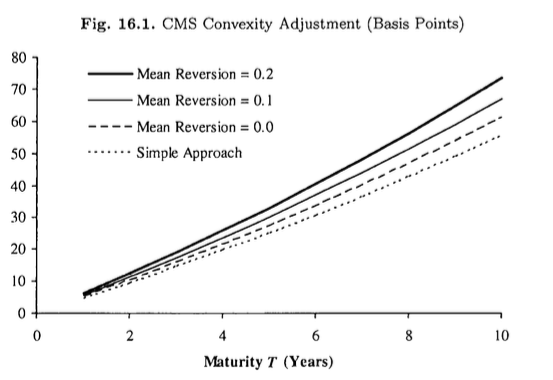

# TOC
    

<!-- vim-markdown-toc GFM -->

* [Interest Rate Modeling 3](#interest-rate-modeling-3)
	* [Symbols](#symbols)
	* [16.3 Terminal Swap Rate Models](#163-terminal-swap-rate-models)
		* [16.3.2 Linear TSR Model](#1632-linear-tsr-model)
		* [16.3.4 Swap-Yield TSR Model](#1634-swap-yield-tsr-model)
	* [16.4 Libor-in-Arrears](#164-libor-in-arrears)
	* [16.6 CMS and CMS-Linked Cash Flows](#166-cms-and-cms-linked-cash-flows)
		* [16.6.1 The replication Method for CMS](#1661-the-replication-method-for-cms)
		* [16.6.2 Annuity Mapping Function as a Conditional Expected Value](#1662-annuity-mapping-function-as-a-conditional-expected-value)
			* [Proposition 16.6.1](#proposition-1661)
			* [Proposition 16.6.2](#proposition-1662)
			* [sketch of proof](#sketch-of-proof)
		* [16.6.3 Swap-Yield TSR Model](#1663-swap-yield-tsr-model)
		* [16.6.4 Linear and Other TSR Models](#1664-linear-and-other-tsr-models)
		* [16.6.5 The Quasi-Gaussian Model](#1665-the-quasi-gaussian-model)
		* [16.6.6 The Libor Market Model](#1666-the-libor-market-model)
			* [Proposition 16.6.3](#proposition-1663)
		* [16.6.7 Correcting Non-Arbitrage-Free Methods](#1667-correcting-non-arbitrage-free-methods)
		* [16.6.8 Impact of Annuity Mapping Function and Mean Reversion](#1668-impact-of-annuity-mapping-function-and-mean-reversion)
		* [16.6.9 CDF and PDF of CMS Rate in Forward Measure](#1669-cdf-and-pdf-of-cms-rate-in-forward-measure)
			* [Proposition 16.6.4](#proposition-1664)
			* [sketch of proof](#sketch-of-proof-1)
			* [Corollary 16.6.5](#corollary-1665)
			* [sketch of proof](#sketch-of-proof-2)
			* [Corollary 16.6.6](#corollary-1666)
			* [sketch of proof](#sketch-of-proof-3)
			* [lemma 16.6.7](#lemma-1667)
			* [sketch of proof](#sketch-of-proof-4)
		* [16.6.10 SV Model for CMS Rate](#16610-sv-model-for-cms-rate)
		* [16.6.11 Dynamics of CMS Rate in Forward Measure](#16611-dynamics-of-cms-rate-in-forward-measure)
			* [Proposition 16.6.8](#proposition-1668)
			* [skecth of proof](#skecth-of-proof)
			* [Corollary 16.6.9](#corollary-1669)
			* [sketch of proof](#sketch-of-proof-5)
		* [16.6.12 Cash-Settled Swaptions](#16612-cash-settled-swaptions)
	* [16.7 Quonto CMS](#167-quonto-cms)
		* [16.7.1 Overview](#1671-overview)
		* [16.7.2 Modeling the Joint Distribution of Swap Rate and Forward Exchange Rate](#1672-modeling-the-joint-distribution-of-swap-rate-and-forward-exchange-rate)

<!-- vim-markdown-toc -->

# 16

## Symbols

* $0 = T_{0} < T_{1} < \ldots < T_{N}$
* $\tau_{n} := T_{n+1} - T_{n}$
* $A_{n, m}(t)$
* $A(T)$: annuity, PVBP

$$
    A(t) 
        := A_{0, N}(t) 
        = \sum_{n=0}^{N-1} \tau_{n}P(t, T_{n+1})
$$

* $p(t, S; T, K)$: $t$での満期$T$, forward $S$, strike $K$のput optionの(non-deflated)価格。
* $c(t, S; T, K)$: $t$での満期$T$, forward $S$, strike $K$のcall optionの(non-deflated)価格。
* $q(M)$: 次を満たす添字$0, \ldots, N$, $M \in [T_{q(M)}, T_{q(M)})$。
    ただし、$T_{N+1} = \infty$
    * index function

## 16.3 Terminal Swap Rate Models
* $0 < T = T_{0} < T_{1} < \ldots < T_{N}, \tau_{n} := T_{n+1} - T_{n}$

TSR modelでは、以下のように$P(T, M)$をmodel化する。

$$
    P(T, M) = \pi(S(T), M),\ M \ge T
$$

ここでで、$\pi$は

### 16.3.2 Linear TSR Model
linear TSR modelは、以下のようにzero coupon bondとannuityの比を線形に近似する。

$$
\begin{equation}
    \frac{\pi(x, M)}{\sum_{n=0}^{N-1} \tau_{n} \pi(x, T_{n+1})}
        = a(M) x + b(M),
    \quad
    M \ge T,
    \label{chap16_linear_tsr_model_def_a_b}
\end{equation}
$$

ここで、$a(\cdot), b(\cdot)$はdeterministic functionである。
no-arbitrage conditionは以下のようになる。

$$
    P(0, M)
        = A(0) \mathrm{E}^{A}
        \left[
            a(M)S(T) + b(M)
        \right],
$$

上記を整理すると

$$
\begin{equation}
    b(M) = \frac{P(0, M)}{A(0)} - a(M) S(0),
    \label{chap16_linear_tsr_model_b_from_no_arbitrage_condition}
\end{equation}
$$

となる。
consistency conditionより、$\forall x$について、

$$
\begin{eqnarray*}
    x 
        & = & \frac{1 - \pi(x, T_{N})}{\sum_{n=0}^{N-1} \tau_{n} \pi(x, T_{n+1}) }
        \\
        & = & \frac{1}{\sum_{n=0}^{N-1} \tau_{n} \pi(x, T_{n+1})}
            - \frac{\pi(x, T_{N})}{\sum_{n=0}^{N-1} \tau_{n} \pi(x, T_{n+1})}
        \\
    \iff
    x
        & = & (a(T_{0})x + b(T_{0})) - (a(T_{N})x + b(T_{N})),
    \iff
    x
        & = & (a(T_{0}) - a(T_{N}))x + b(T_{0})) - b(T_{N}),
        \\
\end{eqnarray*}
$$

より、

$$
\begin{eqnarray}
    b(T_{0}) & = & b(T_{N}),
    \label{chap16_linear_tsr_model_b_from_consistency_condition}
    \\
    a(T_{0}) & = & 1 + a(T_{N}).
    \label{chap16_linear_tsr_model_a_from_consistency_condition}
\end{eqnarray}
$$

が成り立つ必要がある。
$\eqref{chap16_linear_tsr_model_b_from_no_arbitrage_condition}$と$\eqref{chap16_linear_tsr_model_b_from_consistency_condition}$より、$\eqref{chap16_linear_tsr_model_a_from_consistency_condition}$が求まる。
また、逆に$\eqref{chap16_linear_tsr_model_b_from_no_arbitrage_condition}$と$\eqref{chap16_linear_tsr_model_a_from_consistency_condition}$より、$\eqref{chap16_linear_tsr_model_b_from_consistency_condition}$が求まる。

$\eqref{chap16_linear_tsr_model_def_a_b}$より、consistency condition、no-arbitrage conditionに加えて以下が成り立つ。

$$
    \sum_{n=0}^{N-1} \tau_{n}(a(T_{n+1})x + b(T_{n+1})) \equiv 1,
    \quad
    \forall x
$$

また、これより

$$
\begin{eqnarray}
    \sum_{n=0}^{N-1} \tau_{n}a(T_{n+1}) & = & 0,
    \label{chap16_linear_tsr_model_a_from_annuity}
    \\
    \sum_{n=0}^{N-1} \tau_{n}b(T_{n+1}) & = & 1,
    \label{chap16_linear_tsr_model_b_from_annuity}
\end{eqnarray}
$$

である。
上の２つの式は一方が成立すれば、$\eqref{chap16_linear_tsr_model_def_a_b}$よりもう一方が自然に従う。

modelのparameterが満たすべき条件について述べた。
parameterを決める具体的な方法は以下となる。

1. $\\{ a(T_{1}), \ldots, a(T_{N}) \\}$を$\eqref{chap16_linear_tsr_model_a_from_annuity}$から求める
    * 詳細についてはあとで述べる
2. $a(T) = a(T_{0})$を$\eqref{chap16_linear_tsr_model_a_from_consistency_condition}$から求める。
3. 残りの$a(M)$については線形補間などで求める。
4. 最後に$b(M)$は$\eqref{chap16_linear_tsr_model_b_from_no_arbitrage_condition}$から求める。

linearという単純なモデルを仮定したが、実際のマーケットとは一致しない場合もある。
特に、linear TSR modelの場合はparameterの選び方によってはdiscount bondが負になるという問題があり、問題ごとに適切なparameterを選ぶ必要がある。

linear TSR modelは $$\eqref{chap16_linear_tsr_model_a_from_annuity}$$から$a(T_{1}), \ldots, a(T_{N})$を決めるので、決め方には自由度がある。
$a(\cdot)$を決めるために、$a$の意味をもう少し深く考える。
まず、$a$が状態$S(T)$に応じて$T$でのyield curveの形を決めることをみる。
これは、Section 10.1.2で扱った平均回帰係数と同じ性質である。
$a$を平均回帰係数とみなすことは、parameterの数を減らすだけではなく、parameterのファイナンスうにおける解釈に役立つ。

$a(\cdot)$を平均回帰係数と関連付けるために、$\eqref{chap16_linear_tsr_model_def_a_b}$より、両辺$x$について微分し$x=S(T)$とおくと、

$$
    a(M)
        = \frac{\partial}{\partial S(T)} 
            \frac{P(T, M)}{\sum_{n=0}^{N-1} \tau_{n}P(T, T_{n+1}}
$$

が成り立つ。
Gaussian one-factor modelの下では以下のようにかける。

$$
    a(M)
        = \frac{\partial}{\partial x}
            \left.
                \frac{P(T, M)}{\sum_{n=0}^{N-1} \tau_{n}P(T, T_{n+1}, x)}
            \right|_{S(T, x) = S(0)}
            \left(
                \left.
                    \frac{\partial S(T, x)}{\partial x}
                \right|_{S(T, x) = S(0)}
            \right)^{-1},
$$

とかける。
ここで、$x$はshort rateを表すGaussian modelの状態変数である。
$A(T, x)$を$x$に依存したannuityとすると

$$
    A(T, x) = \sum_{n=0}^{N-1} \tau_{n} P(T, T_{n+1}, x),
$$

より、

$$
    S(T, x) = \frac{1 - P(T, T_{N}, x)}{A(T, x)},
$$

さらに、

$$
\begin{eqnarray*}
    \frac{\partial}{\partial x} \frac{P(T, M, x)}{A(T, x)}
        & = & - \frac{P(T, M, x) G(T, M)}{A(T, x)}
            - \frac{P(T, M, x)}{A(T, x)^{2}} 
                \frac{\partial A(T,x)}{\partial x}, 
    \\
    \frac{\partial }{\partial x} S(T, x)
        & = & \frac{P(T, T_{N}, x) G(T, T_{N})}{A(T, x)} 
            - \frac{S(T, x)}{A(T, x)}
                \frac{\partial A(T, x)}{\partial x},
\end{eqnarray*}
$$

ここで、$G(\cdot, \cdot)$は(10.19)の平均回帰の関数である。
以下の近似により

$$
    P(T, t, x) |_{S(T, x)} = S(0)
        \approx \frac{P(0, t)}{P(0, T)},
    \quad
    \forall t \ge T
$$

以下の式を得る。

$$
\begin{equation}
    a(M)
        = \frac{P(0, M) (\gamma - G(T, M))}{P(0, T_{N}) G(T, T_{N}) + A(0)S(0) \gamma}
        \label{chap16_linear_tsr_model_a_relation_to_mean_reversion}
\end{equation}
$$

ここで、

$$
\begin{eqnarray}
    \gamma 
        & := &
            - \frac{1}{A(T, x)} 
                \left.
                    \frac{\partial A(T, x)}{\partial x} 
                \right|_{P(T, t, x) = P(0, T), \forall t  \ge T}
        \nonumber
        \\
        & = &
            \frac{\sum_{n=0}^{N-1} \tau_{n}P(0, T_{n+1}) G(T, T_{n+1})
            }{\sum_{n=0}^{N-1} P(0, T_{n+1})}
            \label{chap16_linear_tsr_model_def_gamma}
\end{eqnarray}
$$

### 16.3.4 Swap-Yield TSR Model
coupon bond yield forumlaから考え出されたTSR model。

## 16.4 Libor-in-Arrears

現実的には、無限のoptionを扱えないことを考慮すると、static hedgeの積分は以下のように離散化できる。

$$
    E^{M}(L(T)^{2}) 
        \approx L(0)^{2} + \sum_{i} w_{i}^{p}p(0, L(0); T, K_{i}) + \sum_{i} w_{i}^{c}c(0, L(0); T, K_{i})
$$

特に、$(x_{\min}, x_{\max})$の範囲が与えられたとき、すべての$x \in (x_{\min}, x_{\max})$に対してsuper-replicationになるように選ぶことができる。

$$
    \sum_{i} \bar{w}_{i}^{p} p(T, x; T, K_{i}) + \sum_{i} \bar{w}_{i}^{c} c(T, x; T, K_{i})
    \ge 2 \int_{-\infty}^{L(0)} p(T, x; T, K)\ d K    
        + 2 \int_{L(0)}^{\infty} c(T, x; T, K)\ dK = x^{2} - L(0)^{2}
$$

同様にsub-replicationとなるように選ぶことができる。

$$
    \sum_{i} \underline{w}_{i}^{p} p(T, x; T, K_{i}) 
        + \sum_{i} \underline{w}_{i}^{c} c(T, x; T, K_{i})
    \le 2 \int_{-\infty}^{L(0)} p(T, x; T, K)\ d K    
        + 2 \int_{L(0)}^{\infty} c(T, x; T, K)\ dK = x^{2} - L(0)^{2}
$$

$\bar{w}$と$\underline{w}$は離散化した被積分関数の上端と下端をとれば良い？

* super-replicationの最小値はlong LIAのupper bound
* sub-replicationの最大値はshort LIAのlower bound
* boundから外れたものはマーケットの商品でarbitrageが可能

## 16.6 CMS and CMS-Linked Cash Flows
* LIBOR In Arrears(LIA)や LIBOR with dealyの考え方は、CMSやCMS linked cash flowsのモデルを考えるのに重要な知見を与えてくれる
* CMSはswap rate$S(T)$を$T_{p} \ge T$に支払うもの(典型的には、$T_{p} \le T_{1}$
    * ここで$T_{1}$は参照しているswapの最初の支払日
* CMS-linked cash flowは$S(T)$の関数を支払いとするもの

* LIAからの類推として、swap measure$Q^{A}$の下での、market impliedな$S(T)$の分布はeuropean swaptionからわかっている。

$$
\begin{equation}
    V_{\mathrm{CMS}}(0) 
        := A(0) E^{A}
            \left(
                \frac{P(T, T_{p})}{A(T)}S(T) 
            \right)
        = P(0, T_{p}) E^{T_{p}}
            \left(
                S(T) 
            \right)
            \label{value_cms}
\end{equation}
$$

CMSのconvexity adjustment$D_{\mathrm{CMS}}$を以下で定義する。

$$
\begin{equation}
    D_{\mathrm{CMS}}(0) 
        := E^{T_{p}}(S(T)) - S(0)
        = \frac{V_\mathrm{CMS}}{P(0, T_{p})} - S(0)
        = \frac{A(0)}{P(0, T_{p})} E^{A}
            \left(
                \frac{P(T, T_{p})}{A(T)}S(T)
            \right) - S(0)
    \label{chap16_cms_convexity_adjustment}
\end{equation}
$$

* Sec16.5のLibor-with-delayの議論はCMSに適用できる。
* $\eqref{value_cms}$はTerm structure modelで計算できるが、計算が遅く、精度も悪い
* replicatoin methodの方が大抵better
    * そのためには$P(T, T_{p}) / A(T)$が$S(T)$の関数としてかける必要がある。
    * LIAやLibor-with-delayですでにやった

### 16.6.1 The replication Method for CMS
$P(T, T_{p})/A(T)$を$S(T)$の関数としてモデル化するために、$S(T)$から$P(T, T_{p})/A(T)$への関数を$\alpha(S(T))$をannuity mapping functionとして定義する。
つまり、

$$
\begin{equation}
    E^{A}
    \left(
        \frac{P(T, T_{p})}{A(T)}S(T)
    \right)
    = E^{A}
    \left(
        \alpha(S(T))S(T)
    \right)
    \label{chap16_value_cms_annuity_mapping_fucntion}
\end{equation}
$$

が成り立つとする。
Proposition 8.4.13をpayoffが$f(S(T)) = \alpha(S(T))S(T), K^{*}=S(0)$として、適用する。
$f'(S) = \alpha'(S)S + \alpha(S)$より、

$$
\begin{eqnarray}
    E^{A}(\alpha(S(T))S(T))
        & = &
            S(0) \alpha(S(0))
            + (\alpha'(S(0))S(0) + \alpha(S(0)))(S(0) - S(0))
            + \int_{-\infty}^{(0)} w(K)p(0, S(0); T, K)\ dK
            + \int_{S(0)}^{\infty} w(K)c(0, S(0); T, K\ dK
            \\
        & = & 
            S(0) \alpha(S(0))
            + \int_{-\infty}^{(0)} w(K)p(0, S(0); T, K)\ dK
            + \int_{S(0)}^{\infty} w(K)c(0, S(0); T, K\ dK
    \label{chap16_expectation_static_hedge}
\end{eqnarray}

$$

ここで、

$$
    w(s) := \frac{d^{2}}{ds^{2}}(\alpha(s)s)
$$

である。
$\eqref{chap16_expectation_static_hedge}$, $\eqref{chap16_value_cms_annuity_mapping_fucntion}$より、以下を得る。

$$
\begin{eqnarray}
    V_{\mathrm{CMS}}
        & = &  A(0)S(0) \alpha(S(0))
            + \int_{-\infty}^{S(0)} w(K)A(0)p(0, S(0); T, K)\ dK
            + \int_{S(0)}^{\infty} w(K)A(0)c(0, S(0); T, K)\ dK \\
        & = &  A(0)S(0) \alpha(S(0))
            + \int_{-\infty}^{S(0)} w(K)V_{\mathrm{rec}}(0, K)\ dK
            + \int_{S(0)}^{\infty} w(K)V_{\mathrm{pay}}(0, K)\ dK 
        \label{chap16_value_cms_static_hedge}
\end{eqnarray}
$$

ここで、$V_{\mathrm{rec}}, V_{\mathrm{pay}}$はそれぞれreciever/payer european swaptionの価格をあわらし、

$$
\begin{eqnarray*}
    V_{\mathrm{rec}}(0, K) 
        & = & A(0)p(0, S(0); T, K) = A(0) E[(K - S(T))^{+}]
    V_{\mathrm{pay}}(0, K) 
        & = & A(0)c(0, S(0); T, K) = A(0) E[(S(T) - K)^{+}]
\end{eqnarray*}
$$

である。
swaptionの価格は、marketの価格を直接に使うか選択したmodelで直接計算される。
replicatoin methodはmarketのすべてのstrikesのswaptionの価格と一貫したCMSの価格を計算するだけでなく、modelに依存しない($\alpha(s)$には依存する）payer/recieverのswaptionのポートフォリオを提供する。

$\eqref{chap16_value_cms_static_hedge}$に対して、いくつかの制約をいれることができる。
例えば、low strikeやhigh stirkeのswaptionは流動性が低いので、以下のように

$$
    A(0)S(0) \alpha(S(0))
        + \int_{K_{\min}}^{S(0)} w(K)V_{\mathrm{rec}}(0, K)\ dK
        + \int_{S(0)}^{K_{\max}} w(K)V_{\mathrm{pay}}(0, K)\ dK, 
    \label{chap16_value_cms_static_hedge_low_liquid}
$$

strikeに上限と下限をつけた形にもできる。
strikeが有限個の場合のrepliationについては、Sec16.4で議論をしている。

replication methodは、$g(S(T))$をpayoffに持ち、$T_{p} \ge T$にも支払いがある場合に拡張できる。
ただし、$g$は十分なめらかであるとする。
例えば、payoffとして、capletとfloorletの場合は以下のようになる。

$$
    g(s) := g_{\mathrm{caplet}}(s) := (s - K)^{+},
    \quad g(s) := g_{\mathrm{floorlet}}(s) := (K - s)^{+}
$$

この時、CMSの価格は以下のようにかける。

$$
    V_{\mathrm{gCMS}}(0) 
        := A(0) E^{A}
            \left[
                \frac{P(T, T_{p})}{A(T)} g(S)
            \right]
        = A(0) E^{A} [\alpha(S(T))g(S(T))] 
$$

また、weightは

$$
\begin{equation}
    w(s) := \frac{d^{2}}{ds^{2}} (\alpha(s)g(s)),
    \label{chap16_49_replication_method_stochastic_weight}
\end{equation}
$$

となる。
financeで現れる多くのpayoff関数は、二階微分をするとdelta関数を含む。
capletとfloorletの場合は、delta関数が集中する点$s_{0}$での$V_{\mathrm{rec}}(0, s_{0})$ないし、$V_{\mathrm{pay}}(0, s_{0})$ (どちらを考慮するかは$s_{0}$と$K$の値による) の値の寄与を考えれば良い。

### 16.6.2 Annuity Mapping Function as a Conditional Expected Value
$\alpha(s)$を前節で導入したが、$\alpha(s)$を何とするかについては議論しなかった。
前節までで議論したTerminal Swap Rate modelsやTerm structure modelによる近似の例が参考になると期待できる。
まずはじめに、annuity mapping functionの理論的な意味についてみる。

$$
\begin{eqnarray*}
    V_{\mathrm{CMS}}
        & = & 
            A(0) E^{A}
                \left[
                    \frac{P(T, T_{p})}{A(T)} S(T) 
                \right] \\
       & = & 
            A(0) E^{A}
                \left[
                    E^{A} 
                    \left( 
                    \left.
                        \frac{P(T, T_{p})}{A(T)} S(T) 
                    \right|
                        S(T)
                    \right)
                \right] \\
       & = & 
            A(0) E^{A}
                \left[
                    S(T)
                    E^{A} 
                    \left( 
                    \left.
                        \frac{P(T, T_{p})}{A(T)}
                    \right|
                        S(T)
                    \right)
                \right] \\
\end{eqnarray*}
$$

これを、 $\eqref{chap16_value_cms_annuity_mapping_fucntion}$と比較する。

#### Proposition 16.6.1
annuity mapping function $\alpha(s)$は、modelに依存せず以下の条件付き期待値ととしてかくことができる。

$$
\begin{equation}
    \alpha(s) 
        = E
        \left[
        \left.
            \frac{P(T, T_{p})}{A(T)}
        \right|
            S(T) = s
        \right]
        \label{chap16_50_annutiy_mapping_function_as_conditional_expectation}
\end{equation}
$$

propositionから今までみてきた近似は、 $\eqref{chap16_50_annutiy_mapping_function_as_conditional_expectation}$で定義される条件つき期待値の近似と見ることができる。
前節までに見てきた方法の他に、条件付き期待値を直接近似する方法を考えることができる。
条件付き期待値は、確率変数$X, Y$について、$X$の$Y$での条件付き期待値は、$\sigma(Y) = \sigma(\{f(Y)) \mid f \in \mathcal{B} \})$を満たす関数全体を$\mathcal{B}$とすると、

$$
    E(X|Y) = f^{*}(Y), 
    f^{*} = \mathrm{argmin} \left\{
        E \left(
            (X - f(Y))^{2}, f \in \mathcal{B}
        \right)
    \right\}
$$

である。
条件付き期待値の近似として$\mathcal{B}$をsubspace $\tilde{\mathcal{B}} \subset \mathcal{B}$ として近似する方法がある。
つまり、

$$
    E(X|Y) \approx f^{*}(Y),
    f^{*} = \mathrm{argmin} \left\{
       E
       \left(
           (X - f(Y))^{2}, f \in \tilde{\mathcal{B}}
       \right)
    \right\}
$$

として、近似する。
$\tilde{\mathcal{B}}$を以下のように$\theta$のparameterでモデル化する。

$$
    \tilde{\mathcal{B}} 
        := { f(y; \theta), \theta \in \Theta }
        , \Theta \subset \mathbb{R}^{d}.
$$

最適値をとるためには、以下の必要条件
満たす必要がある。

$$
    \frac{\partial}{\partial \theta_{i}} 
    E
    \left(
        (X - f(Y;\theta))^{2}
    \right)
    = 0, i = 1, \ldots, d
$$

#### Proposition 16.6.2
確率変数$X, Y$と、parameter付けられた関数の集合$\{ f(y; \theta)\}, \theta \in \Theta \subset \mathbb{R}^{d}$を与える。
このとき$E(X|Y)$の近似は以下で与えられる。

$$
    E(X|Y) \approx f(Y; \theta^{*})
$$

ここで、$\theta^{*}$は

$$
    E
    \left(
        X \frac{\partial f}{\partial \theta_{i}} (Y; \theta)
    \right)
    = E
    \left(
        f(Y; \theta) \frac{\partial f}{\partial \theta_{i}} (Y; \theta)
    \right)
    , i = 1, \ldots, d 
$$

として定義される。

#### sketch of proof
微分と積分の順序交換を認めれば($Xf(Y; \theta) \le  G (\forall \theta)$なる期待値有限の確率変数$G$が存在すれば十分）

$$
    \frac{\partial}{\partial \theta_{i}} 
    E
    \left(
       (X - f(Y; \theta))^{2}
    \right)
    =
    \frac{\partial}{\partial \theta_{i}} 
    E
    \left(
       X^{2} - 2Xf(Y; \theta) + f(Y; \theta)^{2}
    \right)
    =
    \frac{\partial}{\partial \theta_{i}} 
    E
    \left(
       -2Xf(Y; \theta) 
    \right)
    + E
    \left(
       2f(Y; \theta) \frac{\partial}{\partial\theta_{i}}f(Y; \theta)
    \right)
$$

であることと、最適値では1階微分が0でなければならないことより成立

$\Box$

### 16.6.3 Swap-Yield TSR Model
16.3.4でのswap-yield modelを考える。
このModelはswap rateとannuityを結び付けるde-facto standardとなっている。

$q(M)$をindex functionとする。
Sec 16.3 で、$P(T, M)$をSwap rateの関数として、以下のようにModel化した。

$$
    P(T, M)
        = 
        \left(
            \prod_{i=0}^{q(M) - 1} \frac{1}{1 + \tau_{i}S(T)}
        \right)
        \left(
            \frac{1}{1 + \tau_{q(M)}S(T)}
        \right)^{\frac{(M - T_{q(M)})}{\tau_{q(M)}}}
$$

このとき、$q(T_{n+1}) = n$より、

$$
\begin{eqnarray*}
    A(T) 
        & = &
            \sum_{n=0}^{N-1} \tau_{n}P(T, T_{n+1}) \\
        & = &
            \sum_{n=0}^{N-1} \tau_{n} 
            \left(
                \prod_{i=0}^{q(T_{n+1}) - 1} \frac{1}{1 + \tau_{i}S(T)}
            \right)
            \left(
                \frac{1}{1 + \tau_{q(T_{n+1})}S(T)}
            \right)^{\frac{(T_{n+1} - T_{q(T_{n+1})})}{\tau_{q(T_{n+1})}}}
            \\
        & = &
            \sum_{n=0}^{N-1} \tau_{n} 
            \left(
                \prod_{i=0}^{n - 1} \frac{1}{1 + \tau_{i}S(T)}
            \right)
            \left(
                \frac{1}{1 + \tau_{n}S(T)}
            \right)^{\frac{(T_{n+1} - T_{n})}{\tau_{n}}}
            \\
        & = &
            \sum_{n=0}^{N-1} \tau_{n} 
            \left(
                \prod_{i=0}^{n} \frac{1}{1 + \tau_{i}S(T)}
            \right)
            \\
        & = &
            \frac{1}{S(T)}
            \sum_{n=0}^{N-1} 
            \left(
                \prod_{i=0}^{n} \frac{\tau_{n}S(T)}{1 + \tau_{i}S(T)}
            \right)
            \\
        & = &
            \frac{1}{S(T)}
            \sum_{n=0}^{N-1} 
            \left(
                \prod_{i=0}^{n} \frac{-1 + 1 + \tau_{n}S(T)}{1 + \tau_{i}S(T)}
            \right)
            \\
        & = &
            \frac{1}{S(T)}
            \sum_{n=0}^{N-1} 
            \left(
                - \prod_{i=0}^{n} \frac{1}{1 + \tau_{i}S(T)}
                + \prod_{i=0}^{n-1} \frac{1}{1 + \tau_{i}S(T)}
            \right)
            \\
        & = &
            \frac{1}{S(T)}
            \left(
                - \prod_{i=0}^{N-1} \frac{1}{1 + \tau_{i}S(T)}
                + 1
            \right)
\end{eqnarray*}
$$

となる。
最後の等式は、summationの隣り合う項が打ち消し合うことによる。
また、$T_{p} \in [T_{0}, T_{1}]$とすると、同様の議論により、

$$
    P(T, T_{p}) = 
        \left(
            \frac{1}{1 + \tau_{0}S(T)}
        \right)^{(T_{p} - T) / \tau_{0}}
$$

より、

$$
\begin{eqnarray*}
    \alpha(s) 
        & = &
            E^{A}
            \left[
            \left.
                \frac{P(T, T_{p})}{A(T)}
            \right|
                S(T) = s
            \right]
            \\
        & = & 
            s \frac{\frac{1}{1+\tau_{0}s}^{(T_{p} - T)/\tau_{0}}}{1 - \prod_{i=0}^{N-1}\frac{1}{1+\tau_{i}s}}
\end{eqnarray*}
$$

となる。
また、

$$
\begin{eqnarray*}
    P(0, T_{p}) 
        & = &
            \left(
                \frac{1}{1+\tau_{0}S(0)}
            \right)^{T_{p}/\tau_{0}}
            \\
    A(0)
        & = &
        \frac{1}{S(0)}
            \left(
                1 - \prod_{i=0}^{N-1} \frac{1}{1+\tau_{i}S(0)}
            \right)
            \\
    \frac{P(0, T_{p})}{A(0)}
        & = & 
           S(0)
           \frac{
               \frac{1}
               {1+\tau_{0}S(0)}^{T_{p}/\tau_{0}}
           }
           {
               1 - \prod_{i=0}^{N-1}\frac{1}{1+\tau_{i}S(0)}
           }
\end{eqnarray*}
$$

より、以下のマルチンゲール性は成り立たない。
この問題についてはSec 16.6.7で扱う。

$$
    E^{A}(\alpha(S(T)))
    =
    E^{A}
    \left(
        \frac{P(T, T_{p})}{A(T)}
    \right)
    \neq
    \frac{P(0, T_{p})}{A(0)}
$$

### 16.6.4 Linear and Other TSR Models
* 上記のTSR modelの議論は、Sec 16.3で熱方一般のTSR modelに用意に拡張できる
* simpleなlinear TSR modelから扱う

$$
\begin{equation}
    \alpha(s) := \alpha_{1}s + \alpha_{2}
    \label{chap16_52_linear_tsr_model_def_alpha}
\end{equation}
$$

と定義する。
Sec 16.3では、$\alpha_{1} = a(T_{p}), \alpha_{2} = b(T_{p})$であった。
$\alpha_{1}$は入力として、与えられるものである。
$\alpha_{1}$が与えられると、$\alpha_{2}$は無裁定性を満たすように定義される。
つまり、

$$
    \frac{P(0, T_{p})}{A(0)}
        = E^{A}
            \left[
                \frac{P(T, T_{p})}{A(T)}
            \right]
        = E^{A}
        \left[
            \alpha_{1}S(T) + \alpha_{2}
        \right]
        = \alpha_{1}S(0) + \alpha_{2}
$$

が満たされるように、

$$
\begin{equation}
    \alpha_{2} := \frac{P(0, T_{p})}{A(0)} - \alpha_{1}S(0),
    \label{chap16_linear_tsr_model_def_alpha_2}
\end{equation}

$$

と置く。
以上のもと、CMSの価格は

$$
\begin{eqnarray}
    V_{\mathrm{CMS}}(0)
        & = &
            A(0) E^{A}
            \left[
                (\alpha_{1}S(T) + \alpha_{2})S(T)
            \right]
            \nonumber
            \\
        & = & 
            \alpha_{2}A(0)S(0) + A(0) E^{A}
            \left[
                \alpha_{1}S(T)^{2}
            \right]
            \nonumber
            \\
        & = &
            P(0, T_{p})S(0) - A(0)\alpha_{1}S(0)^{2} + \alpha_{1}A(0) E^{A}
            \left[
                S(T)^{2}
            \right]
            \nonumber
            \\
        & = &
            P(0, T_{p})S(0) + A(0)\alpha_{1}\mathrm{Var}^{A}(S(T))
            \label{chap16_linear_tsr_model_cms_value}
\end{eqnarray}
$$

となり、convexity adjustmentは $\eqref{chap16_cms_convexity_adjustment}$より、

$$
\begin{equation}
    D_{\mathrm{CMS}}(0) 
        = \frac{V_{\mathrm{CMS}}}{P(0, T_{p})} - S(0)
        = \alpha_{1} \frac{A(0)}{P(0, T_{p})} \mathrm{Var}^{A}
        \left[
            S(T)
        \right]
        \label{chap16_linear_tsr_model_cms_convexity_adjustment}
\end{equation}
$$

となる。
$S(T)$の分散は、選択したModelないし、$(S(T) - S(0))^{2}$を積分して計算される。
$$\eqref{chap16_linear_tsr_model_cms_convexity_adjustment}$$は、LIAの式に似ておりよく使われるモデルである。
しかし、$\alpha$のとり方によっては、discount factorが負になるという問題がある。
Sec 16.3.2で述べたように$\alpha_{1}$は平均回帰的な役割を持つが、これについてはSec 16.6.8で扱う。
大雑把には、$T$のyield curveが十分低い状況（つまり、$S(T)$がゼロに近い状況）を考えることで、

$$
    \frac{P(T, T_{p})}{A(T)} 
        \approx \frac{1}{ \sum_{n=0}^{N-1} \tau_{n} }
$$

が成り立つと期待できる。
$\alpha_{2}$を$\alpha_{2} = E^{A}(\alpha_{1}S(T) + \alpha_{2} | S(T) = 0)$とかくと

$$
\begin{equation}
    \alpha_{2} 
        = \mathrm{E}^{A}
        \left[
        \left.
            \frac{P(T, T_{p})}{A(T)}
        \right|
            S(T) = 0
        \right]
        \approx \frac{1}{ \sum_{n=0}^{N-1} \tau_{n}},
    \alpha_{1} = \frac{1}{A(0)}
        \left(
            \frac{P(0, T_{p})}{A(0)} - \alpha_{2}
        \right)
    \label{chap16_linear_tsr_model_simple_alpha_estimation}
\end{equation}
$$

とかける。
ここで、第二式は $\eqref{chap16_linear_tsr_model_def_alpha_2}$を使った。
この単純なapproachは、他の方法と比べ低い値になる。
図16.1に比較結果がある。

Proposition 16.6.1との関係について述べる。
$X = P(T, T_{p}), Y = S(T), f(s;\theta) := s\theta_{1} + \theta_{2}$として、Propositoin 16.6.2を適用すると、最適性の条件は

$$
    \frac{\partial }{\partial\theta_{1}} f(Y; \theta)
        = S(T),
    \frac{\partial }{\partial\theta_{2}} f(Y; \theta)
        = 1
$$

より、

$$
\begin{eqnarray*}
    \mathrm{E}^{A}
    \left[
       X \frac{\partial }{\partial\theta_{1}} f(Y; \theta) 
    \right]
        & = & \mathrm{E}^{A}
        \left[
            \frac{P(T, T_{p})}{A(T)} S(T)
        \right],
        \\
    \mathrm{E}^{A}
    \left[
       f(Y; \theta) \frac{\partial }{\partial\theta_{1}} f(Y; \theta) 
    \right]
        & = & \mathrm{E}^{A}
        \left[
            (\theta_{1}S(T) + \theta{2}) S(T)
        \right],
        \\
    \mathrm{E}^{A}
    \left[
       X \frac{\partial }{\partial\theta_{2}} f(Y; \theta) 
    \right]
        & = & \mathrm{E}^{A}
        \left[
            \frac{P(T, T_{p})}{A(T)}
        \right],
        \\
    \left[
       f(Y; \theta) \frac{\partial }{\partial\theta_{2}} f(Y; \theta) 
    \right]
        & = & \mathrm{E}^{A}
        \left[
            (\theta_{1}S(T) + \theta_{2})
        \right],
\end{eqnarray*}
$$

から、

$$
\begin{eqnarray*}
    \mathrm{E}^{A}
        \left[
            \frac{P(T, T_{p})}{A(T)} S(T)
        \right]
        & = & \mathrm{E}^{A}
        \left[
            (\theta_{1}S(T) + \theta{2}) S(T)
        \right],
        \\
    \mathrm{E}^{A}
        \left[
            \frac{P(T, T_{p})}{A(T)}
        \right]
        & = & \mathrm{E}^{A}
        \left[
            (\theta_{1}S(T) + \theta_{2})
        \right],
\end{eqnarray*}
$$

となる。
上の方程式の解は以下で与えれる。

$$
\begin{equation}
    \theta_{1}^{*}
        = \frac{P(0, T_{p})}{A(0)} \frac{D_{\mathrm{CMS}}}
            { 
                \mathrm{Var}^{A}
                \left[
                    S(T)
                \right]
            },
    \theta_{2}^{*}
        = \frac{P(0, T_{p})}{A(0)} - \theta_{1}^{*}S(0).
    \label{chap16_linear_tsr_model_conditional_expectation_solution}
\end{equation}

$$

実際

$$
\begin{eqnarray*}
    V_{\mathrm{CMS}}
        & = & A(0) \mathrm{E}^{A}
        \left[
            \mathrm{E}^{A}
            \left[
            \left.
                \frac{P(T, T_{p})}{A(T)}
            \right|
                S(T)
            \right]
            S(T)
        \right]
        \\
        & = & A(0) \mathrm{E}^{A}
        \left[
            \mathrm{E}^{A} (X | Y )
            S(T)
        \right]
        \\
        & \approx &  A(0) \mathrm{E}^{A}
        \left[
            f(Y; \theta^{*})
            S(T)
        \right]
        \\
        & = & A(0) \mathrm{E}^{A}
        \left[
            \theta_{1}^{*}S(T)^{2} + \theta_{2}^{*}S(T)
        \right]
        \\
        & = & A(0) \theta_{1}^{*} \mathrm{E}^{A}
        \left[
            S(T)^{2}
        \right]
        + A(0) \theta_{2}^{*}S(0)
        \\
        & = & A(0) \theta_{1}^{*} \mathrm{Var}^{A}
        \left[
            S(T)
        \right]
        + A(0) \theta_{1}^{*} S(0)^{2}
        + A(0) \theta_{2}^{*} S(0)
\end{eqnarray*}
$$

TODO

解$$\eqref{chap16_linear_tsr_model_conditional_expectation_solution}$$はlinear TSR modelの$\alpha_{1}, \alpha_{2}$と一致する。

CMSのconvexity adjustmentはparameterのあるannuity mappincg functionで一意に決定できる。
これは、流動性のあるCMS swapにcalibrationする場合に重要である。
calibrationしたannuity mapping functionは、より複雑で流動性の低いCMS capやCMS range accrualsの計算に利用される。

linear TSR modelは解析しやすく、 Proposition 16.6.2は、他のexponential TSR modelなどにも同様に利用できる

### 16.6.5 The Quasi-Gaussian Model
quasi-Gaussian(qG)は、Sec16.5.3のLiboar-with-delayで見たように、annuityとswap rateの関係についての直感を与える。
(13.5)で見たように、 quasi-Gaussianのもと、discount bondは

$$
\begin{eqnarray*}
    P(T, M)
        & = & P(T, M, x(T), y(T)), M \ge T,
        \\
    P(T, M, x, y)
        & = &
            \frac{P(0, M)}{P(0, T)}
            \exp
            \left(
                -G(T, M) x - \frac{1}{2}G(T,M)^{2}y
            \right)
\end{eqnarray*}
$$

とかける。
ただし、$x(T), y(T)$は状態変数で、$G(T, M)$は平均回帰のdeterministic functionである。
また、上記のdiscount bondを用いて、annuity$A(T, x, y)$とswap rate$S(T, x, y)$も同様に定義する。

$$
    \bar{y}(T) 
        :=
        \left(
            \left. 
                \frac{\partial S(T, x, y)}{\partial x} 
            \right|_{x = y = 0}
        \right)^{-2}
        \mathrm{Var}^{A}
        \left[
            S(T)
        \right]
$$

$\mathrm{Var}^{A}(S(T))$はreplication methodでmodelと整合的に計算される。
また、$X(T, s)$を$x$に関する$S(T, x, \bar{y}(T))$の逆関数とする。
つまり、

$$
    x = X(T, S(T, x, \bar{y}(T)))
$$

である。
このとき、mapping functionを

$$
\begin{equation}
    \alpha(s) := \frac{P(T, T_{p}, X(T, s), \bar{y}(T)}{A(T, X(T,s), \bar{y}(T)}
\end{equation}
$$

と定義し、$$\eqref{chap16_value_cms_static_hedge}$$より、$V_{\mathrm{CMS}}$を計算する。
marketと整合的なCMSの価値を計算するために、replication methodのswaptionの価値は、marketから直接得るか、marketにcalibrationしたvanilla modelを使って計算する。
一方、目的がquasi-Gaussian modelでのCMSのcash flowの価値の解析的近似が目的であるならば、swaptionをquasi-Gaussian modelで直接（Proposition 13.1.10のような近似を使って）計算すべきである。

### 16.6.6 The Libor Market Model
Libor Market Model(LMM)は、forward swap rateとannuityの関係を具体化する別の方法である。
callable CMS range accrualsやCMS spread TARNsのようなexotic optionのLMMの応用に役立つ。
LMMのCMS convexity adjustmentの値がmarketのconvexity adjustmentの値を裏付けることが望まれる。
LMMのCMS adjustmentの値をMonte carloで計算することもできるが、perforamnceが悪いので、semi-analytic approchが望まれる。

LMMのCMS adjustmentの計算の問題は、Gatarek[2003]のrepresentative approachなどがあるが、多くの方法はforward measureでのdriftの近似をする"freezing"という手法とみなせる。
freezingは精度の良い手法ではない。
Antonov and Arneguy[2009]が、$P(t, T_{P})/A(t)$を近似したSDEを導出することで、 $\eqref{chap16_linear_tsr_model_conditional_expectation_solution}$よりlinear annuity mapping functionを得、以下の期待値を計算した。

$$
    \frac{P(0, T_{p})}{A(0)} \mathrm{E}^{T_{p}}
    \left[
        S(T)
    \right]
    = \mathrm{E}^{A}
    \left[
        \left(
            \frac{P(T, T_{p})}{A(T)}S(T)
        \right)
    \right]
$$

linear TSR modelは、精度は十分であったが、LMMで重要なのはannnuity mapping functionの非線形の影響を捉えることにある。
以下でその方法について議論する。
$\alpha(s)$が$P(T, T_{p})/A(T)$を$S(T)=s$として条件付けたものであった。
以下では、LMMのもとでこの条件付き期待値を近似することを考える。
Chapter 14と同様に

$$
    L_{n}(t) := L(t, T_{n}, T_{n+1}), n = 0, \ldots, N-1 
$$

とする。
簡単のため$T_{p} = T$とする。
$1/A(T)$は$\mathbb{L}(T) = (L_{0}(T), \ldots, L_{N-1}(T))^{\mathrm{T}}$の関数としてかける。
実際

$$
    \prod_{i=0}^{n}(1 + \tau_{i}L_{i}(T))^{-1}
        = \prod_{i=0}^{n} \frac{P(T, T_{i+1})}{P(T, T_{i})}
        = \frac{P(T, T_{n+1})}{P(T, T_{0})}
        = P(T, T_{n+1})
$$

より

$$
    \frac{1}{A(T)} = \rho(\mathbb{L}(T)), 
    \rho(x) := 
        \left(
            \sum_{n=0}^{N-1} \tau_{n}
            \prod_{i=0}^{n}(1 + \tau_{i}x_{i})^{-1}
        \right)^{-1}
$$

である。
$\alpha(s)$を以下で近似する。

$$
    \alpha(s) 
        = \mathrm{E}^{A}
        \left[
            \rho(\mathbb{L}(T)) | S(T_{n}) = s
        \right]
        \approx
            \rho( \mathrm{E}^{A}
            \left[
                \mathbb{L}(T) | S(T) = s
            \right]
            ).
$$

以上より、LMMで$\mathrm{E}^{A}(\mathbb{L}(T)|S(T)=s)$を計算する問題となった。
よく行われる方法として、Gaussian approximationで近似する方法がある。
具体的に議論をするために以下のLMMを考える。

$$
\begin{eqnarray}
    dL_{n}(t) 
        & = & \sqrt{z(t)}\phi(L_{n}(t)) \lambda_{n}(t) ^{\mathrm{T}} dW^{T_{n+1}}(t),
        \label{chap16_lmm_stochastic_volatility}
        \\
    d z(t)
        & = & \theta(z_{0} - z(t)) dt + \eta(t) \sqrt{z(t)} dZ(t), 
        \quad
        z(0) = z_{0} = 1,
        \\
    \langle dW^{T_{n+1}}(t), dZ(t) \rangle
        & = & 0,
    \nonumber
\end{eqnarray}
$$

$n = 0, \ldots, N-1$である。
$\lambda_{n}(t)$は$m$次元のdeterministic volatility functionで、$W^{T_{n+1}}(t)$は$m$次元$Q^{T_{n+1}}$のBM。
$\mathrm{E}^{A}(\mathbb{L}(T)|S(T) = s)$を計算するために、$Q^{A}$でのSDEを近似する。

$$
    L_{n}(t) \approx \hat{L}_{n}(t),
    \quad
    S(t) \approx \hat{S}(t)
$$

ここで、

$$
\begin{eqnarray*}
    d \hat{L}_{n}(t) 
        & = & \phi(L_{n}(0)) \lambda_{n}(t) ^{\mathrm{T}} dW^{A}(t), 
    \quad
    \hat{L}_{n}(0) = L_{n}(0), 
    \quad
    n = 0, \ldots, N-1,
    \\
    d \hat{S}(t)
        & = & \phi(S(0))
            \left(
                \sum_{i=0}^{N-1} w_{i}\lambda(t)^{\mathrm{T}}
            \right)
            d W^{A}(t),
    \quad
    \hat{S}(0) = S(0),
    \\
    w_{i}
        & = & \frac{\phi(L_{i}(0))}{\phi(S(0))}
            \frac{\partial S(0)}{\partial L_{i}(0)}
    \\
        & = & \frac{\phi(L_{i}(0))}{\phi(S(0))} \frac{\tau_{n}S(0)}{1 + \tau_{n}L_{n}(0)}
            \left[
                \frac{P(0, \tau_{k})}{P(0, T_{j}) - P(0, T_{k})}
                    + \frac{\sum_{i=n}^{k-1} \tau_{i} P(0, T_{i+1})}{A(0)}
            \right],
    \quad
    i = 0, \ldots, N-1,
\end{eqnarray*}
$$

である。
この近似はSection 14.4.2と同様である。
以上の近似を用いて条件付き期待値を計算する。

$$
\begin{eqnarray*}
    \mathrm{E}^{A}
    \left[
        L_{n}(T) | S(T) = s
    \right]
        & \approx &
            \mathrm{E}^{A}
            \left[
            \left.
                \hat{L}_{n}(T)
            \right|
                \hat{S}(T) = s
            \right]
     \\
        & = &
            L_{n}(0)
                \left(
                    1 + c_{n} \frac{s - S(0)}{S(0)}
                \right)
\end{eqnarray*}
$$

ここで、

$$
\begin{equation}
    c_{n} 
        = \frac{
            \phi(L_{n}(0)) S(0) \int_{0}^{T} \lambda_{n}(t)^{\mathrm{T}} 
                \left(
                    \sum_{i=0}^{N-1} w_{i}\lambda_{i}(t)
                \right)
                \ dt
            }{
                \phi(S(0)) L_{n}(0)
                    \int_{0}^{T} 
                        \left\| \sum_{i=0}^{N-1} w_{i} \lambda_{i}(t)
                        \right\|^{2} \ dt
            }
\end{equation}
$$

TODO:

以上をまとめると、

#### Proposition 16.6.3
mapping function $\alpha(s)$が$\eqref{chap16_50_annutiy_mapping_function_as_conditional_expectation}$で定義されているとする。
$\eqref{chap16_lmm_stochastic_volatility}$のLMMにおいて、$\alpha$は以下で与えられる。

$$
    \alpha(s)
        = \mathrm{E}^{A}
        \left[
            \frac{1}{A(T)} | S(T) = s
        \right]
        \approx
            \left(
                \sum_{n=0}^{N-1} \tau_{n}
                    \prod_{i=0}^{n}(1 + \tau_{i}l_{i}(s))^{-1}
            \right),
$$

ここで、

$$
   l_{n}(s) 
        := L_{n}(0)
            \left(
                1 + c_{n} \frac{s - S(0)}{(0)}
            \right),
    \quad
    n = 0, \ldots, N-1,
$$

である。

#### sketch of proof

$$
    \alpha(s)
        = \mathrm{E}^{A}
            \left[
                \frac{1}{A(T)} | S(T) = s
            \right]
        = \mathrm{E}^{A}
            \left[
                \rho(\mathbb{L}) | S(T) = s
            \right]
        \approx \rho
            \left(
                \mathrm{E}^{A}
                \left[
                    \mathbb{L}) | S(T) = s
                \right]
            \right)
        =
            \left(
                \sum_{n=0}^{N-1} \tau_{n}
                    \prod_{i=0}^{n}(1 + \tau_{i}l_{i}(s))^{-1}
            \right),
$$

より、成立。

$\Box$

### 16.6.7 Correcting Non-Arbitrage-Free Methods
Section 16.6.3, 16.6.5, 16.6.6などで扱ったannuity mapping functionはarbitrage-freeではなかった。
一方、linear TSR modelのようなものは理論的にはarbitrage-freeとみなせるかもしれないが、計算上誤差が存在する。
この節では、arbitrageに関する問題を修正する方法について議論する。

CMSの価値は以下で計算された。

$$
    V_{\mathrm{CMS}}(0) 
        = A(0) E^{A}
            \left(
                \frac{P(T, T_{p})}{A(T)}S(T) 
            \right)
        = A(0) E^{A}
            \left(
                \alpha(S(T))S(T) 
            \right),
$$

$\frac{P(T, T_{p})}{A(T)}$は、取引可能な$P$とnumeraire$A$との比で、annuity measureの下でマルチンゲールである。
よって、arbitrage-freeのモデルのもとでは、

$$
    \mathrm{E}^{A}
    \left[
        \frac{P(T, T_{p}}{A(T)}
    \right]
    = \frac{P(0, T_{p})}{A(0)},
$$

が成り立つべきである。
つまり、以下が成り立つ。

$$
\begin{equation}
    \mathrm{E}^{A}
    \left[
        \alpha(S(T))
    \right]
    = \frac{P(0, T_{p})}{A(0)}.
    \label{chap16_annuity_mapping_function_no_arbitrage_condition}
\end{equation}

$$

もし、$\alpha(s)$が上記を満たさない場合は

$$
\begin{equation}
    \bar{\alpha} 
        := \mathrm{E}^{A}
        \left[
            \alpha(S(T))
        \right]
        \neq
        \frac{P(0, T_{p})}{A(0)}
    \label{chap16_mapping_function_not_satisfied_no_arbitrage_condition}
\end{equation}
$$

となる。
この場合、新たに$\tilde{\alpha}(s)$を以下のように定義し、$\eqref{chap16_mapping_function_not_satisfied_no_arbitrage_condition}$を満たすように$\alpha$を取り直せば、式は満たされる。

$$
\begin{equation}
    \tilde{\alpha}(s)
        = \frac{P(0, T_{p})}{A(0)} \frac{\alpha(s)}{\bar{\alpha}}.
    \label{chap16_mapping_function_satisfy_no_aribitrage_condition}
\end{equation}
$$

以上より、CMSの価格を下記のimproved CMS valuation formulaで計算すれば良い。

$$
    V_{\mathrm{CMS}}(0)
        = A(0) \mathrm{E}^{A}
        \left[
            S(T) \tilde{\alpha}(S(T))
        \right]
        =  P(0, T_{p}) \frac{\mathrm{E}^{A}(S(T)\alpha(S(T)))}
            {\mathrm{E}^{A}(\alpha(S(T)))}.
$$

上記の修正は、no-arbitrageのmodelにも有効である。
no-arbitrageのmodelも理論的には無裁定の式が成立するが、数値計算の方法によって発生する計算上の誤差が存在するため、計算上の誤差を改善する目的で適用できるからである。

annuity mapping functionにおいては、$\eqref{chap16_annuity_mapping_function_no_arbitrage_condition}$は成り立つことが期待される基本的な式であるが、他にもCMSの計算の上で考慮すべき関係式がある。
以下は、自明に成り立つ等式である。

$$
    \sum_{n=0}^{N_1} \frac{\tau_{n} P(T, T_{n+1})}{A(T)} = 1,
$$

この両辺に$S(T)$をかけて期待値をとったものを考える。
両辺の期待値を取るために、annuity mapping functionを$P$の満期ごとに定義しておく。

$$
    \alpha(S(T), T_{n}) = \frac{P(T, T_{n})}{A(T)}.
$$

両辺の期待値を取ると

$$
\begin{eqnarray*}
    \sum_{n=0}^{N_1} \frac{\tau_{n} P(T, T_{n+1})}{A(T)}S(T)
        & = & S(T)
        \\
    \Rightarrow
    \sum_{n=0}^{N_1} \tau_{n} \mathrm{E}^{A}
    \left[
        \alpha(S(T), T_{n+1})S(T)
    \right]
        & = & S(0),
\end{eqnarray*}
$$

となる。
この期待値を取った式は、全てのtenorのCMSのconvexity adjustmentの和がswap rateに等しいことを述べている。

また、別の関係式として、$T_{0} = T$として

$$
\begin{eqnarray*}
    \frac{P(T, T_{0}) - P(T, T_{N})}{A(T)}
        & = & S(T)
        \\
    \iff
    \frac{P(T, T_{0})}{A(T)} - \frac{P(T, T_{N})}{A(T)}
        & = & S(T),
        \\
\end{eqnarray*}
$$

が成り立つ。
両辺に$S(T)$をかけて期待値をとると、

$$
    \mathrm{E}^{A}
    \left[
        \alpha(S(T), T_{0})S(T)
    \right]
    - 
    \mathrm{E}^{A}
    \left[
        \alpha(S(T), T_{N})S(T)
    \right]
         = \mathrm{E}^{A}(S(T)^{2}),
$$

が成立。
右辺は $S(T)$ の二乗の期待値で、replication methodで求めることができ、これは、annuity mapping functionには依存しない。
一方左辺は、annuity mapping functionによって決まる。
この等式は、CMSのswap rateのfixing date$T_{0}$の支払いと最後の支払日$T_{N}$の支払いの差は、annuity mapping functionに依存しないことを示している。
よって、この等式もannuity mapping functionの選び方によらず満たされるべきである。

### 16.6.8 Impact of Annuity Mapping Function and Mean Reversion
CMSの評価において、volatility smileの影響を捉える(通常、replication methodの$$\eqref{chap16_value_cms_static_hedge}$$によって)ことの重要性は、広く知られている。
一方、CMSの評価の別の要素であるannuity mapping functionの影響は見落とされがちである。
linear TSR modelの$$\eqref{chap16_linear_tsr_model_cms_value}$$において、$\alpha_{1}$を自由に取れるとすると、CMSのconvexity adjustmentを任意の値にとることができる。

勿論、$\alpha_{1}$の全ての値が実際のマーケットに合うというわけではないが、$\alpha_{1}$の妥当な範囲は明らかではない。
この場合、Section 16.3.2でやったように、平均回帰係数などの理解しやすいparameterとして解釈しと、その影響をみることは有用である。
また、平均回帰係数の場合、Section 13.1.8で扱ったように取引可能な商品の市場価格と直接関係しているという、好ましい性質もある。
CMS convexity adjustmentは平均回帰の妥当な範囲内での水準の違いによって、10%-20%異なることになる。

以下の条件で具体的な例を計算する。
* 10年満期
* semi-annual fixing
* 金利は5%のflat
* linear TSR modelを使う
* swap rateはlog-normal
    * volatilityは全てのfixing dateで$\sigma_{S}$ = 17%

上記の仮定のもとでは以下が成り立つので、$\eqref{chap16_linear_tsr_model_cms_convexity_adjustment}$よりclosed formで解を記述できる。

$$
    \mathrm{Var}^{A}
    \left[
        S(T)
    \right]
    = \mathrm{E}^{A}
        \left[
            S(T)^{2}
        \right]
        -
        \mathrm{E}^{A}
        \left[
            S(T)
        \right]^{2}
    = S(0)^{2} 
        \left(
            e^{\sigma_{S}^{2}T} - 1
        \right),
$$

1. Simple approach
    * $\eqref{chap16_linear_tsr_model_simple_alpha_estimation}$で計算したもの
2. Mean reversion 
    * $\eqref{chap16_linear_tsr_model_a_relation_to_mean_reversion}$より、平均回帰係数$\varkappa$をparameterとして計算。
    * $\varkappa$を0.0, 0.1, 0.2と変化させる

$$
    G(t, T) = \int_{t}^{T} e^{- \int_{t}^{u} \varkappa(s)\ ds}\ du.
$$

* 横軸は満期$T$
* 縦軸はb.p.でconvexity adjustmentの値を表している

### 16.6.9 CDF and PDF of CMS Rate in Forward Measure
CMS-linked cash flowsに対して、replication methodは有用だが、常に良いわけではない。
payoffが不連続な場合は、不連続関数の微分が出てくるので特別なケアが必要。
ここでは、replication methodではない別の方法をここでは見る。
$T_{p}\ (T_{p} \ge T)$に$g(S(T))$をpayoffに持つcash flowのpricingを考える。
この問題は$S(T)$の$T_{p}$-forward measureの下での密度$\psi^{T_{p}}(s)$を求める問題とみなせる。

$$
\begin{equation}
    \mathrm{E}^{T_{p}}
    \left[
        g(S(T))
    \right]
    = \int_{-\infty}^{\infty} g(s) \psi^{T_{p}}(s)\ ds.
    \label{chap16_65_density_integration_method}
\end{equation}
$$

annuity measureの下での分布$\Psi^{A}(\cdot)$と密度関数$\psi^{A}(\cdot)$はは直接求まるわけではない。
しかし、marketにキャリブレーションしたvanilla modelからclosed formとして求めるか、もしくはSection 7.12でやったようにswaptionの全てのstrikeの価格からnon-parametricに求めたものから以下の式、

$$
\begin{eqnarray}
    \Psi^{A}(K) 
        & = & 1 + \frac{\partial}{\partial K} c(K),
    \label{chap16_66_cdf_in_annuity_measure}
    \\
    \psi^{A}(K)
        & = & \frac{\partial^{2}}{\partial K^{2}} c(K),
    \label{chap16_67_pdf_in_annuity_measure}
    \\
    c(K)
        & := & \mathrm{E}^{A}
        \left[
            (S(T) - K)^{+}
        \right],
    \label{chap16_68_cms_call_option_value}
\end{eqnarray}
$$

で求まる。
次の命題はswap rateのforward measureの下でのCDFとPDFとannuity measureの下でのCDF, PDFで特徴づける。

#### Proposition 16.6.4
annuity mapping function $\alpha(s)$が条件付き期待値$$\eqref{chap16_50_annutiy_mapping_function_as_conditional_expectation}$$で定義する。
forward measureの下でのPDF$\psi^{T_{p}}(s)$とCDF$\Psi^{T_{p}}(s)$は、annuity measureの下でのPDF$\psi^{A}(s)$とCDF$\Psi^{A}(s)$と以下の関係が成り立つ。

$$
\begin{eqnarray}
    \psi^{T_{p}}
        & = & \frac{A(0)}{P(0, T_{p})} \alpha(s) \psi^{A}(s),
    \label{chap16_69_pdf_in_forward_measure_related_to_pdf_in_annuity_measure}
    \\
    \Psi^{T_{p}}(s)
        & = & \frac{A(0)}{P(0, T_{p})} 
            \int_{-\infty}^{s} \alpha(s) \psi^{A}(u)\ du.
    \label{chap16_70_cdf_in_forward_measure_related_to_cdf_in_annuity_measure}
\end{eqnarray}
$$

である。

#### sketch of proof
$K$での$\psi^{T_{p}}(K)$の値は、delta関数$\delta(S(T) - K)$のpayoffを持つderivativeの価値に等しい

$$
    \psi^{T_{p}}(K) 
        = \mathrm{E}^{T_{p}}
        \left[
            \delta(S(T) - K)
        \right]
        = \int_{-\infty}^{\infty} \psi^{T_{p}}(s) \delta(S(T) - K)\ ds.
$$

ここで、左辺をannuity measureに変更する。

$$
\begin{eqnarray*}
    \psi^{T_{p}}
        & = & \frac{A(0)}{P(0, T_{p})} \mathrm{E}^{A}
            \left[
                \frac{P(T, T_{p})}{A(T)} \delta(S(T) - K)
            \right]
        \\
        & = & \frac{A(0)}{P(0, T_{p})} \mathrm{E}^{A}
            \left[
                \alpha(S(T)) \delta(S(T) - K)
            \right]
        \\
        & = & \frac{A(0)}{P(0, T_{p})}
            \alpha(K) \psi^{A}(K).
\end{eqnarray*}
$$

よって、$\eqref{chap16_69_pdf_in_forward_measure_related_to_pdf_in_annuity_measure}$が求まった。
両辺積分すれば$\eqref{chap16_70_cdf_in_forward_measure_related_to_cdf_in_annuity_measure}$が求まる。

$\Box$

実務的には、$\alpha(s)$はSection 16.6.3, 16.6.4, 16.6.5, 16.6.6のように近似して求める。
$\eqref{chap16_65_density_integration_method}$のdensity integration methodは、理論的にはreplicaton methodと等しいが、非連続な関数や滑らかでない関数をpayoffにもつdigital optionやrange acrrulasのようなものにたいしては、良い数値的性質を持つ。
Chapter17で議論する複数のCMS rateに依存するCash flowを持つ商品において重要である。

$\alpha(s)$がlinear TSR modelのときは$\eqref{chap16_70_cdf_in_forward_measure_related_to_cdf_in_annuity_measure}$のCDFはよりsimpleな形を持つ。

#### Corollary 16.6.5
$$\eqref{chap16_52_linear_tsr_model_def_alpha}$$のlinear TSR modelを考える。
このとき、swap rateの$T_{p}$-forward measureの下でのCDF$\Psi^{T_{p}}(s)$は以下で与えられる。

$$
\begin{equation}
    \Psi^{T_{p}}(s)
        = \frac{A(0)}{P(0, T_{p})} 
            \left(
                \alpha_{1} (S(0) - s - c(s)) + \alpha(s) \Psi^{A}(s)),
            \right)
    \label{chap16_71_cdf_in_forward_measure_with_linear_tsr_model}
\end{equation}
$$

が成立。
ここで$Psi^{A}(s)$は$\eqref{chap16_66_cdf_in_annuity_measure}$で与えられる。
$c(s)$は$\eqref{chap16_68_cms_call_option_value}$で定義された、 strike $s$のcall option価格である。

#### sketch of proof

$$
\begin{eqnarray*}
    \frac{P(0, T_{p})}{A(0)} \Psi^{T_{p}}(s)
        & = & \int_{-\infty}^{s} (\alpha_{1} u + \alpha_{2}) \psi^{A}(u)\ du
        \\
        & = & \alpha_{1}
            \left(
                \int_{-\infty}^{\infty} u\psi^{A}(u)\ du
                - \int_{s}^{\infty} (u - s) \psi^{A}(u)\ du
                - s \int_{s}^{\infty} \psi^{A}(u)\ du
            \right)
            + \alpha_{2} \int_{-\infty}^{s} \psi^{A}(u)\ du
\end{eqnarray*}
$$

が成り立つ。
ここで、

$$
\begin{eqnarray*}
    \int_{-\infty}^{\infty} u \psi^{A}(u)\ du
        & = & S(0),
    \\
    \int_{s}^{\infty} (u - s)\psi^{A}(u)\ du,
        & = & c(s),
    \\
    \int_{s}^{\infty} \phi^{A}(u)\ du
        & = & 1 - \Psi^{A}(s),
    \\
    \int_{-\infty}^{s} \psi^{A}(u) \ du
        & = & \Psi^{A}(s),
\end{eqnarray*}
$$

である。
これを代入すると、

$$
\begin{eqnarray*}
    \frac{P(0, T_{p})}{A(0)} \Psi^{T_{p}}(s)
        & = & \alpha_{1}
            \left(
                \int_{-\infty}^{\infty} \psi^{A}(u)\ du
                - \int_{s}^{\infty} (u - s) \psi^{A}(u)\ du
                - s \int_{s}^{\infty} \psi^{A}(u)\ du
            \right)
            + \alpha_{2} \int_{-\infty}^{s} \psi^{A}(u)\ du
        \\
        & = & \alpha_{1}
            (
                S(0)
                - c(s)
                - s (1 - \Psi^{A}(s))
            )
            + \alpha_{2}  \Psi^{A}(s)
        \\
        & = & \alpha_{1}
            (
                S(0)
                - c(s)
                - s 
            )
            + s \alpha_{1} \Psi^{A}(s)
            + \alpha_{2}  \Psi^{A}(s)
        \\
        & = & \alpha_{1} (S(0) - c(s) - s)
            + \alpha(s) \Psi^{A}(s)) 
\end{eqnarray*}
$$

より成立。

$\Box$

#### Corollary 16.6.6
linear TSR model$$\eqref{chap16_52_linear_tsr_model_def_alpha}$$において、p.d.f. $\psi^{T_{p}}(s)$は以下のようにかける。

$$
\begin{equation}
    \psi^{T_{p}}(s)
        = \frac{A(0)}{P(0, T_{p})} (\alpha_{1}(s) + \alpha_{2})
            \psi^{A}(s),
    \label{chap16_72_pdf_in_forward_measure_with_linear_tsr_model}
\end{equation}
$$

#### sketch of proof
Corollary 16.6.5と同様に$\eqref{chap16_69_pdf_in_forward_measure_related_to_pdf_in_annuity_measure}$から直接求めるか、$\eqref{chap16_71_cdf_in_forward_measure_with_linear_tsr_model}$を微分して求めれば良い。
$\eqref{chap16_71_cdf_in_forward_measure_with_linear_tsr_model}$を両辺微分する。
まず、

$$
   \frac{d }{d s} c(s)
        = \mathrm{E}^{A}
        \left[
            \frac{d }{d s} (S(T) - s)^{+}
        \right]
        = \mathrm{E}^{A}
        \left[
            -1_{\{S(T) \ge s\}}
        \right]
        = -P^{A}(S(T) \ge s)
        = -1 + \Psi^{A}(s)
$$

である。
$\eqref{chap16_71_cdf_in_forward_measure_with_linear_tsr_model}$の両辺を微分すると、

$$
\begin{eqnarray*}
    \Psi^{T_{p}}(s)
        & = & \frac{A(0)}{P(0, T_{p})} 
            \left(
                \alpha_{1} (S(0) - s - c(s)) + \alpha(s) \Psi^{A}(s))
            \right)
    \\
    \Rightarrow
    \psi^{T_{p}}(s)
        & = & \frac{A(0)}{P(0, T_{p})} 
            \left(
                \alpha_{1}(-1  - \frac{d}{d s}c(s)) + \alpha_{1} \Psi^{A}(s) + \alpha(s) \psi^{A}(s)
            \right)
        & = & \frac{A(0)}{P(0, T_{p})} (\alpha(s) \psi^{A}(s))
\end{eqnarray*}
$$

より成立。

$\Box$

forward measureの下でのp.d.f.が求まった。
このp.d.f.と取引されているderivativeとの関係は、CMS capletのかあっくが以下で表現されていたのを思い出すと、

$$
\begin{equation}
    V_{\mathrm{cmscaplet}}(0, K)
        = P(0, T_{p}) \mathrm{E}^{T_{p}}
        \left[
            (S(T) - K)^{+}
        \right]
    \label{chap16_73_cms_caplet_value_under_forward_measure}
\end{equation}
$$

次の補題を得る。

#### lemma 16.6.7
marketにimpliedされた$T_{p}$-forward measureの下でのp.d.f.$\psi^{T_{p}}(s)$はCMS capletの価値から直接求めることができる。

$$
\begin{equation}
    \psi^{T_{p}}(K)
        = \frac{1}{P(0, T_{p})} \frac{\partial^{2}}{\partial K^{2}} V_{\mathrm{cmscaplet}}(0, K)
    \label{chap16_74_pdf_implied_by_cms_caplet}
\end{equation}
$$

#### sketch of proof

$\Box$

### 16.6.10 SV Model for CMS Rate
支払日のforward measureは、複数のmarket rateに依存したvanilla derivativeを扱うときに、有用なmeasureである。
次の章では複数のmarket rateから決まるvanilla derivativeを扱うがその準備として、この節ではforward measureの下でのp.d.f.とc.d.f.の表現を求める。
特に、annuity measureの下でswap rateをSV modelで定義した場合に、forward measureの下での分布をSV modelのparameterを調節することで近似的に求める方法について議論する。

Proposition 16.6.4とCorollary 16.6.6は $T_{p}$-forward measureがannuity measureへのmeasure変換において、swap rateのp.d.f.がどのように変化するかについて述べている。
この変換は、modelに依存していない議論であり、厳密に一致する。
上で述べたように、p.d.f.$\psi^{T_{p}}$の近似を得ることは有用である。
以下では、議論を厳密にするために次のSV modelを考える。

$$
\begin{eqnarray}
    dS(t) 
        & = & \lambda(b S(t) + (1 - b)S(0)) \sqrt{z(t)} dW^{A}(t),
        \label{chap16_75_swap_rate_stochastic_volatility_displaced_diffusion}
    \\
    dz(t) 
        & = & \theta(1 - z(t)) dt + \eta \sqrt{z(t)} dZ^{A}(t),
        \quad
        z(0) = 1,
        \label{chap16_76_volatility_stochastic_volatility_displaced_diffusion}
    \\
    \langle dZ^{A}(t), dW^{A}(t) \rangle
        & = & 0,
    \nonumber
\end{eqnarray}
$$

ここで、$Z^{A}(t), W^{A}(t)$は$Q^{A}$上のBMである。
上記のSDEは分布を持ち、特に$S(T)$のp.d.f.$\psi^{A}(\cdot)$をもつ。
ここで、調整をいれたprocess $\tilde{S}(t)$を$T_{P}$-forward measureの下、次で与える。

$$
    \begin{eqnarray}
        d \tilde{S}(t) 
            & = & \tilde{\lambda} 
                \left(
                    \tilde{b} \tilde{S}(t) 
                        + (1 - \tilde{b}) \tilde{S}(0)
                \right)
                \sqrt{z(t)} dW^{T_{p}},
    \label{chap16_77_ajusted_sde}
    \\
    d \tilde{z}(t)
        & = &
            \theta(1 - \tilde{z}(t)) dt
                + \tilde{\eta}\sqrt{\tilde{z}(t)} dZ^{T_{p}}(t),
    \quad
    \tilde{z}(0) = 1,
    \nonumber
    \end{eqnarray}
$$

ここで、$Z^{T_{p}}, W^{T_{p}}$は$Q^{T_{p}}$の下でのBMで、$\langle d Z^{T_{p}}, dW^{T_{p}} \rangle = 0,$ である。
$\tilde{S}(T)$の平均をCMSの価値と一致させるようにとる。
つまり、

$$
    \tilde{S}(0) := \mathrm{E}^{T_{p}}
    \left[
        S(T)
    \right].
$$

最後に、$T_{p}$-forward measureでの$S(T)$の分布に近くなるように$\tilde{\lambda}, \tilde{b}, \tilde{\eta}$を取り$\tilde{S}(T)$のp.d.f.$\psi^{T_{p}}$を定義する。

measure変換はSDEのdriftに影響を与えるので、measure変換をdiffusion項のparameterのみで表現しているこの方法では、一般的には$Q^{T_{p}}$の下で$S(T)$と$\tilde{S}(T)$は一致しない。
しかし、節のはじめに述べたように、近似であっても、chapter17のmulti-rate derivativeにおいては有用である。

$(S(0), \lambda, b, \eta)$から$(\tilde{S}(0), \tilde{\lambda}, \tilde{b}, \tilde{\eta})$の解析的な計算は難しいので、数値的に行うのが良い。
以下の方法でparameterを決める。

1. convexityの調整された$\tilde{S}(0)$は、replication methodで計算
    * $\mathrm{E}^{T_{p}}(S(T))$をreplication methodで計算
2. $\eqref{chap16_73_cms_caplet_value_under_forward_measure}$の$\tilde{S}(T)$に対する式を計算
    * $\eqref{chap16_77_ajusted_sde}$のcalibrationで$(\tilde{\lambda}, \tilde{b}, \tilde{\eta})$を求める。
    * 下記式の右辺は$\tilde{S}(T)$に対するEuropean call optionなので計算可能
    * 下記式の左辺は$S(T)$についてreplication methodで求まる。
    * 左辺のreplication methodの計算のために一定範囲のstrikeで、下記式が必要

$$
    V_{\mathrm{cmscaplet}}(0, K) = P(0, T_{p}) \mathrm{E}^{T_{p}}
    \left[
        (\tilde{S}(T) - K)^{+}
    \right]
$$
    
$(\lambda, b, \eta)$はannuity measureからforward measureへの変更で変化するか？という疑問がある。
つまり、measure変換の影響が、$S(0) \rightarrow \tilde{S}(0) = \mathrm{E}^{T_{p}}(S(T))$で説明されるか？という問である。
答えとしては、一般には変化すると考えるべきである。

* $\eqref{chap16_71_cdf_in_forward_measure_with_linear_tsr_model}$は、$S(T)$の分布の平均のshiftではない
* 平均をshiftせずに、平均をあわせるためには分布全体を動かす必要がある
* 実際linear TSRで$$\eqref{chap16_72_pdf_in_forward_measure_with_linear_tsr_model}$$で示されるように、p.d.f.が$\alpha_{1}>0$であればswap rateが高い値ほどp.d.f.の値が大きくなる。
    * 少なくともskew parameter $b$が変化するし、他のparameterも変化する

よって、CMS caps/floorsは単純にconvexity adjustmentしたforward swap rateで評価すべきではなく、 european swaptionに対するものと同じparameterと同じmodelで評価されるべきである。
かなりの誤差があるにも関わらず、実務ではよく使われている。

### 16.6.11 Dynamics of CMS Rate in Forward Measure
前の節で、実際にはdriftに影響のあるmeasure変換を、SV modelのdiffusionのparameterでmeasure変換の影響を表現した。
SV modelの場合に、この問題を詳しく扱う。
single-rateの場合はあまり重要ではないが、Section 17.8.1のmultiple-rateでMonte Carlo pricingをする際に重要である。

swap rate$S(t)$とannuity $A(t)$を考える。

$$
\begin{eqnarray}
    dS(t)
        & = & \lambda \phi(S(t))\sqrt{z(t)} dW^{A}(t),
        \label{chap16_78_swap_rate_stochastic_volatility}
        \\
    dz(t)
        & = & \theta(1 - z(t)) dt + \eta \psi(z(t)) dZ^{A}(t), 
        \quad
        z(0) = 1,
        \label{chap16_79_volatility_stochastic_volatility}
\end{eqnarray}
$$

ここで、$\langle dZ^{A}(t), dW^{A}(t) \rangle = 0$で、$Z^{A}(t), W^{A}(t)$は$Q^{A}$の下でBM。
$$\eqref{chap16_78_swap_rate_stochastic_volatility}$$, $$\eqref{chap16_79_volatility_stochastic_volatility}$$は$T_{p}$-forwrd measureを一意には定めない。
一方条件付き期待値$$\eqref{chap16_50_annutiy_mapping_function_as_conditional_expectation}$$についての知識があると仮定すれば、$T_{p}$に支払い$T$にfixingするEuropean-typeのpayoffを持つ商品に対してforward measureに似た速度を構成できる。
（$T$以外にfixingするEuropean-typeの商品は扱えない）
より正確には、fixing timeの$T$においては、以下がなりつ様なmeasure$\tilde{Q}^{T_{p}}$を定義したい。
適当な関数$f$て、

$$
    \mathrm{E}^{A}
    \left[
        \frac{P(T, T_{p})}{A(T)} f(S(T))
    \right]
        = \frac{P(0, T_{p})}{A(0)} \tilde{\mathrm{E}}^{T_{p}}
        \left[
            f(S(T))
        \right],
$$

ここで、$\tilde{\mathrm{E}}^{T_{p}}$は$\tilde{Q}^{T_{p}}$の下での期待値である。

記号を簡潔にするために、$\eqref{chap16_50_annutiy_mapping_function_as_conditional_expectation}$の$\alpha$をscaleした$\hat{\alpha}$を定義しておく。

$$
    \hat{\alpha}(s)
        := \frac{A(0)}{P(0, T_{p})}\alpha(s)
        = \frac{A(0)}{P(0, T_{p})} \mathrm{E}^{A}
        \left[
            \left.
                \frac{P(T, T_{p})}{A(T)}
            \right|
                S(T) = s
        \right].
$$

#### Proposition 16.6.8
$z(t), S(t)$が$$\eqref{chap16_78_swap_rate_stochastic_volatility}$$, $$\eqref{chap16_79_volatility_stochastic_volatility}$$のSDEとする。
ある確率測度$\tilde{Q}^{T_{p}}$が存在して、$\tilde{Q}^{T_{p}}$の下、以下のSDEを満たすとする。

$$
\begin{eqnarray}
    dS(t)    
        & = & \lambda \phi(S(t)) \sqrt{z(t)} (d W^{T_{p}}(t) + v^{S}(t) dt),
        \label{chap16_80_stochastic_volatility_proposition_16_6_8}
        \\
    dz(t)
        & = & \theta(1 - z(t)) dt + \eta \psi(z(t))(dZ^{T_{p}} + v^{z}(t) dt),
        \quad
        z(0) = 1,
        \nonumber
\end{eqnarray}
$$

ここで、$Z^{T_{p}}, W^{T_{p}}$は無相関のdriftのない$\tilde{Q}^{T_{p}}$の下でのBMで、driftの調整項は以下のようにかけるとする。

$$
\begin{eqnarray}
    v^{z}(t) 
        & := & \eta \psi(z(t)) \frac{\partial}{\partial z}  \ln( \Lambda(t, z(t), S(t))),
        \label{chap16_81_proposition_drift_adjustment}
        \\
    v^{S}(t)
        & := & \lambda \phi(S(t)) \sqrt{z(t)} \frac{\partial}{\partial S} \ln(\Lambda(t, z(t), S(t))),
        \nonumber
\end{eqnarray}
$$

また、関数$\Lambda(t, z, s)$は以下のPDEに従っているとする。

$$
\begin{equation}
    \frac{\partial}{\partial t} \Lambda(t, z, s)
        + \theta(1 - z) \frac{\partial}{\partial z} \Lambda(t, z, s)
        + \frac{\eta^{2}}{2} \psi(z)^{2} \frac{\partial^{2}}{\partial z^{2}}  \Lambda(t, z, s)
        + \frac{\lambda^{2}}{2}\phi(s)^{2} z \frac{\partial^{2}}{\partial s^{2}} \Lambda(t, z, s) = 0,
        \quad
        t \in [0, T],
        \label{chap16_82_proposition_pde}
\end{equation}
$$

境界条件は$t = T$

$$
\begin{equation}
    \Lambda(T, z, s) = \hat{\alpha}(s).
    \label{chap16_83_proposition_terminal_condition}
\end{equation}
$$

である。
このとき、適当な関数$f(\cdot)$に対して、

$$
\begin{equation}
    \frac{A(0)}{P(0, T_{p})} \mathrm{E}^{A}
    \left[
        \frac{P(T, T_{p})}{A(T)} f(S(T))
    \right]
        = \tilde{\mathrm{E}}^{T_{p}}
        \left[
            f(S(T))
        \right].
    \label{chap16_84_proposition_measure_change}
\end{equation}
$$

#### skecth of proof
$f(\cdot)$について、

$$
    \frac{A(0)}{P(0, T_{p})} \mathrm{E}^{A}
    \left[
        \frac{P(T, T_{p})}{A(T)} f(S(T))
    \right]
    = \mathrm{E}^{A}
    \left[
        \hat{\alpha}(S(T))f(S(T))
    \right].
$$

であった。
よって、Propositionの結論は

$$
    \mathrm{E}^{A}
    \left[
        \hat{\alpha}(S(T))f(S(T))
    \right]
        = \tilde{\mathrm{E}}^{T_{p}}
        \left[
            f(S(T))
        \right]
$$

が成り立つことである。
この為には、$\hat{\alpha}(S(T))$が$T$でのdensity processであれば良い。
そのようなdeinsity processは、以下の条件付き期待値を考えれば、$T$で$\hat{\alpha}(S(T))$を満たす。

$$
    \Lambda(t) := \mathrm{E}_{t}^{A}
    \left[
        \hat{\alpha}(S(T))
    \right],
$$

density processは新たなmeasure を定めるからこれを$\tilde{Q}^{T_{p}}$とする。
$\Lambda(t)$が以下のようにかけるとする。

$$
    \frac{d\Lambda(t)}{\Lambda(t)} 
        = v^{z}(t) dZ^{A}(t) + v^{S} dW^{A}(t)
$$

$$
\begin{eqnarray*}
    dZ^{A}(t)
        & = & dZ^{T_{p}}(t) + v^{z}(t) dt,
        \\
    dW^{A}(t)
        & = & dW^{T_{p}}(t) + v^{S}(t) dt,
\end{eqnarray*}
$$

$\Lambda(t)$

$$
    d\Lambda(t, z(t), S(t))
        = \Lambda_{z}(t, z(t), S(t)) \eta \psi(z(t)) dZ^{A}(t)
            + \Lambda_{S}(t, z(t), S(t)) \lambda \phi(S(t)) \sqrt{z(t)} dW^{A}(t).
$$

Feyman-KacよりPDEの解は、$u(t, x_{1}, x_{2}) = \Lambda(t, z, s)$, $h(t,x_{1}, x_{2}) \equiv 0$, $r(t,x_{1}, x_{2}) \equiv 0$, $g(x_{1}, x_{2}) \equiv \hat{\alpha}(x_{2})$とおくと

$$
    \Lambda(t, z, s)
        = \mathrm{E}^{P}
            \left[
                \hat{\alpha}(S(T)) 
                | (z(t), S(t))  = (z, s)
            \right]
$$

である。

TODO

$\Box$

#### Corollary 16.6.9
$\hat{\alpha}$が以下でかけるとする。

$$
    \hat{\alpha}(s) = \hat{\alpha}_{1} s + \hat{\alpha}_{2}
$$

このとき、

$$
\begin{equation}
    v^{z}(t) = 0,
    v^{S}(t) = \lambda \phi(S(t)) \sqrt{z(t)} 
        \frac{\hat{\alpha}_{1}}{\hat{\alpha}_{1}S(t) + \hat{\alpha}_{2}}
    \label{chap16_85_linear_tsr_model_drift_adjustment}
\end{equation}
$$

#### sketch of proof
$S(t)$は$Q^{A}$-マルチンゲールなので

$$
    \Lambda(t, z, s)
        = \mathrm{E}^{A}
            \left[
                \hat{\alpha}(S(T)) | z(t) = z, S(t) = s
            \right]
        = \hat{\alpha}_{1} s + \hat{\alpha}_{2}.
$$

よって、

$$
    \frac{\partial}{\partial z} \ln (\Lambda(t, z, s))
        = 0
$$

かつ、

$$
    \frac{\partial}{\partial S} \ln (\Lambda(t, z, S))
        = \frac{1}{\hat{\alpha}_{1} S + \hat{\alpha}_{2}} \hat{\alpha}_{1}
$$

より、$\eqref{chap16_81_proposition_drift_adjustment}$を計算れば良い。

$\Box$

### 16.6.12 Cash-Settled Swaptions
Section 5.10で述べたcash-settled swaptionの話。
特に、EURとGBPで広くとr引きされている。
Section 16.6.11の議論を応用する。
swap rateの関数の支払いを持つ、cach settled swaptionは、replication methodでphysical settlementのswaptionの積分を使って表現できる。
cach-settledとphysical settledが同じマーケットで取引されていることはないが、physical settled swaptionはmodelのキャリブレーションの対象とする基本的なvanilla optionなので重要である。
cach-settled payer swaptionのpayoffを$g(\cdot)$と書くと、

$$
    g(s) 
        := \left(
            \sum_{n=0}^{N-1} \tau_{n}
                \prod_{i=0}^{n}\frac{1}{1+\tau_{i}s}
        \right)
        (s - K)^{+}
$$

である。
annuity mapping functionを使って書くと

$$
\begin{equation}
    V_{\mathrm{CSS}}(0)
        = A(0) \mathrm{E}^{A}
        \left[
            \alpha(S(T)) g(S(T))
        \right],
    \label{chap16_86_value_of_cach_settled_payer_swaption}
\end{equation}
$$

で、これは今まで議論で計算できる。

$\eqref{chap16_86_value_of_cach_settled_payer_swaption}$を具体的に計算する為にannuity mapping functionの具体形を定める必要がある。
我々は、linear TSR model(Section 16.3.2)を推奨する。
特に、annutiy mapping functionとしてswap-yield model(Section 16.6.3)を考えると

$$
    \alpha(s)g(s) = (s - K)^{+},
$$

となって、swap-yield modelの場合は以下のようにpysical settled swaptionと等しくなる。

$$
    V_{\mathrm{CSS}}(0) 
        = A(0) \mathrm{E}^{A}
        \left[
            (S(T) - K)^{+}
        \right].
$$

しかし、多くの場合marketのpysical settled swaptionとcach-settled swaptionの価格は異なっており、これはswap-yieldのmodelの仮定が、現実のmarketに即していないこと表している。

cach-settled swaptionは通常のput-call parityは成り立たない。

$$
\begin{eqnarray*}
    V_{\mathrm{CSS,pay}}(0) - V_{\mathrm{CSS,rec}}(0)
        & = & A(0) \mathrm{E}^{A}
        \left[
            \alpha(S(T))
                \sum_{n=0}^{N-1} \tau_{n} \prod_{i=0}^{n} \frac{1}{1+\tau_{i}S(T)} (S(T) - K)^{+}
        \right]
        - A(0) \mathrm{E}^{A}
        \left[
            \alpha(S(T))
                \sum_{n=0}^{N-1} \tau_{n} \prod_{i=0}^{n} \frac{1}{1+\tau_{i}S(T)} (K - S(T))^{+}
        \right]
        \\
        & = & A(0) \mathrm{E}^{A}
        \left[
            \alpha(S(T)) \left(
                \sum_{n=0}^{N-1} \tau_{n} \prod_{i=0}^{n} \frac{1}{1+\tau_{i}S(T)}
            \right)
            (S(T) - K)
        \right]
        \\
        & \neq &
            A(0) (S(0) - K).
\end{eqnarray*}
$$

cash-settled payer swaptionとcash-settled reciever swaptionは、以下のcash-settled swapともいうべき商品(多くの場合実際には取引されてない)と等しくなる。

$$
    \left(
        \sum_{n=0}^{N-1} \tau_{n} \prod_{i=0}^{n}\frac{1}{1+\tau_{i}S(T)}
    \right)
    (S(T) - K).
$$

## 16.7 Quonto CMS
Quanto CMSは、domesticの$S(T)$を参照するCMSで、支払いはforeign currencyで行われる。

### 16.7.1 Overview
$S(T)$がdomestic currencyのyield curveとする。
quanto CMSは、payoff $g(S(T))$をforeign currencyで$T_{p}$に受け取る取引である。

$$
    V_{\mathrm{QuantoCMS}}(0)
        = \beta_{f}(0) \mathrm{E}^{f}
        \left[
            \frac{1}{\beta_{f}(T_{p})} g(S(T))
        \right]
$$

$\beta_{f}(t)$はforeign money market accountで、$\mathrm{E}^{f}$はforeign risk-neutral measureを
$S(t)$はdomestic interest rate curveで定義されているので、その分布はdomestic annuity measureでswaption marketより得られる。
Lemma 4.3.1 より、

$$
    \mathrm{E}_{t}^{d}
    \left[
        \frac{d Q^{f}}{d Q^{d}} 
    \right]
        = \frac{\beta_{f}(t) X(t)}{\beta_{d}(t) X(0)}
        = \frac{
            \frac{
                \beta_{d}(0)
            }{
                \beta_{d}(t)
            }
        }{
            \frac{
                \beta_{f}(0)X(0)
            }{
                \beta_{f}(t)X(t)
            }
        },
    \quad
    t \ge 0,
$$

$$
    \mathrm{E}_{t}^{f}
    \left[
        \frac{d Q^{d}}{d Q^{f}} 
    \right]
        = \frac{\beta_{d}(t) X(0)}{\beta_{f}(t) X(t)}
        = \frac{
            \frac{
                \beta_{f}(0)X(0)
            }{
                \beta_{f}(t)X(t)
            }
        }{
            \frac{
                \beta_{d}(0)
            }{
                \beta_{d}(t)
            }
        },
    \quad
    t \ge 0,
$$

$X(t)$[DOM/FOR]は、spot FXはforeign currency 1単位に対するdomestic currencyである。
上記を用いて、domestic risk-neutral measureでの期待値は

$$
\begin{equation}
    V_{\mathrm{QuantoCMS}}(0)
        = \mathrm{E}^{f}
        \left[
            \mathrm{E}_{t}^{f}
            \left[
                \frac{d Q^{d}}{d Q^{f}}
            \right]
            \frac{X(t)\beta_{d}(0)}{X(0) \beta_{d}(t)} g(S(T))
        \right]
        = \frac{\beta_{d}(0)}{X(0)}
            \mathrm{E}^{d}
            \left[
                \frac{1}{\beta_{d}(T_{p})} g(S(T)) X(T_{p})
            \right],
    \label{chap16_87_value_of_quanto_cms_under_domestic_measure}
\end{equation}
$$

となる。
また、$T_{p}$にdomestic currencyで$g(S(T))X(T_{p})$支払われる取引も同様である。

$$
\begin{eqnarray*}
    V_{\mathrm{QuantoCMS}}(0)
        & = &
            \frac{\beta_{d}(0)}{X(0)} \mathrm{E}^{d}
            \left[
                \mathrm{E}_{T}^{d}
                \left[
                    \frac{\beta_{d}(T)}{\beta_{d}(T)} g(S(T))
                    \frac{1}{\beta_{d}(T_{p})} X(T_{p})
                \right]
            \right]
        \\
        & = &
            \frac{\beta_{d}(0)}{X(0)} \mathrm{E}^{d}
            \left[
                \frac{1}{\beta_{d}(T)} g(S(T))
                    \beta_{d}(T)
                    \mathrm{E}_{T}^{d}
                    \left[
                        \frac{1}{\beta_{d}(T_{p})} X(T_{p})
                    \right]
            \right]
        \\
        & = &
            \frac{\beta_{d}(0)}{X(0)} \mathrm{E}^{d}
            \left[
                \frac{1}{\beta_{d}(T)} g(S(T))
                    \beta_{d}(T)
                    \mathrm{E}_{T}^{d}
                    \left[
                        \frac{P_{d}(T_{p}, T_{p})}{\beta_{d}(T_{p})} X_{T_{p}}(T_{p})
                    \right]
            \right]
        \\
        & = &
            \frac{\beta_{d}(0)}{X(0)} \mathrm{E}^{d}
            \left[
                \frac{1}{\beta_{d}(T)} g(S(T))
                    \beta_{d}(T)
                        \frac{P_{d}(T, T_{p})}{\beta_{d}(T)} X_{T_{p}}(T)
            \right]
        \\
        & = &
            \frac{\beta_{d}(0)}{X(0)} 
                \mathrm{E}^{d}
                \left[
                    \frac{1}{\beta_{d}(T)} g(S(T)) P_{d}(T, T_{p}) X_{T_{p}}(T)
                \right]
\end{eqnarray*}
$$

ここで、$X_{T}(t)$は$t$での$T$-forward FX rateで以下が成り立つ。

$$
    X_{T_{p}}(T)
        = \frac{P_{f}(T, T_{p})}{P_{d}(T, T_{p})}X(T).
$$

domestic annuity measureの下で、以下となる。

$$
\begin{eqnarray*}
    V_{\mathrm{QuantoCMS}}(0)
        & = &
            \frac{1}{X(0)} 
                \mathrm{E}^{d}
                \left[
                    \frac{\beta_{d}(0)}{\beta_{d}(T)} g(S(T)) P_{d}(T, T_{p}) X_{T_{p}}(T)
                \right]
        \\
        & = &
            \frac{1}{X(0)} 
                \mathrm{E}^{A, d}
                \left[
                    \frac{A(0)}{A(T)} g(S(T)) P_{d}(T, T_{p}) X_{T_{p}}(T)
                \right]
        \\
        & = & \frac{A(0)}{X(0)} \mathrm{E}^{A,d}
        \left[
            g(S(T)) \frac{P_{d}(T, T_{p})}{A(T)} X_{T_{p}}(T)
        \right].
\end{eqnarray*}
$$

一方、Quantoでない通常のCMSにおいて、CMSの価値は以下で与えられていた。

$$
    V_{\mathrm{CMS}}(0) 
        = A(0) \mathrm{E}^{A, d}
        \left[
            g(S(T)) \frac{P_{d}(T, T_{p})}{A(T)}
        \right].
$$

以上より、Quanto adjustmentをこの2つの比として定義する。

$$
    D_{\mathrm{Quanto}}(0) 
        := \frac{V_{\mathrm{QuantoCMS}}(0)}{V_{\mathrm{CMS}}(0)}
        = \frac{\mathrm{E}^{A,d}
            \left[
                g(S(T)) \frac{P_{d}(T, T_{p})}{A(T)} X_{T_{p}}(T)
            \right]
            }{X(0) \mathrm{E}^{A,d}
            \left[
                g(S(T)) \frac{P_{d}(T, T_{p})}{A(T)}
            \right]
            }
$$

quanto CMSの評価では、full term structure interest rate modelより、今まで議論したsingle-currencyのCMS linked cash flowに対する方法を拡張する方が適している。

Section 16.6.2の議論と同様に

$$
\begin{equation}
    V_{\mathrm{QuantoCMS}}(0)
        = \frac{A(0)}{X(0)} \mathrm{E}^{A,d}
        \left[
            g(S(T)) v(S(T))
        \right],
    \label{chap16_88_quanto_cms_nu}
\end{equation}
$$

ここで、

$$
    v(s) := \mathrm{E}^{A,d}
    \left[
        \frac{P_{d}(T, T_{p})}{A(T)} X_{T_{p}}(T)
        | S(T) = s
    \right]
$$

さらに

$$
    \chi(s)
        := \mathrm{E}^{A,d}
        \left[
            X_{T_{p}}(T) | S(T) = s
        \right]
$$

とおき、近似的に

$$
    v(s) \approx \alpha(s)\chi(s),
$$

とする。
よって、(yield curveとforward FX rateが独立と思えば）近似的に

$$
\begin{equation}
    V_{\mathrm{QuantoCMS}}(0)
        \approx \frac{A(0)}{X(0)} \mathrm{E}^{A,d}
        \left[
            g(S(T)) \alpha(S(T)) \chi(S(T))
        \right],
    \label{chap16_90_value_of_quanto_cms_approximtely}
\end{equation}
$$

とかける。
$\eqref{chap16_90_value_of_quanto_cms_approximtely}$で表現できれば、今までの議論と同様にreplication methodで計算可能。

### 16.7.2 Modeling the Joint Distribution of Swap Rate and Forward Exchange Rate
$\chi(s)$を計算する為には、$S(T)$と$X_{T_{p}}(T)$の同時分布が必要。
$$\eqref{chap16_66_cdf_in_annuity_measure}$$で示したように、$S(T)$のc.d.f.$\Psi^{A}(s)$は$S(T)$の$Q^{A,d}$での分布はswaption modelで与えられる。
quanto CMSのcash flow $$\eqref{chap16_88_quanto_cms_nu}$$は、$X_{T_{p}}(T)$に線形に依存しており、FX rateの分布への依存はある程度制限される。
実際、数値検証ではこれを裏付ける結果が示されている。
ただし、満期の長いquanto CMSでは、FX volatilityのsmileが問題となってくる。
Chapter 17の方法でFX smileを扱ったmodelに拡張できる。
以下では解析のしやすさのため、$X_{T_{p}}$が$Q^{A,d}$の下でlog-normalであるとする。

$$
\begin{equation}
    X_{T_{p}} = X(0) e^{\sigma_{X}\sqrt{T}\xi_{1} + m_{X}T},
    \label{chap16_91_forward_fx_log_normal}
\end{equation}
$$

ここで、$\xi_{1}$は標準正規乱数で、$\sigma_{X}$はvolatility、$m_{X}$は定数である。
volatility $\sigma_{X}$は$T$満期のFX rateのATM optionにキャリブレーションして求める。
$m_{X}$については以下で述べる方法でキャリブレーションする。

$S(T)$と$X_{T_{p}}$の同時分布を表現する為に、copula methodを使う。
Chapter 17でcopula methodについて詳しく述べるが、ここでは次のように$S(T)$を定義する。
$\xi_{2}$が標準正規乱数とすると、

$$
    S(T) := (\Psi^{A})^{-1}(\Phi(\xi_{2})),
$$

ここで、$\Phi(\cdot)$は標準正規分布のc.d.f.である。
以上の設定の下、$S(T)$と$X_{T_{p}}(T)$の相関は$\xi_{1}$と$\xi_{2}$の相関$\rho_{XS}$で表現される。

$$
\begin{eqnarray*}
    X_{T_{p}}(T)
        & = & X(0) e^{\sigma_{X} \sqrt{T} \xi_{1} + m_{X}T},
        \\
    S(T) 
        & = & (\Psi^{A})^{-1}(\Phi(\xi_{2})),
        \\
    Corr(\xi_{1}, \xi_{2}) 
        & = & \rho_{XS}.
\end{eqnarray*}
$$

$$
\begin{eqnarray*}
    \chi(s)
        & = & \mathrm{E}^{A,d}
            \left[
                X_{T_{p}}(T) | S(T) = s
            \right]
            \nonumber
            \\
        & = & 
            X(0) e^{m_{X}T} \mathrm{E}^{A,d}
            \left[
                e^{\sigma_{X}\sqrt{T}\xi_{1}} | \xi_{2} = \Psi^{-1}(\Phi^{A}(s))
            \right]
            \nonumber
            \\
        & = &
            X(0) e^{m_{X}T} \hat{\chi}(s),
\end{eqnarray*}
$$

ここで、

$$
    \tilde{\chi} 
        := \exp 
            \left(
                \rho_{XS}\sigma_{X}\sqrt{T}\Phi^{-1}(\Psi^{A}(s))
                    + \frac{\sigma_{X}^{2}T}{2}(1 - \rho_{XS}^{2})
            \right).
$$

である。
$\xi_{1}, \xi_{2}$は相関$\rho_{XS}$の標準正規乱数である。
$\rho := \rho_{XS}$とおき、$x_{2} := \Psi^{-1}(\Phi^{A}(s))$とおく。

$$
\begin{eqnarray*}
    \mathrm{E}^{A,d}
        \left[
            e^{\sigma_{X}\sqrt{T}\xi_{1}} | \xi_{2} = x_{2}
        \right]
    & = &
        \frac{1}{\sqrt{2 \pi \sigma_{11}^{2}(1 - \rho^{2})}}
        \int_{-\infty}^{\infty} 
            \exp
            \left(
                \sigma_{X} \sqrt{T} x_{1}
            \right)
            \exp
            \left(
                \frac{
                    \left(
                        x_{1}
                        - x_{2} \frac{\sigma_{11}\rho}{\sigma_{22}} 
                    \right)^{2}
                }{
                    \sigma_{11}^{2}(1 - \rho^{2})
                }
            \right)
        \ dx_{1}
    \\
    & = &
        \frac{1}{\sqrt{2 \pi (1 - \rho^{2})}}
        \int_{-\infty}^{\infty} 
            \exp
            \left(
                \sigma_{X} \sqrt{T} x_{1}
            \right)
            \exp
            \left(
                -\frac{1}{2}
                \frac{
                    (x_{1} - x_{2}\rho)^{2}
                }{
                    (1 - \rho^{2})
                }
            \right)
        \ dx_{1}
    \\
    & = &
        \frac{1}{\sqrt{2 \pi (1 - \rho^{2})}}
        \int_{-\infty}^{\infty} 
            \exp
            \left(
                \frac{2 \sigma_{X} \sqrt{T} x_{1}(1 - \rho^{2})}{2(1 - \rho^{2})}
                -
                \frac{
                    (x_{1} - x_{2}\rho)^{2}
                }{
                    2(1 - \rho^{2})
                }
            \right)
        \ dx_{1}
    \\
    & = &
        \frac{1}{\sqrt{2 \pi (1 - \rho^{2})}}
        \int_{-\infty}^{\infty} 
            \exp
            \left(
                \frac{
                    2 \sigma_{X} \sqrt{T} x_{1}(1 - \rho^{2}) - (x_{1} - x_{2}\rho)^{2}
                }{
                    2(1 - \rho^{2})
                }
            \right)
        \ dx_{1}
    \\
    & = &
        \frac{1}{\sqrt{2 \pi (1 - \rho^{2})}}
        \int_{-\infty}^{\infty} 
            \exp
            \left(
                \frac{
                    2 \sigma_{X} \sqrt{T} x_{1}(1 - \rho^{2}) - x_{1}^{2} + 2x_{1}x_{2}\rho - x_{2}^{2}\rho^{2}
                }{
                    2(1 - \rho^{2})
                }
            \right)
        \ dx_{1}
        \\
    & = &
        \frac{1}{\sqrt{2 \pi (1 - \rho^{2})}}
        \int_{-\infty}^{\infty} 
            \exp
            \left(
                \frac{
                    -x_{1}^{2} + 2 x_{1}(\sigma_{X} \sqrt{T}(1 - \rho^{2}) + x_{2}\rho) -x_{2}^{2}\rho^{2}
                }{
                    2(1 - \rho^{2})
                }
            \right)
        \ dx_{1}
    \\
    & = &
        \frac{1}{\sqrt{2 \pi (1 - \rho^{2})}}
        \int_{-\infty}^{\infty} 
            \exp
            \left(
                \frac{
                    -(x_{1} - (\sigma_{X} \sqrt{T}(1 - \rho^{2}) + x_{2}\rho))^{2}
                    +(\sigma_{X} \sqrt{T}(1 - \rho^{2}) + x_{2}\rho)^{2}
                    -x_{2}^{2}\rho^{2}
                }{
                    2(1 - \rho^{2})
                }
            \right)
        \ dx_{1}
    \\
    & = &
        \frac{1}{\sqrt{2 \pi (1 - \rho^{2})}}
        \int_{-\infty}^{\infty} 
            \exp
            \left(
                \frac{
                    -(x_{1} - (\sigma_{X} \sqrt{T}(1 - \rho^{2}) + x_{2}\rho))^{2}
                    +\sigma_{X}^{2} T(1 - \rho^{2})^{2} 
                    + 2\sigma_{X} \sqrt{T} (1 - \rho^{2})x_{2}\rho
                    + x_{2}^{2}\rho^{2}
                    -x_{2}^{2}\rho^{2}
                }{
                    2(1 - \rho^{2})
                }
            \right)
        \ dx_{1}
    \\
    & = &
        \frac{1}{\sqrt{2 \pi (1 - \rho^{2})}}
        \int_{-\infty}^{\infty} 
            \exp
            \left(
                \frac{1}{2} \sigma_{X}^{2} T(1 - \rho^{2})
                + \sigma_{X} \sqrt{T} x_{2}\rho
            \right)
            \exp
            \left(
                \frac{
                    -(x_{1} - (\sigma_{X} \sqrt{T}(1 - \rho^{2}) + x_{2}\rho))^{2}
                }{
                    2(1 - \rho^{2})
                }
            \right)
        \ dx_{1}
    \\
    & = &
        \exp
        \left(
            \frac{1}{2} \sigma_{X}^{2} T(1 - \rho^{2})
            + \sigma_{X} \sqrt{T} x_{2}\rho
        \right)
\end{eqnarray*}
$$

### 16.7.3 Normalizing Constant and Final Formula
最後に$m_{X}$を求める方法を述べる。
$X_{T_{p}}(\cdot)$が、$T_{p}$-forward measure$Q^{T_{p},d}$の下でマルチンゲールである。

$$
    X_{T_{p}}(0) = \mathrm{E}^{T_{p},d}
    \left[
        X_{T_{p}}(T)
    \right].
$$

ここで、domestic measure $Q^{A,d}$に変更すると

$$
    X_{T_{p}}(0)
        = \frac{A(0)}{P_{d}(0,T_{p})} \mathrm{E}^{A,d}
        \left[
            \frac{P_{d}(T, T_{p})}{A(T)} X_{T_{p}}(T)
        \right].
$$

となる。
$\alpha(s)$と$\chi(s)$の定義より

$$
\begin{eqnarray*}
    X_{T_{p}}(0)
        & = & \frac{A(0)}{P_{d}(0, T_{p})}
            \mathrm{E}^{A,d}
            \left[
                \alpha(S(T)) \chi(S(T))
            \right]
        \\
        & = &
            X(0) e^{m_{X}T} \frac{A(0)}{P_{d}(0, T_{p})}
                \mathrm{E}^{A, d}
                \left[
                    \alpha(S(T)) \tilde{\chi}(S(T))
                \right].
\end{eqnarray*}
$$

よって、

$$
    e^{-m_{X}T}
        = \frac{X(0)}{X_{T_{p}}} \frac{A(0)}{P_{d}(0, T_{p})}
            \mathrm{E}^{A, d}
            \left[
                \alpha(S(T)) \tilde{\chi}(S(T))
            \right].
$$

#### Proposition 16.7.1
Forward FXを$X_{T_{p}}(T)$がlog-normalで$\sigma_{X}$で$\eqref{chap16_91_forward_fx_log_normal}$で定義されているとする。
また、annuity mapping function $\alpha(\cdot)$は条件付き期待値$\eqref{chap16_50_annutiy_mapping_function_as_conditional_expectation}$で定義されているとする。

$$
\begin{equation}
    V_{\mathrm{QuantoCMS}}
        \approx
            P_{f}(0, T_{p})
            \frac{\mathrm{E}^{A,d}
            \left[
                g(S(T)) \alpha(S(T)) \tilde{\chi}(S(T))
            \right]
            }{\mathrm{E}^{A,d}
            \left[
                \alpha(S(T)) \tilde{\chi}(S(T))
            \right]
            }
    \label{chap16_93_approximated_value_of_quanto_cms}
\end{equation}
$$

ここで、$\tilde{\chi}$は

$$
    \tilde{\chi}(s)
        = \exp
            \left(
                \rho_{XS} \sigma_{X}\sqrt{T} \Phi^{-1}(\Psi^{A}(s))
                    + \frac{\sigma_{X}^{2}T}{2}(1 - \rho_{XS}^{2})
            \right),
$$

で、$\Psi^{A}(s) := P^{A,d}(S(T) < s)$である。

