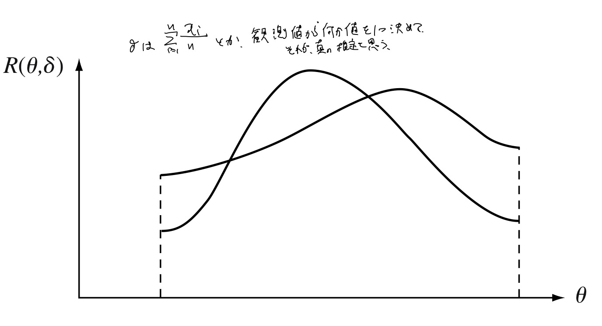

## 1. The General Decision Problem

## 1.1 Statistical Inference and Statistical Decisions

* $$(\Omega, \mathcal{F}, P)$$,
    * 確率空間
    * 本では$\Omega$はパラメータの空間に使われている
* $(\mathcal{X}, \mathcal{A})$
    * 可測空間
* $\Theta$
    * parameter space
    * パラメータの空間
    * 本では$\Omega$が使われている
* $X$
    * 真の確率変数
* $P_{X}$
    * $X$の分布
* $$P_{\theta}$$,
    * $X$の分布の探索空間
    * $\theta \in \Theta$
    * $$P_{X} = P_{\theta}$$となるようにするかもしくは仮定する
* $D$
    * 行動の全体
* $\delta$
    * 行動指針
* $L(\theta, \delta)$

### Remark
以下はWaldによる統計的決定問題(statistical decision problem)の定義。

* $$(\Omega, \mathcal{F}, P)$$,
    * 確率空間
* $$(\mathcal{X}, \mathcal{A})$$,
    * 可測空間
    * sample space, 標本空間
* $$X: \Omega \rightarrow \mathcal{X}$$,
    * 確率変数
* $$\mathcal{P} := \{P_{\theta}\}_{\theta \in \Theta}$$,
    * $(\mathcal{X}, \mathcal{A})$上の確率分布の族
* $$(D, \mathcal{B})$$,
    * 可測空間
    * decision space, action space, 決定空間、行動空間
* $$L: \Theta \times D \rightarrow \mathbb{R}_{\ge 0}$$,
    * $\forall \theta \in \Theta$について、$L(\theta, \cdot)$が$\mathcal{D}$可測
    * loss function, 損失関数
* $\delta: \mathcal{X} \rightarrow D$
    * 可測写像
    * nonrandomized decision function, 非確率的決定関数
* $\delta: D \times \mathcal{X} \rightarrow [0, 1]$
    * $\forall x \in \mathcal{X}$について$\delta(\cdot \mid x)$は$$(D, \mathcal{B})$$上の確率測度
    * $\forall B \in \mathcal{B}$について$\delta(B \mid \cdot)$は$\mathcal{A}$可測
    * randomized decision function
    * nonrandomized decision functionより一般的
* $$\Delta$$,
    * nonrandomizedかrandomized　decision functionの族

$$(\mathcal{X}, \mathcal{A}, \mathcal{P}, \Theta, D, \mathcal{B}, L, \Delta)$$を統計的決定問題という。

以下の例を考えよう。

* $$X_{1}, \ldots, X_{n}$$,
    * ある確率分布に従う確率変数
    * 同分布かも不明
* $$x_{1}, \ldots, x_{n}$$,
    * $X_{i}$の観測値
* $\mu$
    * $X_{1}$の平均、存在は仮定

上記の元$\mu$を推定する問題を考える。
平均の推定としてい例えば以下のような方法が考えられる。

1. $$t_{1} := x_{1}$$,
    * $X_{1}$の観測値を平均だと思う
2. $$t_{2} := \sum_{i=1}^{n} x_{j} / n$$,
    * $X_{i}$の観測値の算術平均を平均だと思う
3. $$t_{3} := x_{n}$$,
    * $X_{n}$の観測値を平均だと思う

これらは、観測値に基づく推定方法である。
観測値に基づく推定方法ではたまたま$\mu$に近くなることはありうるので、意味がない。
推定方法の良し悪しについては、推定量に対して比較をする。
つまり関数の一点で議論するのではなく、関数全体に対してその方法の良し悪しを議論する。
上記の観測値に基づく方法は、自然に以下の推定量を導くことができる。

1. $$T_{1}(\omega) := X_{1}(\omega) = \delta_{1}(x_{1}, \ldots, x_{n}) := x_{1}$$,
2. $$T_{2}(\omega) := \sum_{i=1}^{n} X_{j}(\omega) / n = \delta_{2}(x_{1}, \ldots, x_{n}) := \sum_{i=1}^{n} x_{j} / n$$,
3. $$T_{3}(\omega) := X_{n}(\omega) = \delta_{3}(x_{1}, \ldots, x_{n}) := x_{n}$$,

i.i.d.であれば2が分散最良の推定量となることが分かるが、一般の場合には必ずしもそうではない。

これを例に統計的決定問題を考える。
まず、sample spaceを$$(\mathcal{X}, \mathcal{A}) := (\mathbb{R}^{n}, \mathcal{B}(\mathbb{R}^{n}))$$とする。
確率分布族として

$$
    \mathcal{P}_{1}
    :=
    \left\{
        P_{*}^{n}
        \mid
        P_{*}^{n} \text{: prob. measure over } \mathbb{R}^{n},
        \
        \int x^{2}\ P(dx) < \infty
    \right\}
$$

を考える。
$P \in \mathcal{P}_{1}$は$$X_{1}, \ldots, X_{n}$$の同時分布を与える。
また$$\mathcal{P}_{1}$$の添字$\Theta$を考えて$$\mathcal{P}_{1} = \{P_{\theta} \mid \theta \in \Theta\}$$とかけるとする。
$\Theta$がparameter spaceとなる。
decision spaceは平均値の全体なので、$$(D, \mathcal{B}) := (\mathbb{R}, \mathcal{B}(\mathbb{R}))$$とする。
$$\Delta := \{T_{1}, T_{2}, T_{3} \}$$は$D$に値を取る非確率的決定関数の族である。
損失関数を

$$
\begin{eqnarray}
    \theta \in \Theta,
    \
    a \in D,
    \
    L(\theta, a)
    & := &
        (a - \mu_{1}(P_{\theta}))^{2}
    \nonumber
    \\
    P_{\theta}^{1}(A)
    & := &
        \int_{A \times \mathbb{R}^{n-1}} \ P(dy_{1}, \ldots, dy_{n})
    \nonumber
    \\
    \mu_{1}(P_{\theta})
    & := &
        \int y\ P_{\theta}^{1}(dy)
    \nonumber
\end{eqnarray}
$$

で定義する。
$\mu_{1}(P_{\theta})$は$P_{\theta}$の下での$X_{1}$の周辺分布の平均値である。
risk functionは

$$
    \forall \theta \in \Theta,
    \
    \delta \in \Delta,
    \
    R(\theta, \delta)
    :=
    \int L(\theta, \delta(y_{1}, \ldots, y_{n})\ P_{\theta}(dy_{1}, \ldots, dy_{n})
$$

となる。
loss functionの定義からrisk functionは$P_{\theta}$の下での$\delta$の分散となる。
つまり、

$$
\begin{eqnarray}
    \forall \theta \in \Theta,
    \
    \delta \in \Delta,
    \
    R(\theta, \delta)
    & = &
        \int
            (\delta - \mu_{1}(P_{\theta}))^{2}
        \ P_{\theta}(dy_{1}, \ldots, dy_{n})
\end{eqnarray}
$$

である。
上記の統計的決定問題を考えれば、risk funcitonを最小にする推定量は分散最小の推定量ということになる。

$$
\begin{eqnarray}
    \forall \theta \in \Theta,
    \
    R(\theta, T_{1})
    & = &
        \int
            (y_{1}- \mu_{1}(P_{\theta}))^{2}
        \ P_{\theta}(dy_{1}, \ldots, dy_{n})
    \nonumber
    \\
    & = &
        \mathrm{Var}_{P_{\theta}}
        \left[
            X_{1}
        \right]
    \nonumber
    \\
    R(\theta, T_{3})
    & = &
        \int
            (y_{n}- \mu_{1}(P_{\theta}))^{2}
        \ P_{\theta}(dy_{1}, \ldots, dy_{n})
    \nonumber
    \\
    & = &
        \int
            (y_{n}- \mu_{1}(P_{\theta}))^{2}
        \ P_{\theta}^{n}(dy_{n})
    \nonumber
    \\
    R(\theta, T_{2})
    & = &
        \int
            \left(
                \sum_{i=1}^{n}
                    \frac{y_{i}}{n}
                -
                \mu_{1}(P_{\theta})
            \right)^{2}
        \ P_{\theta}(dy_{1}, \ldots, dy_{n})
\end{eqnarray}
$$

となる。
一方、$$\mathcal{P}_{2}$$を

$$
    \mathcal{P}_{2}
    :=
    \left\{
        (P_{*})^{n}
        \mid
        P_{*} \text{: prob. measure over } \mathbb{R},
        \
        \int_{\mathbb{R}} x^{2}\ P(dx) < \infty
    \right\}
$$

と定義する。
$$X_{1}, \ldots, X_{n}$$の同時分布を1次元の分布の$n$個の直積として定義する。
つまり、同分布とすると、risk functionは以下のようになる。

$$
\begin{eqnarray}
    \forall \theta \in \Theta_{2},
    \
    R(\theta, T_{1})
    & = &
        \int
            (y_{1}- \mu_{1}(P_{\theta}))^{2}
        \ P_{\theta}(dy_{1}, \ldots, dy_{n})
    \nonumber
    \\
    & = &
        \mathrm{Var}_{P_{\theta}}
        \left[
            X_{1}
        \right]
    \nonumber
    \\
    R(\theta, T_{3})
    & = &
        \int
            (y_{n}- \mu_{1}(P_{\theta}))^{2}
        \ P_{\theta}(dy_{1}, \ldots, dy_{n})
    \nonumber
    \\
    & = &
        \mathrm{Var}_{P_{\theta}}
        \left[
            X_{1}
        \right]
    \nonumber
    \\
    R(\theta, T_{2})
    & = &
        \int
            \left(
                \sum_{i=1}^{n}
                    \frac{y_{i}}{n}
                -
                \mu_{1}(P_{\theta})
            \right)^{2}
        \ P_{\theta}(dy_{1}, \ldots, dy_{n})
    \nonumber
    \\
    & = &
        \frac{1}{n^{2}}
        \left(
            \sum_{i=1}^{n}
                \mathrm{Var}_{P_{\theta}}
                \left[
                    X_{i}
                \right]
            +
            2
            \sum_{i=1}^{n}
                \sum_{j=i+1}^{n}
                    \mathrm{Cov}
                    \left[
                        X_{i}, X_{j}
                    \right]
        \right)
    \nonumber
    \\
    & = &
        \frac{1}{n}
        \mathrm{Var}_{P_{\theta}}
        \left[
            X_{1}
        \right]
        +
        \frac{2}{n^{2}}
        \sum_{i=1}^{n}
            \sum_{j=i+1}^{n}
                \mathrm{Cov}
                \left[
                    X_{i}, X_{j}
                \right]
\end{eqnarray}
$$

となる。
更に、独立同分布であれば、risk functionが最小のものが分散最小になることも分かる。

■

大まかにいえば、Statistical Infereceとは、$X$の分布についての情報を観測されるものから得る方法のことを指す。
もしくは、$X$の分布を決定する$\theta$を観測されたものから得る方法である。

$X$の分布が未知の時に、統計的な分析が必要となる。
$X$の分布が未知の場合には、$X$に対する最良の行動を決定することはできない。
この行動の決定問題は次のように数学的に考えることができる。

我々は、$X$に影響を受ける幾つかの行動の選択肢を持っているとする。
$X$の観測は$X$の分布に対する情報を与えると共に、$X$に対する行動を決める指針にもなり得るだろう。
行動の決定問題は、$X$の観測値から取るべき行動を具体化することに他ならない。
観測値から行動への関数を$\delta$として定義する。
$X$の一つの観測値が$x$とするならば、行動$d$は$d := \delta(x)$として表現される。
$\delta$は観測値から行動を決定する為に、一つのruleを定める。

$\delta$がどのように選ばれるべきかを見るためには、異なる行動$d$をとった場合に得られる結果と比較する必要がある。
これを考えるにあたって、$X$の分布が$P_{\theta}$とした時に、ある行動$d$を取ったときのLossを$L(\theta, d)$としてかく。
$L(\theta, d)$は、非負値の関数である。
つまり、$X$の分布を$\theta$と思って、$d$で行動した時に発生する損失を表現する。
$L$は確率的な損失を表すから、平均的な損失については$L$の期待値によって、$R(\theta, \delta) := \mathrm{E}[L(\theta, \delta(X))]$と定義する。
$R(\theta, \delta)$は、risk functionと呼ばれる。
$d$の決定は、$L(\theta, d)$によって決まり、$\delta$の決定は$R(\theta, \delta)$で決まる。

## 1.2 Specification of a Decision Problem
統計的な問題を考えるにあたって以下の3つを決める必要がある。

* $$\mathcal{P} := \{P_{\theta} \mid \theta \in \Theta\}$$,
    * $X$の分布の候補のクラス
    * ある$\theta$について、$$P_{X} = P_{\theta}$$を仮定する
* $D$
    * 行動の全体
    * $d \in D$が行動
* $L$
    * loss function

まず$\mathcal{P}$を考える。
仮定としては以下が良く考慮される。

* 確率や確率分布についての数値的な仮定は置かない。
* 確率が等しいことや観測している確率変数が独立であるということが良くに仮定される。
* 極限をとったときの確率についての挙動
    * 極限をとれば0になるなど

$X$が二項分布に従う場合を例に考える。
つまり、真のパラメータ$$(n_{0}, p_{0})$$が存在して、

$$
\begin{equation}
    P(X = x)
    =
    \left(
        \begin{array}{c}
            n_{0} \\
            x
        \end{array}
    \right)
    p_{0}^{x}
    (1 - p_{0})^{n_{0} - x},
    \label{chap01_1_1_true_binomial_pdf}
\end{equation}
$$

とかけるとする。
$b(n, p)$を二項分布の分布とする。
つまり、

$$
    \forall n \in \mathbb{N},
    \
    0 \le p \le 1,
    \
    \forall x = 0, \ldots, n,
    \
    b(n, p)(x)
    :=
    P(X \le x)
$$

である。
このとき、$\Theta$や$\mathcal{P}$は以下のように考えることができる。

* $\Theta := \mathbb{N} \times [0, 1]$
* $$\mathcal{P} := \{b(n, p) \mid  (n, p) \in \Theta \}$$,

また、同様に$n$については先験的に分かっているとすれば

* $\Theta := [0, 1]$
* $$\mathcal{P} := \{b(n_{0}, p) \mid  p \in \Theta \}$$,

となる。
上の例から分かるように、何をパラメータとするかどうかは恣意的に決まることに注意する。

また、別の例としてポアソン分布の場合を考える。
つまり、$X$の真のパラメータ$\tau_{0}$とすれば

$$
\begin{equation}
    P(X = x)
    =
    \frac{
        \tau_{0}^{x}
    }{
        x!
    }
    e^{-\tau_{0}},
    \label{chap01_1_2_true_poisson_pdf}
\end{equation}
$$

とする。
$P(\tau)$をポアソン分布の分布とすれば、

$$
    \forall \tau > 0,
    \
    \forall x = 0, 1, \ldots, 
    \
    P(\tau)(x)
    :=
    \frac{
        \tau^{x}
    }{
        x!
    }
    e^{-\tau},
$$

である。
同様に、$\Theta$や$\mathcal{P}$は以下のように考えることができる。

* $\Theta := (0, \infty)$
* $$\mathcal{P} := \{P(\tau) \mid  \tau \in \Theta \}$$,

ポアソン分布は、

* ある区間の間に起こる事象の発生回数を表現するのに良く使われる。

また、別の例として正規分布の場合を考える。
つまり、$X$の真のパラメータ$\mu_{0}, \sigma_{0}$とすれば

$$
\begin{eqnarray}
    p(x)
    & := &
        \frac{
            1
        }{
            \sqrt{2\pi}
            \sigma_{0}
        }
        \exp
        \left(
            -
            \frac{
                1
            }{
                2\sigma_{0}^{2}
            }
            (x - \mu_{0})^{2}
        \right)
    \label{chap01_1_3_true_normal_pdf}
    \\
    F(x)
    & := &
        \int_{-\infty}^{x} 
            \frac{
                1
            }{
                \sqrt{2\pi}
                \sigma_{0}
            }
            \exp
            \left(
                -
                \frac{
                    1
                }{
                    2\sigma_{0}^{2}
                }
                (y - \mu_{0})^{2}
            \right)
        \ dy
    \nonumber
\end{eqnarray}
$$

を確率密度関数とする
$\mathrm{N}(\mu, \sigma)$を正規分布の分布とすれば、

$$
    \forall \mu \in (-\infty, \infty)
    \
    \forall \sigma \in (0, \infty)
    \
    \forall x \in (-\infty, \infty), 
    \
    \mathrm{N}(\mu, \sigma)(x)
    :=
    \int_{-\infty}^{x} 
        \frac{
            1
        }{
            \sqrt{2\pi}
            \sigma
        }
        \exp
        \left(
            -
            \frac{
                1
            }{
                2 \sigma^{2}
            }
            (y - \mu)^{2}
        \right)
    \ d y
$$

である。
同様に、$\Theta$や$\mathcal{P}$は以下のように考えることができる。

* $\Theta := \mathbb{R} \times (0, \infty)$
* $$\mathcal{P} := \{\mathrm{N}(\mu, \sigma) \mid  (\mu, \sigma) \in \Theta \}$$,

次にDecisionの空間$D$について考える。

### Example 1.2.1
* $$X_{1}, \ldots, X_{n}$$,
    * $$\eqref{chap01_1_1_true_binomial_pdf}$$-$$\eqref{chap01_1_3_true_normal_pdf}$$のいずれかの分布のi.i.d.
    * 例として$$\eqref{chap01_1_3_true_normal_pdf}$$の場合を考える。
* $\theta$
    * $$\eqref{chap01_1_1_true_binomial_pdf}$$の時は$p$
    * $$\eqref{chap01_1_2_true_poisson_pdf}$$の時は$\tau$
    * $$\eqref{chap01_1_3_true_normal_pdf}$$の時は$(\mu, \sigma)$
* $\gamma(\theta)$
    * $\mathbb{R}$値の関数
    * 本でこのような表記をしているのは、分布を上記3つのどれかとしているので、パラメータは離散値だったり、連続値だったりする細かい問題に対処する為。

#### (i) Two-decision problem or Testing a hypothesis
$\gamma(\theta)$の値がある値$\gamma_{0}$を超えているかいないかでdecisionを決定する。

* $$\mathcal{X}_{1}, \mathcal{X}_{2}$$,
    * $$\mathcal{X}$$の分割
* $$D := \{d_{0}, d_{1}\} = \{0, 1\}$$,
* $$\Theta \subseteq \mathbb{R}^{p}$$,
* $$A_{0}, A_{1}$$,
    * $$\Theta$$の分割

$$
    x \in \mathcal{X},
    \
    \delta(x_{1}, \ldots, x_{n})
    :=
    d_{0}
    1_{\mathcal{X}_{1}}(x)
    +
    d_{1}
    1_{\mathcal{X}_{2}}(x)
$$

二択の決定問題。
$d_{0}$なら採択、$$d_{1}$$なら非採択など。
検定もこのクラスの問題に属する。

$$
    L(\theta, d)
    :=
    \begin{cases}	
        1_{\{d_{0}\}}(d) & (\theta \in A_{0})\\
        1_{\{d_{1}\}}(d) & (\theta \in A_{1})
    \end{cases}
$$

#### (ii) Testing Point Estimate
点推定。
パラメータの推定の問題。

* $$D \subseteq \mathbb{R}^{d}$$,
    * 凸Borel集合くらいの条件をかす
* $\delta: \mathcal{X} \rightarrow D$
    * 何かしらの推定量
    * $$x_{1}, \ldots, x_{n}$$を観測値とすれば、$$\delta(x_{1}, \ldots, x_{n}) = \sum_{i=1}^{n}x_{i}/n$$などにあたる
* $L$
    * 凸関数くらいの条件を課す

例えば、$\theta$が正規分布の平均値であるとすれば$L$は以下のように定義できる。

$$
    L(\theta, d)
    :=
    |d - \theta|^{2}
$$

#### (iii) Multiple Decision Procedure
(i)を一般化した問題。
二択の決定問題から、n択の決定問題。
$\theta$の値がある部分集合に属しているかいないかでdecisionを決定する。

* $$\mathcal{X}_{1}, \mathcal{X}_{2}, \ldots, \mathcal{X}_{n}$$,
    * $\mathcal{X}$の分割
* $$D := \{d_{0}, d_{1}, \ldots, d_{n}\} = \{0, 1, \ldots, n\}$$,
* $\Theta \subseteq \mathbb{R}^{p}$
* $A_{0}, \ldots, A_{n}$
    * $\Theta$の分割

$$
    \forall x \in \mathcal{X},
    \
    \delta(x)
    :=
    \sum_{i=0}^{n}
        d_{i} 
        1_{\mathcal{X}_{i}}(x)
$$

損失関数は例えば以下のようになる。

$$
    L(\theta, d)
    :=
    \begin{cases}	
        1_{\{d_{0}\}}(d)
            & (\theta \in A_{0})
        \\
        1_{\{d_{1}\}}(d)
            & (\theta \in A_{1})
        \\
        \vdots
            & 
        \\
        1_{\{d_{n}\}}(d)
            & (\theta \in A_{n})
    \end{cases}
$$

■

### Example 1.2.2
* $s$
    * sampleの数
* $\mathrm{N}(\mu_{i}, \sigma^{2})$
    * $i = 1, \ldots, s$
* $$X_{i,j}$$, $\forall i = 1, \ldots, s$, $\forall j = 1, \ldots, n_{i}$
    * $i$番目のsampleの$j$個目のi.i.d.

#### (i)
* $s = 2$
* 2つの平均の差

$$
    \delta(\theta)
    :=
    d_{0}
    1_{\{|\mu_{2} - \mu_{1}| \le \Delta\}}
    +
    d_{1}
    1_{\{\mu_{2} - \mu_{1} > \Delta\}}
    +
    d_{2}
    1_{\{\mu_{1} - \mu_{2} > \Delta\}}
$$

$$
    \delta(\theta)
    :=
    d_{0}
    1_{\{\max_{i,j = 1, \ldots, s}|\mu_{i} - \mu_{j}| \le \Delta\}}
    +
    d_{1}
    1_{\{\max_{i,j = 1, \ldots, s}|\mu_{i} - \mu_{j}| > \Delta\}}
$$

#### (ii)
平均$\mu_{i}$の大きい順番に並べる問題

#### (iii)
$\mu_{0}$が与えられたとする。
$\mu_{0}$を超える平均が存在するかを判定する問題。

■

### Example 1.2.3
* $$P(\tau_{1}), P(\tau_{2})$$,
    * ポアソン分布
    * $$\tau_{1} < \tau_{2}$$であることは既知
* $$Z_{1}, \ldots, Z_{n}$$,
    * $P(\tau_{1})$か$P(\tau_{2})$のどちらか一方のi.i.d.列

loss functionは$$P(\tau_{1}), P(\tau_{2})$$のどちらかかを正しく分類できなかった回数。

■

今までの例は全てaction problemsと言われる問題である。
$\theta$を与えると一意なdecisiton $d$が存在し、$L(\theta, d) = 0$となることが仮定されている。
しかし、全ての統計的な問題にそのような仮定ができるわけではない。

### Example 1.2.4
* $$X_{1}, \ldots, X_{n}$$,
    * $$\mathrm{N}(\mu, \sigma^{2})$$,のi.i.d.
* $k \in \mathbb{R}$
    * 事前に決定する値
* $\underline{L}, L \in \mathbb{R}$
    * $\underline{L} < L$
    * $\mu \in [\underline{L}, L]$

■

最後にLoss functionについて述べる。
Example 1.2.1(i)を例に考える。

$$
    L(\theta, d_{0}) 
    =
    \begin{cases}	
        a & \gamma(\theta) \le \gamma_{0} \\
        b & \gamma(\theta) > \gamma_{0}
    \end{cases}
$$

さらに

$$
\begin{equation}
    R(\theta, \delta)
    :=
    \begin{cases}	
        a P_{\theta}(\delta(X) = d_{0}) & \gamma(\theta) \le \gamma_{0} \\
        b P_{\theta}(\delta(X) = d_{1})  & \gamma(\theta > \gamma_{0} 
    \end{cases}
    \label{chap01_1_4_risk_function}
\end{equation}
$$

となる。

Loss functionを上のように単純にかける場合はまれである。
多くの場合は数学的な簡単さの為に慣習的なものを使う。
Example 1.2.1(ii)のようなPoint Estimationの問題では、二乗誤差に比例する形のものを選ぶ場合が多い。

$$
    L(\theta, d)
    :=
    v(\theta)
    (d - \gamma(\theta))^{2}
$$

ここで$v$は$\theta$の適当な関数である。
この場合$L$は二階微分可能性と正しい$\theta$を選んだ場合に$L(\theta, \gamma(\theta)) = 0$が成立する。

m

$$
\begin{equation}
    \mathrm{E}
    \left[
        L_{1}(\theta, \delta(X))
    \right]
    \le
    \alpha,
    \label{chap01_1_6_risk_function_inequality}
\end{equation}
$$

## 1.3 Randomizations: Choice of Experiment

### Motivation of Randomizations
Randomizationの一つの動機は以下の例から分かる。

コイン投げの検定を考える。
コインが確率$p$で表、$1-p$の確率で裏になると仮定しよう。
帰無仮説を$p = 1/2$とし、対立仮説を$p > 1/2$とする。
検定の有意水準を$\alpha = 0.05$とすれば、帰無仮説の下に20回中14回表と15回表にになる確率は

$$
\begin{eqnarray}
    \sum_{k=14}^{20}
        \left(
            \begin{array}{c}
                20 \\
                k
            \end{array}
        \right)
        \left(
            \frac{1}{2}
        \right)^{20}
    & \approx &
        0.05777
    \nonumber
    \\
    \sum_{k=15}^{20}
        \left(
            \begin{array}{c}
                20 \\
                k
            \end{array}
        \right)
        \left(
            \frac{1}{2}
        \right)^{20}
    & \approx &
        0.0207
    \label{chap01_randomization_example_siginificant_level_for_15}
\end{eqnarray}
$$

となる。
14回の時は棄却できないが、15回では棄却されることになる。
しかし、この2つの間には大きな開きがある。
丁度有意水準0.05となるような表の出る回数を考えることはできるだろうか。
その為に、14回の場合については、確率$\phi$で棄却し、確率$1-\phi$で採択するという検定を考える。

$$
\begin{eqnarray}
    & &
        \phi
        \sum_{k=14}^{20}
            \left(
                \begin{array}{c}
                    20 \\
                    k
                \end{array}
            \right)
            \left(
                \frac{1}{2}
            \right)^{20}
        +
        (1 - \phi)
        \sum_{k=15}^{20}
            \left(
                \begin{array}{c}
                    20 \\
                    k
                \end{array}
            \right)
            \left(
                \frac{1}{2}
            \right)^{20}
        =
        0.05
    \nonumber
    \\
    & \Leftrightarrow &
        \phi
        \left(
            \begin{array}{c}
                20 \\
                14
            \end{array}
        \right)
        \left(
            \frac{1}{2}
        \right)^{20}
        +
        \sum_{k=15}^{20}
            \left(
                \begin{array}{c}
                    20 \\
                    k
                \end{array}
            \right)
            \left(
                \frac{1}{2}
            \right)^{20}
        =
        0.05
    \nonumber
\end{eqnarray}
$$

となる。

検定問題も統計的決定問題と見做せることをこの例を用いて示そう。
後で述べるが統計的決定問題としての解釈はあまり有用でないが、検定においてもloss functionやrisk functionが存在しており、推定と検定は理論的に(有用であるかは別として）一貫したものであることがわかる。
まず、一般の検定問題に対する統計的決定問題としての解釈を示す。
その後、実際の問題に対する例として、上記の例がどのように定式化されるかを示す。

* $$(\Omega, \mathcal{F})$$,
    * 確率空間
* $$X: \Omega \rightarrow \mathcal{X}$$,
    * 観測している確率変数
* $$(\mathcal{X}, \mathcal{A})$$,
    * 確率変数が値をとる空間
* $$\Theta$$,
* $$\Theta_{1}, \Theta_{2}$$,
    * $$\Theta$$の分割
* $$\mathcal{P} := \{P_{\theta} \mid \theta \in \Theta\}$$,
* $$D := \{ 0, 1\}$$,
    * 0の時に帰無仮説を採択、1の時に帰無仮説を棄却する。
* $\phi: \mathcal{X} \rightarrow [0, 1]$
    * 可測関数
    * test or test functionという

確率的決定関数$$\delta_{\phi}: D \times \mathcal{X} \rightarrow D$$とloss functionは以下のようになる。

$$
\begin{eqnarray}
    \delta_{\phi}(dz \mid x)
    & := &
        \phi(x) \epsilon_{1}(dz)
        +
        (1 - \phi(x)) \epsilon_{0}(dz)
    \nonumber
    \\
    L(\theta, d)
    & := &
        \begin{cases}	
            1_{\{1\}}(d) & (\theta \in \Theta_{0}) \\
            1_{\{0\}}(d) & (\theta \in \Theta_{1})
        \end{cases}
    \nonumber
\end{eqnarray}
$$

risk functionは

$$
\begin{eqnarray}
    R(\theta, \delta_{\phi})
    & := &
        \int_{\mathcal{X}}
            \int_{D} 
                L(\theta, z)
            \ \delta_{\phi}(dz \mid x)
        \ P_{\theta}(d x)
    \nonumber
    \\
    & = &
        \int_{\mathcal{X}}
            \int_{D} 
                L(\theta, z)
                \phi(x) \epsilon_{1}(dz)
        \ P_{\theta}(d x)
        +
        \int_{\mathcal{X}}
            \int_{D} 
                L(\theta, z)
                (1 - \phi(x)) \epsilon_{0}(dz)
        \ P_{\theta}(d x)
    \nonumber
    \\
    & = &
        \begin{cases}	
            \int_{\mathcal{X}}
                \int_{D} 
                    1_{\{1\}}(z)
                    \phi(x) \epsilon_{1}(dz)
            \ P_{\theta}(d x)
            +
            \int_{\mathcal{X}}
                \int_{D} 
                    1_{\{1\}}(z)
                    (1 - \phi(x)) \epsilon_{0}(dz)
            \ P_{\theta}(d x)
            &
                (\theta \in \Theta_{0})
            \\
            \int_{\mathcal{X}}
                \int_{D} 
                    1_{\{0\}}(z)
                    \phi(x) \epsilon_{1}(dz)
            \ P_{\theta}(d x)
            +
            \int_{\mathcal{X}}
                \int_{D} 
                    1_{\{0\}}(z)
                    (1 - \phi(x)) \epsilon_{0}(dz)
            \ P_{\theta}(d x)
            &
                (\theta \in \Theta_{1}) 
        \end{cases}
    \nonumber
    \\
    & = &
        \begin{cases}	
            \int_{\mathcal{X}}
                    \phi(x)
            \ P_{\theta}(d x)
            &
                (\theta \in \Theta_{0})
            \\
            \int_{\mathcal{X}}
                    (1 - \phi(x))
            \ P_{\theta}(d x)
            &
                (\theta \in \Theta_{1}) 
        \end{cases}
    \nonumber
    \\
    & = &
        \begin{cases}	
            \mathrm{E}_{\theta}
            \left[
                \phi
            \right]
            &
                (\theta \in \Theta_{0})
            \\
            1
            -
            \mathrm{E}_{\theta}
            \left[
                \phi
            \right]
            &
                (\theta \in \Theta_{1}) 
        \end{cases}
    \nonumber
\end{eqnarray}
$$

で、ここで$$\epsilon_{a}$$は$a$に重みを持つDirac's delta measureである。
有意水準$\alpha$の検定全体$$\phi_{\alpha}$$を

$$
    \phi_{\alpha}
    :=
    \{
        \phi: \text{ test function }
        \mid
        \sum_{\theta \in \Theta_{0}}
            R(\theta, \delta_{\phi})
        \le
        \alpha
    \}
$$

と定義する。
上記が一般の検定問題に対する統計的決定問題としての解釈である。

この枠組みの下、先程の例を定式化する。

* $$(\Omega, \mathcal{F}) := (\{\mathrm{H} , \mathrm{T}\}^{20}, 2^{\mathcal{X}})$$,
    * Hは表、Tは裏を表す
* $$X(\omega) := \#\{i \mid \omega_{i} = H\}$$,
    * 表の出た回数
* $$(\mathcal{X}, \mathcal{A}) := (\{0, \ldots, 20\}, 2^{\mathcal{X}})$$,
* $$\Theta := [1/2, 1]$$,
* $$\Theta_{0} := \{1/2\}, \Theta_{1} := (1/2, 1]$$,
    * $$\Theta$$の分割

$$
\begin{eqnarray}
    p \in \Theta,
    \
    y \in \mathcal{X},
    \
    f(y; p)
    & := &
        \left(
            \begin{array}{c}
                20 \\
                y
            \end{array}
        \right)
        p^{y}
        (1 - p)^{20 - y}
    \nonumber
    \\
    A \in \mathcal{A}
    \
    P_{p}(A)
    & := &
        \sum_{y \in A}
            f(y; p)
    \nonumber
    \\
    \mathcal{P}
    & := &
        \{P_{p} \mid p \in \Theta\}
    \nonumber
\end{eqnarray}
$$

* $$D := \{ 0, 1\}$$,
    * 0の時に帰無仮説を採択、1の時に帰無仮説を棄却する。

$\phi:\mathcal{X} \rightarrow [0, 1]$を検定関数とする。
確率的決定関数は、

$$
    x \in \mathcal{X},
    \
    \delta_{\phi}(dz \mid x)
    :=
    \phi(y)
    \epsilon_{1}(dz)
    +
    (1 - \phi(x))
    \epsilon_{0}(dz)
$$

$$
    L(\theta, d)
    :=
    \begin{cases}	
        1_{\{1\}}(d) & (\theta \in \Theta_{0}) \\
        1_{\{0\}}(d) & (\theta \in \Theta_{1})
    \end{cases}
$$

$$
    R(\theta, \delta_{\phi})
    =
    \begin{cases}	
        \mathrm{E}_{\theta}
        \left[
            \phi
        \right]
        &
            (\theta \in \Theta_{0})
        \\
        1
        -
        \mathrm{E}_{\theta}
        \left[
            \theta
        \right]
        &
            (\theta \in \Theta_{1}) 
    \end{cases}
$$

となる。
まず、Randomizationのない場合の検定を考える。
有意水準$\alpha$の検定$\phi$は

$$
    \theta \in \Theta_{0},
    \
    E_{\theta}[\phi]
    \le
    \alpha
$$

となる$\phi$である。
$$\Theta_{0} = \{1/2\}$$より、$\phi$として$$\phi(x; n) := 1_{\{n, \ldots, 20\}}(x)$$の形のものだけを考えれば、

$$
\begin{eqnarray}
    E_{\theta}[\phi]
    & = &
        \int_{\mathcal{X}}
            \phi(x)
            f(x; 1/2)
        \ d x
    \nonumber
    \\
    & = &
        \int_{\mathcal{X}}
            1_{\{n, \ldots, 20\}}(x)
            f(x; 1/2)
        \ d x
    \nonumber
    \\
    & = &
        \int_{\{n, \ldots, 20\}}
            f(x; 1/2)
        \ d x
    \nonumber
    \\
    & = &
        \sum_{i=n}^{20}
            f(i; 1/2)
    \nonumber
\end{eqnarray}
$$

となる。
$n$は有意水準を満たすように選ぶ。
つまり、$\alpha = 0.05$とすれば、

$$
\begin{eqnarray}
    & &
        \sum_{i=n}^{20}
            f(i; 1/2)
        \le
        \alpha
    \nonumber
    \\
    & \Leftrightarrow &
        n = 15
    \nonumber
\end{eqnarray}
$$

となる。
第二式は、$$\eqref{chap01_randomization_example_siginificant_level_for_15}$$より分かる。

次に、Randomizationのある場合の検定を考える。
$n = 0, \ldots, 20$, $p \in [0, 1]$とし、$\phi$として$$\phi(x; n, p) := p1_{\{n, \ldots, 20\}}(x) +  (1-p)1_{\{n + 1, \ldots, 20\}}(x)$$の形のものだけを考えれば、上と同様に

$$
\begin{eqnarray}
    E_{\theta}[\phi]
    & = &
        \int_{\mathcal{X}}
            \phi(x)
            f(x; 1/2)
        \ d x
    \nonumber
    \\
    & = &
        p
        \sum_{i=n}^{20}
            f(i; 1/2)
        +
        (1-p)
        \sum_{i=n+1}^{20}
            f(i; 1/2)
    \nonumber
\end{eqnarray}
$$

$n, p$は有意水準を満たすように選ぶ。
つまり、$\alpha = 0.05$とすれば、$p \in [0, 1]$と$$\sum_{i=n}^{20} f(i; 1/2)$$が$n$に関して単調であることから

$$
\begin{eqnarray}
    & &
        p
        \sum_{i=n}^{20}
            f(i; 1/2)
        +
        (1-p)
        \sum_{i=n+1}^{20}
            f(i; 1/2)
        \le
        \alpha
    \nonumber
    \\
    & \Leftrightarrow &
        n = 14,
        \quad
        p
        =
        \frac{
            \alpha
            -
            \sum_{i=n+1}^{20}
                f(i; 1/2)
        }{
            \sum_{i=n}^{20}
                f(i; 1/2)
            -
            \sum_{i=n+1}^{20}
                f(i; 1/2)
        }
    \nonumber
\end{eqnarray}
$$

となる。
上記の定式化から明らかであるが、検定問題においては、risk functionが真のパラメータの下での実現値の発生した確率を与えている。

■

今までの議論では、決定関数は非確率的であった。
より一般に確率的に決定する決定関数を考えることもできる。
この確率的な決定関数の分布は、観測値$x$に依存してきまる。

### Example 1.3.1
以下の例を考える。
パラメータ$\mu$を推定をしたい。

* $$X_{1}, \ldots, X_{N}$$,
    * $$X_{i} \sim \mathrm{N}(\mu, \sigma^{2})$$,

正規分布の分散が$\sigma^{2}$が同じで、平均が$\mu_{1}, \mu_{2}$と異なっている場合は、2つの正規分布の平均の差は$$\mu_{1} - \mu_{2}$$は$\sigma$に比例して区別ができなくなることが予想される。
その時risk functionは無限大になるだろう。
また、逆に$\sigma$が小さくなれば、2つの分布の平均の差も区別可能になることが予想される。
その時risk functionはゼロに近づく。

risk functionの値を制御するのに必要な観測値の数というのは一般には未知である。
観測数が増えれば、上記の設定では$\sigma$に関する情報が得られ、$\sigma$を推定することができる。
それに伴って、$\mu$を推定にするのに必要な観測値の数も決定することができるであろう。

■

### Example 1.3.2
確率$p$で起こる事象と$1-p$で起こらない事象がある場合を考える。
この時、$p \le 1/2$か$p > 1/2$かどうかを決定したいとする。

$p$が1か0に十分近いならどちらか一方の事象しか殆ど観測されないから、勘で推定するのは簡単である。
一方、1/2に近い場合は、大きなsample数が必要となる。

■

### Example 1.3.3
必要なsample sizeは実際の観測値にもとづいて決めることが重要。
例えば、$(\theta - 1/2, \theta + 1/2)$上の一様分布のparameter$\theta$を推定する問題を考える。
例えば、2つの観測値の差の最大値$$\max_{i, j}\|x_{i} - x_{j}\|$$が1に近い時は$\theta$に近いし、$$\max_{i,j}\|x_{i} - x_{j}\|$$が0に近い時は、全て同じような値を取っており、観測値としての情報があまりない可能性がある。

■

極単純な場合を除き、適切なsample sizeの決定は、実験の設計の問題である。
一般には、sample sizeだけでなく何を観測するかも重要な問題である。
医療における統計においては、新しい治療方法を標準的な方法と比較する時、2つの治療方法のうちどちらを、新しく来た患者に適用するかを具体化する必要がある場合がある。
形式的には、これらの問題は、一般的な決定問題として定式化できる。
$X$を全ての観測可能な変数として、実験の継続のコストをloss functionに含め、実験をやめるかどうかを決定する問題として考えることができる。

## 1.4 Optimum Procedures
Section 1.1で統計理論の目的は、decision function $\delta$をrisk functionを最小にするように決めることと述べた。

$$
\begin{equation}
    R(\theta, \delta)
    :=
    \mathrm{E}_{\theta}
    \left[
        L(\theta, \delta(X))
    \right].
    \label{chap01_1_7_risk_function}
\end{equation}
$$

risk functionの最小化は$\theta$に依存している。
ある$\theta_{0}$の下では$d_{0}$が正しいdecisionだとすれば、$$L(\theta_{0}, d_{0}) = 0$$とすれば良いが、ほかの$\theta$の元では$L(\theta, \delta)$の値が大きくなる場合がある。
一般に全ての場合にうまくいく方法はないが、2つのよく使われる方法が知られている。

一つの方法は$\theta$について一様にrisk functionを最小にするようなdecision functionに限定する方法である。
これに関連して、invariance, unbiasednessの概念がある。
これらについては次の節に譲る。

もう一つの方法は、$$\delta_{1}, \delta_{2}$$の2つのdecision functionを考える。
もし$$R(\theta, \delta_{1}) < R(\theta, \delta_{2})\ \forall \theta$$であれば、明らかに$\delta_{1}$の方が好ましい。
このような場合は単純であるが、実際はFigure1.1.のような場合が多い。
この場合にどちらが良いかという規準を作る必要がある。
この方法については1.6節に譲る。

    
     
    Figure 1.1

risk functionの最小化でdecision functionを決める方法では、上記のような仮定が必要になる。
このような仮定は、数学の現実への応用で常に付きまとう問題である。
現実の問題で、上記の仮定と矛盾してないかというcheckは常に必要である。

risk functionの最小化で求めたdecision functionが適切なdecision functionというわけではないことを理解しておく必要がある。

riskの最小性に加えて、robustnessも同様に重要であるが、robustnessを考慮する形に拡張することができる。

model $\mathcal{P}$の設定方法も重要な問題で、問題ごとに適切に選ぶ必要がある。
複雑すぎるmodelより、よりsimpleなmodelの方が良い。
loss functionにmodelの複雑さを加えることで、この問題を考慮できる。
これに関連した研究については、Stone (1981), de Leeuw (1992) and Rao and Wu (2001)がある。

## 1.5 Invariance and Unbiasedness

### Example 1.5.1
* $$X_{1,1}, \ldots, X_{1,n}$$,
    * $$X_{1,j} \sim N(\mu_{1}, \sigma^{2})$$,
* $$X_{2,1}, \ldots, X_{2,n}$$,
    * $$X_{2,j} \sim N(\mu_{2}, \sigma^{2})$$,
* $$\Delta \in \mathbb{R}_{\ge 0}$$,
    * 平均の差
    * given
* $d_{0}$
    * $$\left|
        \mu_{2} - \mu_{1}
    \right| \le \Delta $$,
    * 2つの正規分布の平均の差が$\Delta$以下
* $d_{1}$
    * $$\mu_{2} - \mu_{1} > \Delta$$,
    * $$\mu_{2}$$が$$\mu_{1}$$より$\Delta$大きい
* $d_{2}$
    * $$\mu_{1} - \mu_{2} < \Delta$$,
    * $$\mu_{1}$$が$$\mu_{2}$$より$\Delta$大きい
* $$\Theta := \mathbb{R}^{2}$$,

loss functionは以下のように定義する。

$$
\begin{equation}
    (\mu_{1}, \mu_{2}) \in \Theta,
    \
    L((\mu_{1}, \mu_{2}), d_{i})
    :=
    \begin{cases}	
        \sum_{i=0}^{2}
            w_{0, j}
            1_{\{ d_{j} \}}(d_{i})
        &
            (|\mu_{2} - \mu_{1}| \le \Delta)
        \\
        \sum_{j=0}^{2}
            w_{1, j}
            1_{\{ d_{j} \}}(d_{i})
        &
            (\mu_{2} - \mu_{1} > \Delta)
        \\
        \sum_{j=0}^{2}
            w_{2, j}
            1_{ \{d_{j}\} }(d_{i})
        &
            (\mu_{1} - \mu_{2} > \Delta)
    \end{cases}
    \nonumber
\end{equation}
$$

$$w_{i,j} \in \mathbb{R}_{\ge 0}$$は真のパラメータが$$d_{i}$$の条件を満たすとき、$$d_{j}$$を選択したときのlossである。
多くの場合ある程度の対称性を仮定する。
例えば以下のような対称性が考えられる。

$$
    \sigma \in \mathfrak{S}_{2} \times \mathfrak{S}_{n},
    \
    \delta(x_{1, 1}, \ldots, x_{1,n}, x_{2,1}, \ldots, x_{2,n})
    =
    \delta(x_{\sigma(1, 1)}, \ldots, x_{\sigma(1,n)}, x_{\sigma(2, 1)}, \ldots, x_{\sigma(2, n)})
$$

この対称性の仮定は、観測値の順番によらないということである。
確率変数が独立であれば、このような仮定は成り立つ。

■

### Example 1.5.2
$\mu$を推定する問題を考える。
1 feet = 12 inch に注意。

* $f(x)$
    * 密度関数の条件(積分が1とか)を満たす何らかの関数
* $\sigma$
    * given
* $$X_{1}, \ldots, X_{n}$$,
    * $$g(x) := f((x - \mu) / \sigma) / \sigma$$を密度関数にもつとする。
    * $X_{i}$はfeetで観測されているとする
* $\Theta := \mathbb{R}$
* $D := \mathbb{R}$

loss functionは、$\sigma$で標準化した二乗誤差とする。

$$
    \mu in \Theta,
    \
    d \in D,
    \
    L(\mu, d)
    :=
    \frac{
        (d - \mu)^{2}
    }{
        \sigma
    }.
$$

一方、$$X_{1}^{\prime}, \ldots, X_{n}^{\prime}$$について、$X_{i}^{\prime}$はinchで観測されているとする。
つまり、$a=12$として、$$X_{i}^{\prime} = a X_{i}$$である。
このとき、密度関数は$$g(x) := f((x - \mu^{\prime}) / \sigma^{\prime}) / \sigma^{\prime}$$となる。
ここで、$\sigma^{\prime} := a \sigma$, $\mu^{\prime} := a \mu$となる。
同様にloss functionは

$$
    \mu^{\prime}:= a\mu in \Theta,
    \
    d^{\prime}:= ad \in D,
    \
    L^{\prime}(\mu^{\prime}, d^{\prime})
    :=
    \frac{
        (d^{\prime} - \mu^{\prime})^{2}
    }{
        \sigma^{\prime}
    }
    =
    \frac{
        (d - \mu)^{2}
    }{
        \sigma
    }
$$

となる。
よって、

$$
    \frac{1}{a}
    \delta(ax_{1}, \ldots ax_{n})
    =
    \delta(x_{1}, \ldots, x_{n})
$$

■

## 1.6 Bayes and Minimax Procedures

## 1.7 Maximum Likelihood

## 1.8 Complete Classes

## 1.9 Sufficient Statistics

## 1.10 Problems

## 1.11 Notes

