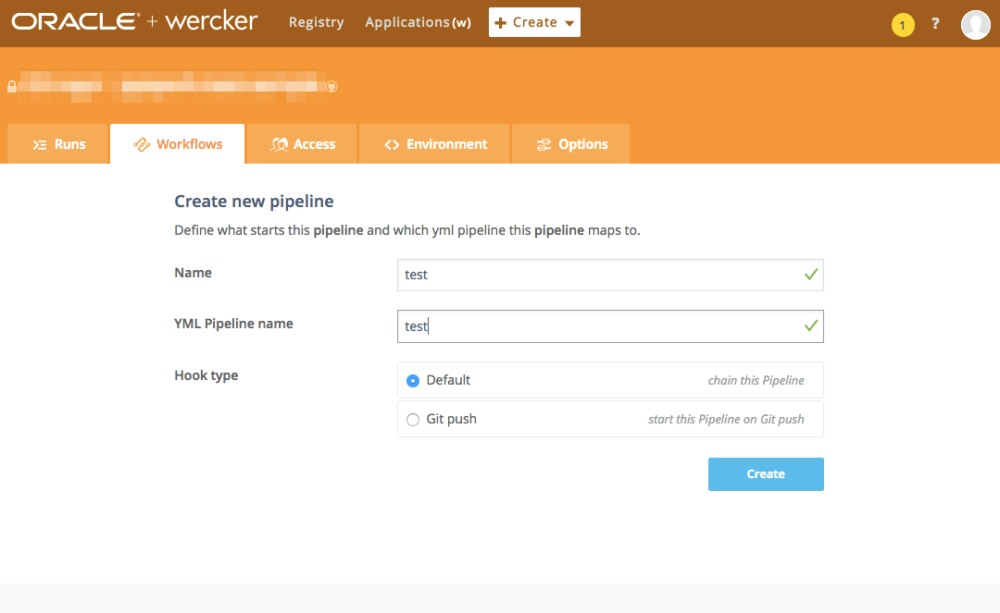
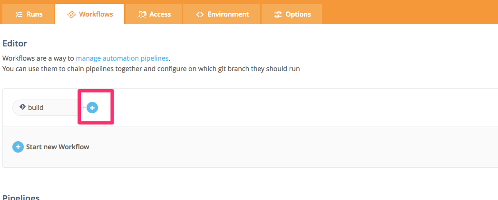

## Wercker
`wercker.yml`に設定を記述する。

* workflows
    * pipelinesの集まり
    * pipelinesの実行順序や実行条件などを記載した一連の処理
* pipelines
    * `wercker.yml`に記載する`build`や`deploy`, `test`、`dev`といったもの
    * pipelineは、stepsと呼ばれる処理の集まり
* steps
    * bashやコマンドの実行、インストールなど実際の処理
    * stpesは自分で記載することもできるが、communityで提供されているものも使うことができる
* box
    * docker imageのこと

## Python
* [Getting started with Wercker & Python](http://devcenter.wercker.com/docs/quickstarts/building/python)

```yaml
# The container definition we want to use for developing our app
box: python:2.7-slim

dev:
  steps:
    # first we want to run pip-install to install all the dependencies
    - pip-install
    # then we want to run a wercker step that watches your files and reloads
    # when changes are detected.
    - internal/watch:
        code: python app.py
        reload: true
```

* `box: python:2.7-slim`
    * DockerHubのContainerを指定できる
    * 他のregistryも設定で登録可能
* `dev:`
    * development pipelineのコマンドなど
    * pipelineの中はstepで構成される
    * stepは自分で記述するか、werckerやcommunityによって提供されるbash scriptなど
* `pip-install`
    * dev pipelineのstep

## Steps
Step registoryでcommunity から提供されているstepを利用できる。

* https://app.wercker.com/#explore/steps/search/

よく使うstepsは

* `script`
    * bash として実行
* `internal/watch`
    * web serverを使う場合に使う

### Internal Steps

* `internal/watch`
    * fileの変更で更新されるstep
    * よくあるのが、front-end developerがwebserverにファイルの変更を知らせる
    * 以下はnpmの例

```yaml
box: nodesource/trusty
dev:
  steps:
    - npm-install
    - internal/watch:
        code: node app.js
        reload: true
```

これを実行する場合は、

```
wercker dev --publish 5000
```

`5000`でserverを見ることができる。

OSXで使う場合は、一度に大量のファイルを監視すると制限に引っかかるため、以下のコマンドでしきい値を変更する。

```
sysctl -w kern.maxfiles=20480 (or whatever number you choose)
sysctl -w kern.maxfilesperproc=18000 (or whatever number you choose)
```

#### Internal/shell
shellのコマンドを実行したい場合は、`internal/shell`を使う。

* `cmd`
    * 起動するshell
* `code`
    * 実行するshellコマンド

```yaml
box: nodesource/trusty
dev:
  - npm-install
  - internal/shell:
      cmd: /bin/sh  #defaults to /bin/bash
      code: |
        # some code to automatically run in your shell session
        # before you start interacting
        cd /var/log
```

### Script Step
単純なshell commandを実行できる。
interna/shellとの使い分けは？

```yaml
build:
  steps:
    - script:
      name: indentify distribution
      code: cat /etc/lsb-release
    - script:
      name: starting xvfb
      code: |
        # Start xvfb which gives the context an virtual display
        # which is required for tests that require an GUI
        export DISPLAY=:99.0
        start-stop-daemon --start --quiet --pidfile /tmp/xvfb_99.pid --make-pidfile --background --exec /usr/bin/Xvfb -- :99 -screen 0 1024x768x24 -ac +extension GLX +render -noreset
        # Give xvfb time to start. 3 seconds is the default for all xvfb-run commands.
        sleep 3
```

### Creating Steps
Step registryに目的のstepがない場合は自分で定義することができる。


### Install Packages
containerに必用な依存ファイルをinstallする場合は、 `install-packages` stepを使う。
versionの指定も可能。

```yaml
- install-packages:
        packages: apache2=2.2.20-1ubuntu1
```


### After steps
step実行後に実行する場合は、`after-steps`というstepを使う。

```yaml
deploy:
    steps:
        - script:
            name: fabric deploy
            code: |
              fab deploy
    after-steps:
        - hipchat-notify:
            token: $HIPCHAT_TOKEN
            room_id: id
            from-name: name
```

## Pipelines
* [Pipelines](http://devcenter.wercker.com/docs/pipelines)


## Workflows
Pipelinesの流れを記述する。
デフォルトでは、buildのみ登録されている。
よくある構成は

1. build
2. test
3. deploy
    * to staging
    * to production

である。
repositoryを作成したら、testの作成までは行う。
workflowに登録されているpipelineは、`wercker.yml`に必ず記載する必要がある。
将来的なworkflowとして登録しているが、現在特に処理するものがない場合は、以下のように空のstepsをいれる。

```yaml
build:
  steps:
test:
  steps:
    - script:
        name: execute pytest
        code: |
          pytest
```

<div style="text-align: center">
    
</div>

<div style="text-align: center">
    
</div>

<div style="text-align: center">
    
</div>

## Wercker.yml
`dev`は特別なpipelineである。
`dev`はlocalのCLIで実行されるpipelineである。

## Environment variables


## Web Interface

### Repository Access
GitHubやBitBucketなどのrepositoryにアクセスする方法。
publicの場合は、public repositoryの節まで読み飛ばして良い。

### SSH keys
werckerはpublic keyをrepositoryに提供し、private keyでrepositoryのソースコードにアクセスする。
public keyを認可する方法はいくつかあるが、それぞれ良いことと悪いことがある。

* Deploy keys
    * deploy keyとしてpublic keyを登録する
    * 

## CLI
* [The Wercker Command Line Interface (CLI)](http://devcenter.wercker.com/docs/cli)

### Install
Dockerが必要なので、適宜インストールしておく。

For OSX

```
brew tap wercker/wercker
brew install wercker-cli
```


## Samples

```yaml
# This references the default Python container from
# the Docker Hub with the 2.7 tag:
# https://registry.hub.docker.com/_/python/
# If you want to use a slim Python container with
# version 3.4.3 you would use: python:3.4-slim
# If you want Google's container you would reference google/python
# Read more about containers on our dev center
# http://devcenter.wercker.com/docs/containers/index.html
box: coorpacademy/docker-pyspark:latest
# You can also use services such as databases. Read more on our dev center:
# http://devcenter.wercker.com/docs/services/index.html
# services:
    # - postgres
    # http://devcenter.wercker.com/docs/services/postgresql.html

    # - mongo
    # http://devcenter.wercker.com/docs/services/mongodb.html

# This is the build pipeline. Pipelines are the core of wercker
# Read more about pipelines on our dev center
# http://devcenter.wercker.com/docs/pipelines/index.html
build:
  # The steps that will be executed on build
  # Steps make up the actions in your pipeline
  # Read more about steps on our dev center:
  # http://devcenter.wercker.com/docs/steps/index.html
  steps:
    # A step that sets up the python virtual environment
    - virtualenv:
        name: setup virtual environment
        install_wheel: false # Enable wheel to speed up builds (experimental)

    # # Use this virtualenv step for python 3.2
    # - virtualenv
    #     name: setup virtual environment
    #     python_location: /usr/bin/python3.2

    # A step that executes `pip install` command.
    - pip-install

    # # This pip-install clears the local wheel cache
    # - pip-install:
    #     clean_wheel_dir: true

    # A custom script step, name value is used in the UI
    # and the code value contains the command that get executed
    - script:
        name: echo python information
        code: |
          echo "python version $(python --version) running"
          echo "pip version $(pip --version) running"
```


## reference
* [まだ CircleCI で消耗してるの？ - Qiita](http://qiita.com/KeithYokoma/items/b839ef3f5496a22f3e7a#_reference-3b29690796d83937e179)
* [Werckerの仕組み，独自のboxとstepのつくりかた | SOTA](http://deeeet.com/writing/2014/10/16/wercker/)
