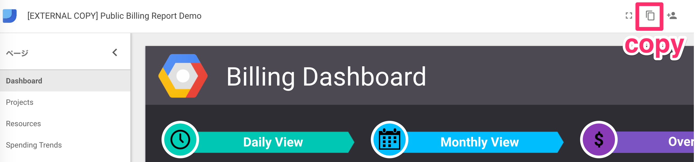
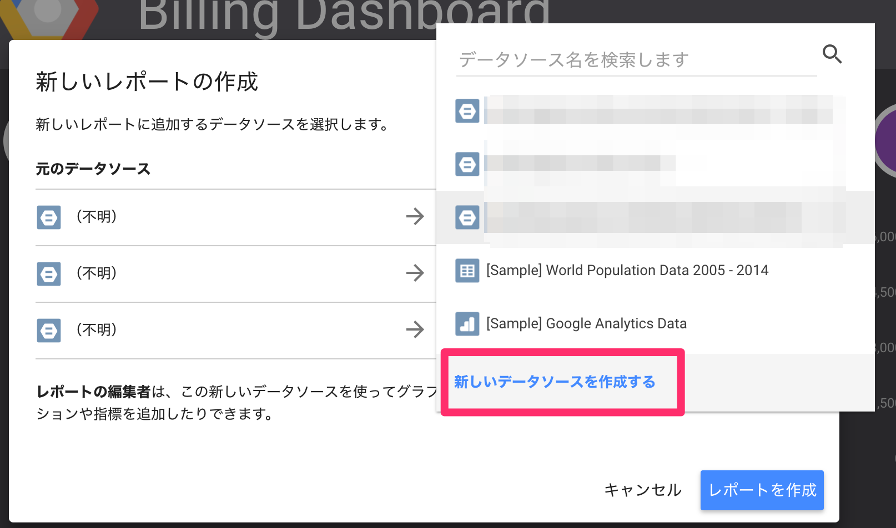
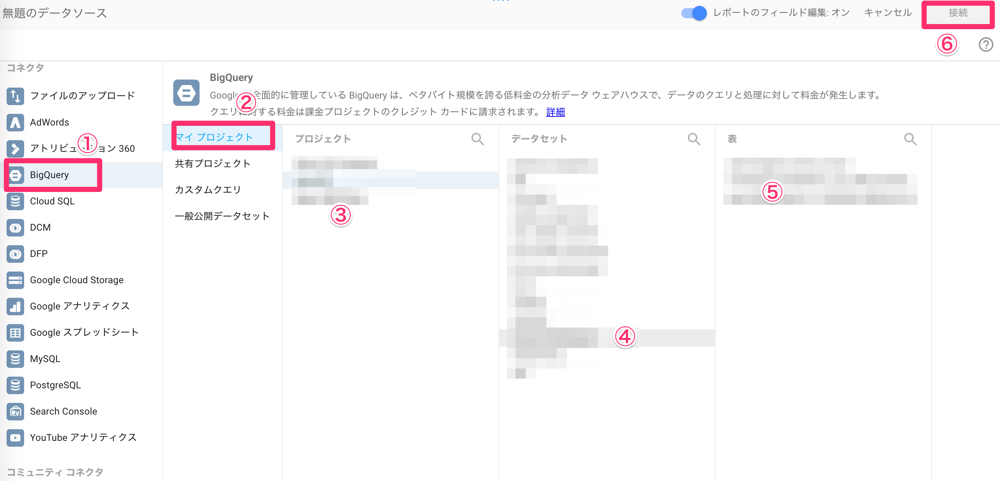
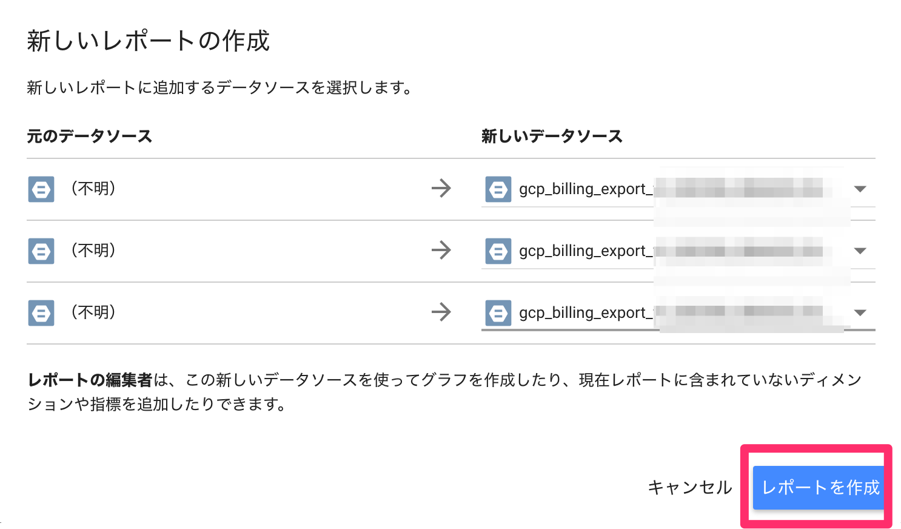

## Google Cloud Billing

* すべての請求先アカウントのリストを取得する。
* 特定の請求先アカウントの情報を取得する。
* 請求先アカウントに関連付けられているプロジェクトを一覧表示する。
* プロジェクトのお支払い情報を取得する。
* プロジェクトに対する請求を有効にする（請求先アカウントに関連付けることで）。
* プロジェクトに対する請求を無効にする（請求先アカウントを削除することで）。
* プロジェクトに関連付けられた請求先アカウントを変更する。


## Terms/Concepts
* billing account
    * 1つ以上のprojectに紐付けられる支払い用のaccount
    * 支払い方法、請求先、Cloud Platform Identity and Access Management（IAM）の役割に応じたアクセス制御が含まれる
    * projectにbilling accountが紐付けられていない場合は、有料のGCP serviceは利用不可
* billing account type
    * self service
    * Invoiced

## Visualization
* [Visualize Spend Over Time with Data Studio  |  Google Cloud Billing API Documentation  |  Google Cloud Platform](https://cloud.google.com/billing/docs/how-to/visualize-data)

BigQueryとGoogle Data Studioを使うと以下のような可視化が簡単にできる。

<div style="text-align: center">
    
</div>

<div style="text-align: center">
    
</div>

Billing Dataのexportをする。
`Billing`の画面に移動。

`Export blling data`

Export先のproject idとBigQueryのdataset名を入力する。
GCPがofficialで提供しているDashboardを開いて、copyする。

https://datastudio.google.com/reporting/0B7GT7ZlyzUmCZHFhNDlKVENHYmc/page/dizD

<div style="text-align: center">
    
</div>

Data sourceの選択画面がでるので、`新しいデータソースを作成する`を選択。

<div style="text-align: center">
    
</div>

Billing dataのexportに指定したdatasetに`gcp_billing_export_....`という名前のtableが作成されているので、選択して、接続する。
`...`の部分はbilling accoutnによって変わる。

<div style="text-align: center">
    
</div>

`新しいデータソース`に`gcp_billing_export_....`を指定する。

<div style="text-align: center">
    
</div>

Dashboardの作成は完了。
上記の`新しいデータソース`の3つの内、2つは本来は別のdatasourceを指定するもので、正しく作成すると以下の2つが可能になるが省略している。

* 線形回帰で翌月のcostを予測する
    * Dashboardの`Spending Trends` Page
* BigQueryの ueryごとのQuery, processed byte, cost, userを可視化できる
    * Dashboardの`BigQuery` Page

### Supplements
BigQueryのExport先は一箇所しか選べないが、tableの転送は難しくないので、あまり気にしなくてよい。
Billing dataはexportを有効にしないと、出力されないので、projectを作ったらなるべく早めに有効にした方が良い。

## Visualization without 
* https://cloud.google.com/bigquery/audit-logs
    * sample SQL
* https://cloud.google.com/logging/docs/reference/audit/bigquery/rest/Shared.Types/AuditData
    * schema definitnion

```sql
#standardSQL
SELECT
  TIMESTAMP_TRUNC(protopayload_auditlog.servicedata_v1_bigquery.jobCompletedEvent.job.jobStatistics.endTime, HOUR)
  AS time_window,
  FORMAT('%9.2f', 5.0 * (SUM(protopayload_auditlog.servicedata_v1_bigquery.jobCompletedEvent.job.jobStatistics.totalBilledBytes) / POWER(2, 40)))
  AS Estimated_USD_Cost
FROM
  `AuditLogsDataSet.cloudaudit_googleapis_com_data_access_YYYYMMDD`
WHERE
  protopayload_auditlog.servicedata_v1_bigquery.jobCompletedEvent.eventName = 'query_job_completed'
GROUP BY time_window
ORDER BY time_window DESC
```

## Access control
* [Overview of Billing Access Control  |  Google Cloud Billing API Documentation  |  Google Cloud Platform](https://cloud.google.com/billing/docs/how-to/billing-access)

https://cloud.google.com/billing/docs/images/access-control-org.png

組織体系に応じてどのようなAccess controlにすべきかの例が記載されている。


## Reference
* [Google Cloud Billing のドキュメント  |  Google Cloud Billing  |  Google Cloud Platform](https://cloud.google.com/billing/docs/?hl=ja)
