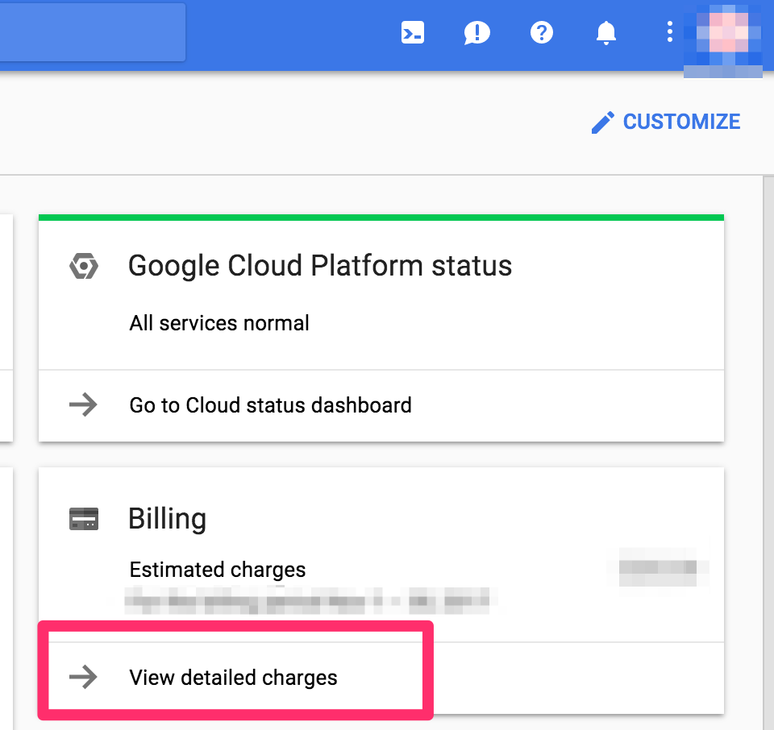
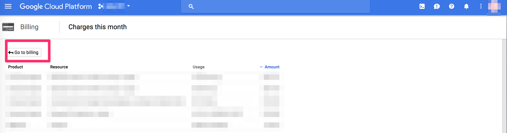
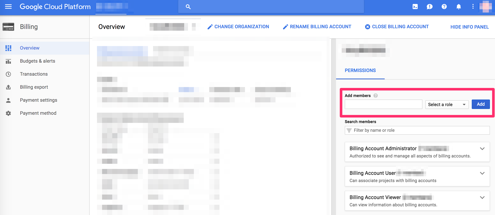

## Google Cloud Identity and Access Management

## Concepts
* [Overview  |  Cloud Identity and Access Management Documentation  |  Google Cloud Platform](https://cloud.google.com/iam/docs/overview)

    

* IAM
    * Policy/Role/Permission/Identites/Service accountなどを提供するserviceの総称
* Policy
    * Roles + Identites
    * RoleとIdentitiesの対応の集まり
    * Policyはinheritされる
* Roles
    * collection of permissions
    * Primitive roles
        * 以下の3種類
        * Owner
            * 状態を保持する読み取り専用アクションに必要な権限。
        * Editor
            * すべての閲覧者権限、および状態を変更するアクションに必要な権限。
        * Viewer
            * 状態を保持する読み取り専用アクションに必要な権限。
    * Predefined role
        * Primitive rolesより細かく、resourceやserviceの用途などに合わせて作られたrole
        * serviceごとに提供されている
    * Custom roles
        * userが自分で定義するrole
* Permission
    * `<service>.<resource>.<verb>`
    * `pubsub.subscriptions.consume`
    * compute.instanceAdmin
    * storage.objectAdmin
* Identities
    * google account
    * google service account
    * google group
    * G Suite domain
    * google apps domain

## Service Accounts
* [GCP Service Accountを理解する - Qiita](https://qiita.com/t-yotsu/items/5d3d36847fbc71b72b76)

Service AccountsはIdentiteisの一つだが、Google accountのように特定の個人に結びつかない。
Service accountsに対して、roleを付与することができる。

Service accountの種類

* GCP-managed keys
    * Google APIs service account
        * `[PROJECT_NUMBER]@cloudservices.gserviceaccount.com`
    * このキーはAppEngineやComputeEngineなどのサービスで使用されるキーであり、ダウンロードはできない。Googleが鍵を管理し、自動的にそれらを毎日ローテーションする
* User-managed keys
    * `[PROJECT-NUMBER]-compute@developer.gserviceaccount.com`
    * このキーはユーザが作成、ダウンロードが可能で、ユーザが管理する

## List of roles
`IAM & admin` -> `Roles`で利用可能なroleの一覧を見ることができる。

以下がdefaultで利用可能なroleの一覧

| Name                                    | Used in                |
+=========================================|========================+
| App Engine Admin                        | App Engine             |
| App Engine Code Viewer                  | App Engine             |
| App Engine Deployer                     | App Engine             |
| App Engine Service Admin                | App Engine             |
| App Engine Viewer                       | App Engine             |
| BigQuery Admin                          | BigQuery               |
| BigQuery Data Editor                    | BigQuery               |
| BigQuery Data Owner                     | BigQuery               |
| BigQuery Data Viewer                    | BigQuery               |
| BigQuery Job User                       | BigQuery               |
| BigQuery User                           | BigQuery               |
| Browser                                 | Project                |
| Cloud Dataflow Service Agent            | Service Management     |
| Cloud Datastore Import Export Admin     | Datastore              |
| Cloud Datastore Index Admin             | Datastore              |
| Cloud Datastore Owner                   | Datastore              |
| Cloud Datastore User                    | Datastore              |
| Cloud Datastore Viewer                  | Datastore              |
| Cloud Debugger Agent                    | Cloud Debugger         |
| Cloud Debugger User                     | Cloud Debugger         |
| Cloud KMS Admin                         | Cloud KMS              |
| Cloud KMS CryptoKey Decrypter           | Cloud KMS              |
| Cloud KMS CryptoKey Encrypter           | Cloud KMS              |
| Cloud KMS CryptoKey Encrypter/Decrypter | Cloud KMS              |
| Cloud Scheduler Admin                   | Cloud Scheduler        |
| Cloud Scheduler Viewer                  | Cloud Scheduler        |
| Cloud Security Scanner Editor           | Cloud Security Scanner |
| Cloud Security Scanner Runner           | Cloud Security Scanner |
| Cloud Security Scanner Viewer           | Cloud Security Scanner |
| Cloud SQL Admin                         | Cloud SQL              |
| Cloud SQL Client                        | Cloud SQL              |
| Cloud SQL Editor                        | Cloud SQL              |
| Cloud SQL Viewer                        | Cloud SQL              |
| Cloud Tasks Admin                       | Cloud Tasks            |
| Cloud Tasks Queue Admin                 | Cloud Tasks            |
| Cloud Tasks Task Deleter                | Cloud Tasks            |
| Cloud Tasks Viewer                      | Cloud Tasks            |
| Cloud Trace Admin                       | Cloud Trace            |
| Cloud Trace Agent                       | Cloud Trace            |
| Cloud Trace User                        | Cloud Trace            |
| Compute Admin                           | Compute Engine         |
| Compute Image User                      | Compute Engine         |
| Compute Instance Admin (beta)           | Compute Engine         |
| Compute Instance Admin (v1)             | Compute Engine         |
| Compute Load Balancer Admin             | Compute Engine         |
| Compute Network Admin                   | Compute Engine         |
| Compute Network User                    | Compute Engine         |
| Compute Network Viewer                  | Compute Engine         |
| Compute OS Admin Login (beta)           | Compute Engine         |
| Compute OS Login (beta)                 | Compute Engine         |
| Compute Security Admin                  | Compute Engine         |
| Compute Storage Admin                   | Compute Engine         |
| Compute Viewer                          | Compute Engine         |
| Container Engine Service Agent          | Service Management     |
| Conversation API Client                 | Other                  |
| Dataflow Admin                          | Dataflow               |
| Dataflow Developer                      | Dataflow               |
| Dataflow Viewer                         | Dataflow               |
| Dataflow Worker                         | Dataflow               |
| Dataproc Editor                         | Dataproc               |
| Dataproc Service Agent                  | Service Management     |
| Dataproc Viewer                         | Dataproc               |
| Dataproc Worker                         | Dataproc               |
| Deployment Manager Editor               | Deployment Manager     |
| Deployment Manager Type Editor          | Deployment Manager     |
| Deployment Manager Type Viewer          | Deployment Manager     |
| Deployment Manager Viewer               | Deployment Manager     |
| Editor                                  | Project                |
| Error Reporting Admin                   | Error Reporting        |
| Error Reporting User                    | Error Reporting        |
| Error Reporting Viewer                  | Error Reporting        |
| Errors Writer                           | Error Reporting        |
| IAP-Secured Web App User                | Cloud IAP              |
| Kubernetes Engine Admin                 | Kubernetes Engine      |
| Kubernetes Engine Cluster Admin         | Kubernetes Engine      |
| Kubernetes Engine Developer             | Kubernetes Engine      |
| Kubernetes Engine Viewer                | Kubernetes Engine      |
| Logging Admin                           | Logging                |
| Logs Configuration Writer               | Logging                |
| Logs Viewer                             | Logging                |
| Logs Writer                             | Logging                |
| Monitoring Admin                        | Monitoring             |
| Monitoring Editor                       | Monitoring             |
| Monitoring Metric Writer                | Monitoring             |
| Monitoring Viewer                       | Monitoring             |
| Organization Administrator              | Resource Manager       |
| Organization Policy Viewer              | Organization Policy    |
| Owner                                   | Project                |
| Private Logs Viewer                     | Logging                |
| Project Billing Manager                 | Billing                |
| Project Deleter                         | Resource Manager       |
| Project IAM Admin                       | Resource Manager       |
| Project Lien Modifier                   | Resource Manager       |
| Pub/Sub Admin                           | Pub/Sub                |
| Pub/Sub Editor                          | Pub/Sub                |
| Pub/Sub Publisher                       | Pub/Sub                |
| Pub/Sub Subscriber                      | Pub/Sub                |
| Pub/Sub Viewer                          | Pub/Sub                |
| Quota Administrator                     | Service Management     |
| Quota Viewer                            | Service Management     |
| Reserve Partner Admin                   | Reserve Partner        |
| Reserve Partner Reader                  | Reserve Partner        |
| Role Administrator                      | Roles                  |
| Role Viewer                             | Roles                  |
| Security Reviewer                       | IAM                    |
| Service Account Actor                   | Project                |
| Service Account Admin                   | Service Accounts       |
| Service Account Key Admin               | Service Accounts       |
| Service Account Token Creator           | Service Accounts       |
| Service Account User                    | Service Accounts       |
| Service Management Administrator        | Service Management     |
| Storage Admin                           | Storage                |
| Storage Object Admin                    | Storage                |
| Storage Object Creator                  | Storage                |
| Storage Object Viewer                   | Storage                |
| Viewer                                  | Project                |

EditorとAdminがあるように見えるが、Adminがある場合はEditorがなく、Editorがある場合はAdminがない場合が多いので、基本的に同じ意味で使われている。
`Monitoring Admin`と`Monitoring Editor`があるが、どちらも同じpermissionを持っているので、違いはない。
例外的に、`Pub/Sub Editor`と`Pub/Sub Admin`の場合は、`Pub/Sub Admin`の方が多くの権限を持っている。

Roleについている`Owner`, `Admin`などの権限の強さはだいたい以下の順で、上に行くほど多くの権限を持っている場合が多い。

1. Owner
2. Administorator ≒ Admin > Editor
3. Viewer ≒ Reader ≒ Browser

`Used in`は使われるserviceを指していることが多いので、必要なroleにあたりをつける。
serviceと対応していないものとして、以下のような項目がある。

* project
    * projct全体に対するrole
* IAM
    * security reviewerのみ
* Roles
    * IAMのRoleの作成や閲覧に関する権限
* Service Accounts
    * Serivce accountの作成と閲覧/編集の権限

## Use cases

### IAMのRoleの一覧を見たい
以下のRole

* `Role viewer`

### IAMのRoleの作成/編集/閲覧
以下のRole

* `Role Viewer`
    * 閲覧のみ
* `Role Administrator`
    * 閲覧/編集/作成

### service accountの作成/編集/閲覧

* `Service Account Actor`
    * ?
* `Service Account Admin`
    * ?
* `Service Account Key Admin`
    * ?
* `Service Account Token Creator`
    * ?
* `Service Account User`
    * ?

### Billing account
今の所、Billing accountに関するRoleはIAMの画面からは付与できない。
Billing accountは、複数のprojectに結びつくので、特定のprojectのIAMの画面から変更できないようになっているのだと思う。
Billing accountのRoleが必要な場合は、Billing accountのお支払画面から、付与できる。

    

    

Dialogが出ている場合は、`Go to Billint account`にする。

    

## Best Prctice

### Service Accounts
service accountの作成時は、以下を確認する。

* サービス アカウントでアクセス可能なリソース
* サービス アカウントに必要な権限
* サービス アカウントの ID を持つコードが実行される場所（Google Cloud Platform またはオンプレミスのどちらか）

    

* Service accountは`display name`を設定する
* サービス アカウントに最小限の権限を付与する
* サービス アカウント キーの管理
* service accountの命名規則を決める

## Reference
* [Using Resource Hierarchy for Access Control  |  Cloud Identity and Access Management Documentation  |  Google Cloud Platform](https://cloud.google.com/iam/docs/resource-hierarchy-access-control)
