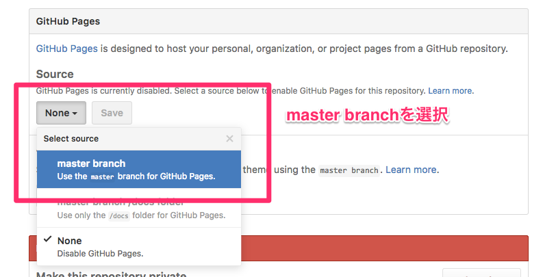
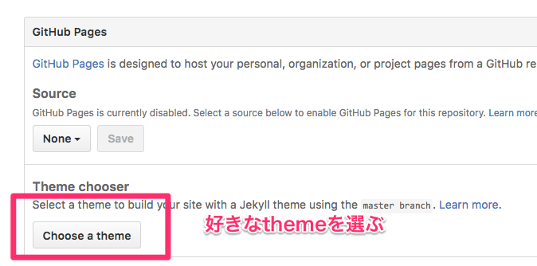

# markdown presentation
Markdownでプレゼンテーションを行うソフトと使い方

## Reveal.js + GitHub Pages(jekyll)

最終的なディレクトリの構成は以下のようになる。

```
.
├── README.md
├── asset
│   └── css
│       └── theme
│           └── black.css
├── reveal.js
└── sample_slide
    ├── contents.md
    ├── index.html
    ├── reference.md
    └── title.md
```

* `reveal.js`
	* submodule
* `asset`以下
	* themeをカスタムしたものやcssなどなどを置く
* `sample_slide`
	* スライド置き場
	* `contents.md`にスライドの内容をかく


1. `slides_reveal_js`というディレクトリを作る
2. gitのrepositoryとして初期化する

    ```bash
    cd slides_reveal_js
    git init
    git commit --allow-empty -m "root commit"
    ```

3. reveal.jsをgit submoduleとして追加

    ```bash
    git submodule add https://github.com/hakimel/reveal.js.git reveal.js
    git commit -m "Add reveal.js as submodule"
    ```

4. slide用のディレクトリを作る

    ```bash
    mkdir sample_slide
    ```

5. `sample_slide`に必要なファイルを置く
    * 以下をコピー
    * [index.html](https://raw.githubusercontent.com/i05nagai/slides_reveal/master/sample_simple/index.html)
		* `reveal.js`を読み込んだりslide表示用の設定が記載されている
    * [title.md](https://raw.githubusercontent.com/i05nagai/slides_reveal/master/sample_simple/title.md)
        * slideの1枚目のタイトル用のmarkdownファイル
		* titleはcenteringしたりfontのサイズを変えたり、メインの中身と異なる設定をしたい場合があるので分けている
    * [contents.md](https://raw.githubusercontent.com/i05nagai/slides_reveal/master/sample_simple/contents.md)
        * 2枚目以降のスライド用のmarkdownファイル
		slideの区切りは`---`を記載する。
    * [reference.md](https://raw.githubusercontent.com/i05nagai/slides_reveal/master/sample_simple/reference.md)
		* slide最後のreference用。
        趣味で分けているだけなので、分けずに`contents.md`に書いても良い。
	* OSX (curlがある)の場合

    ```bash
    cd sample_slide
    curl https://raw.githubusercontent.com/i05nagai/slides_reveal/master/sample_simple/index.html -o index.html
    curl https://raw.githubusercontent.com/i05nagai/slides_reveal/master/sample_simple/title.md -o title.md
    curl https://raw.githubusercontent.com/i05nagai/slides_reveal/master/sample_simple/contents.md -o contents.md
    curl https://raw.githubusercontent.com/i05nagai/slides_reveal/master/sample_simple/reference.md -o reference.md
    ```

	* wgetがある場合

    ```bash
    cd sample_slide
    wget https://raw.githubusercontent.com/i05nagai/slides_reveal/master/sample_simple/index.html
    wget https://raw.githubusercontent.com/i05nagai/slides_reveal/master/sample_simple/title.md
    wget https://raw.githubusercontent.com/i05nagai/slides_reveal/master/sample_simple/contents.md
    wget https://raw.githubusercontent.com/i05nagai/slides_reveal/master/sample_simple/reference.md
    ```

6. GitHubのrepositoryを作る。
7. `README.md`を追加する。
	レポジトリからGitHub Pagesのトップページや角スライドへに行けるようにLinkを貼っておくと便利だろう。
    * `{username}`
        * githubのusernameに変更
    * `{repository_name}`
        * githubのrepositoryの名前に変更

    ```markdown
    # Presentation
    
    See [top page](https://{username}.github.io/{repository_name}/).
    
    ## Links
    * [top page](https://{username}.github.io/{repository_name}/)
        * top pages of GitHub pages
    * [sample_simple](http://{username}.github.io/{repository_name}/sample_slide/)
        * simple sample
    ```

8. githubにpush
    * `{username}`
        * githubのusername
    * `{repository_name}`
        * githubのrepositoryの名前

    ```bash
    git remote add origin https://github.com/{username}/{repository_name}.git
    git add .
    git commit -m "Add slide"
    ```

9. GitHub Pagesの設定




新しくスライドを作る場合は、`sample_slide`をコピーして、`contents.md`と`title.md`,`reference.md`を変更する。

## Tips

### ローカルでプレビューしたい
firefoxの場合は、`index.html`を開けばローカルでpreviewできる。
Chromeの場合は、ローカルサーバを立ち上げる必要がある。
`reveal.js`はnode.jsが使えるようになっているので、`npm install`をしておく。

```bash
cd reveal.js
npm install
cd ..
```

`npm start`で`node.js`を起動できるが、`revea.js`のrootをrepositoryのrootにするために`Gruntfile.js`を編集する必要がある。
毎回編集するのが面倒な場合は以下のスクリプトを`npm_start.sh`などと名前をつけて、repositoryのトップにおいておけば良い。

```
#!/bin/bash

set -e

REPLACEE="var root = grunt.option('root') || '.';"
REPLACER="var root = grunt.option('root') || '..';"
sed -i '' -e "s/${REPLACEE}/${REPLACER}/" reveal.js/Gruntfile.js
pushd reveal.js
npm start
popd
```

スクリプトで行っているのは、`reveal.js/Gruntfile.js`のテキストを置換と`npm start`の実行。
以下のコマンドを実行する。

```
bash npm_start.sh
```

### 文字のサイズとか変更したい
用意されているthemeだと文字サイズが大きすぎたり全てcenteringされているので、やや気持ち悪い。
自分でthemeを追加すれば良いが、いちからthemeを追加するのは大変なので、既存のthemeをコピーする。
`black.css`のthemeをベースに変更する場合は以下のようにする。

```bash
cd path/to/slide_reveal_js
# どこでも良いがここでは`asset/css/theme`におく
mkdir -p asset/css/theme
cp reveal.js/css/theme/black.css asset/css/theme
```

以下を参考に修正。

* [Configure custom theme · i05nagai/slides_reveal@5798ea6](https://github.com/i05nagai/slides_reveal/commit/5798ea64817acd16cf777c95e144e297a8fed301?diff=split)
	* 数字(`30px`など)は好みで設定する。
	* 文字列を左揃え
	* スライド全体の文字のサイズを`30px`に
	* スライドの`line-height`を`1.2`に
	* `#`の文字を大文字に変更するのをやめる

#### スライドの区切り
スライドの区切りは、 `index.html`の`section`タグの`data-separator`で設定されている。
以下の設定では行頭の`---`がスライドの区切りとなる。

```html
<section data-markdown="title.md"
         data-separator="^---"
         data-separator-vertical="^--"
         data-separator-notes="^Note:"
         data-charset="utf-8">
</section>
```

`---`はmarkdownの区切り文字なので、slide用のファイルをmarkdownのファイルとして見たときに、スライドごとに区切り文字が入って見やすいので、特に変更する必要はないと思う。

## Reveal.js

### Install
Reveal.jsをcloneするかプロジェクトのzipを取得する。

### Tips

#### スライドの縦方向の中央揃えをやめる
縦方向のalignmentは`Reveal.initialize()`で制御されている。
`center: true`を`center: false`にすれば良い。

#### 画像の中央揃えとサイズの変更
htmlで書くしかない。
外部markdownファイルを使っている場合も、htmlに直接書いている場合も以下のように書けば良い。

```html
<div style="text-align:center;">
  
</div>
```

* 外側の`sytle="text-align:center;"`が中央揃えの設定である。
    * 右揃えにしたければ`right`にすれば良い
* `img`タグに画像ファイルへのpathとサイズを`width:40%`として書いている


### Reference
* [hakimel/reveal.js: The HTML Presentation Framework](https://github.com/hakimel/reveal.js)
* [ブログズミ: reveal.js + Markdown のちょっとしたメモ - その２](http://srz-zumix.blogspot.com/2015/02/revealjs-markdown_25.html)
* [Markdown でプレゼンテーションスライドを書ける reveal.js と remark のどちらが良いか | nDiki](https://www.naney.org/diki/d/2014-10-28-Markdown-revealjs-remark.html)

## Remark.js
[github](https://github.com/gnab/remark)

jsをurlで読み込めるので、ネットにつながる環境ならすごく便利。
以下の`index.html`を作り、同じディレクトリに`contents.md`を配置する。
`index.html`をブラウザで開けばOK。

`index.html`
```html
<DOCTYPE html>
<html>
<head><title>Presentation</title></head>
<body>
  <script src="http://gnab.github.io/remark/downloads/remark-latest.min.js" type="text/javascript"></script>
  <script type="text/javascript">
    var slideshow = remark.create({
      sourceUrl: "contents.md",
      highlightStyle: 'default',
      highlightLanguage: 'sh'
    });
  </script>
</body>
</html>
```

`contents.md`
```md
# slied 1 
- 1ページ目
---
# slide 2
- 2ページ目

```

### キー操作
* `j` 次のスライド
* `k` 前のスライド
* `c` スライドのclone
    * スライドを clone すると、元のスライドでページ移動した際、clone 先のスライドも同期して移動する。
* `f` フルスクリーン
* `p` プレゼンモード
* `h` ヘルプの表示

### gh-pagesに公開
1. githubにレポジトリを作る。
2. `gh-pages`という名前でブランチを切る。
3. `https://username.github.io/repository_name`にアクセスするとレポジトリトップの`index.html`のファイルが表示される。
    * uploadしたデータが反映されるまで10分ほどかかるみたいなので気長にまつ。

個人的には、スライドごとにレポジトリを作る気分にあんまりならないので、下記のように1つのレポジトリをまとめている。
特に工夫はないが、レポジトリのトップの`contents.md`はレポジトリ内のスライドへのリンクテーブルになっている個人的に便利。
1. githubにレポジトリを作る。
2. レポジトリのトップに、`index.html`と`contetns.md`を置く。`contents.md`はサブディレクトリへのリンク。
```md

```
3. レポジトリにスライドごとにディレクトリを作り、各ディレクトリに`index.html`と`contents.md`を作る。


### mathjaxを使う
`index.html`にmathjaxを読み込む設定を書く。
`contents.md`では、普通にmarkdown中にmathjaxを書けばOK。
具体的には、`$$`で数式を囲む。
mathjaxのURLに`delayStartupUntil=configured`オプションを含めると、markdownで問題になる`_`のエスケープなどが不要になるので便利。

`index.html`
```html
<DOCTYPE html>
<html>
<head><title>Presentation</title></head>
<body>
  <script src="http://gnab.github.io/remark/downloads/remark-latest.min.js" type="text/javascript"></script>
  <script src="http://cdn.mathjax.org/mathjax/latest/MathJax.js?config=TeX-AMS_HTML&delayStartupUntil=configured" type="text/javascript"></script>
  <script type="text/javascript">
    var slideshow = remark.create({
      sourceUrl: "contents.md"
    });

    // Setup MathJax
    MathJax.Hub.Config({
      tex2jax: {
        skipTags: ['script', 'noscript', 'style', 'textarea', 'pre']
      }
    });
    MathJax.Hub.Queue(function() {
      $(MathJax.Hub.getAllJax()).map(function(index, elem) {
        return(elem.SourceElement());
      }).parent().addClass('has-jax');
    });
    MathJax.Hub.Configured();
  </script>
</body>
</html>
```

```md
# slide 1 
- 1ページ目
---

# slide 2
- 2ページ目

$$
x = a_{1} + b^{2}
$$
## フーリエ変換
$$
  F(u) = \int\_{-\infty}^{\infty} f(x)\mathrm{e}^{-j2\pi ux}dx
$$

## 2次元のフーリエ変換
$$
  F(u,v) = \int\_{-\infty}^{\infty} \int\_{-\infty}^{\infty} f(x,y)\mathrm{e}^{-j2\pi (ux + vy )}dxdy
$$
```

### 参考
[markdown + remark.js + gh-pages でプレゼン資料を公開する](http://qiita.com/harasou/items/1fa3cca6ac1ef175c876)

## Reveal.js
[github](https://github.com/hakimel/reveal.js/)

### 参考
[mathjaxを使う](http://qiita.com/hilohiro/items/147536f84a537d485d11)


