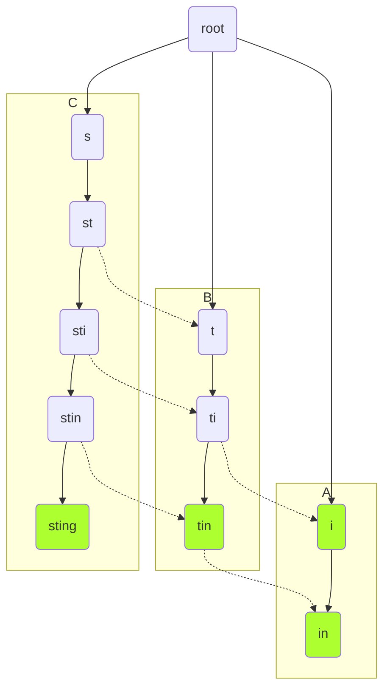

## Aho Corasick

## Reference
- https://en.wikipedia.org/wiki/Aho%E2%80%93Corasick_algorithm
- https://cp-algorithms.com/string/aho_corasick.html
- http://web.stanford.edu/class/archive/cs/cs166/cs166.1166/lectures/02/Slides02.pdf
