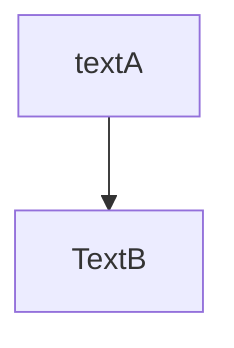
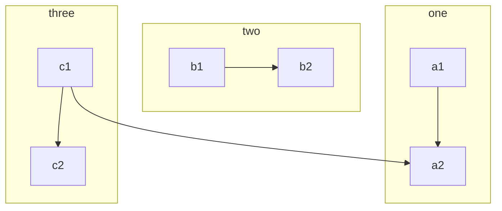

## mermaid
以下の図がテキストでかける。

* flowchart
* gantt chart
* sequence chart

## Install

## Flowchart

`%%`で始まる行はコメントになる。
最初に`graph type`を書く。

* `type`は以下から選ぶ
    * `TD`
        * top down
    * `LR`
        * Left to Right

nodeの定義は`NodeName[Text in Node]`
* `NodeName`
    * NodeNameはNodeの名前
    * `[]`を省略するとNodeのテキストにもなる
* `[text in node] `
    * nodeに表示されるテキスト

node間の関係は矢印で記載する。
1行1つの関係を記載。

nodeは`[]`では四角形だが、`[]`を変更すれば形を変更できる。

* `[ ]`
    * 四角形
* `( )`
    * 四角形で四隅が丸い
* `(( ))`
    * 円
* `> ]`
    * 栞
* `{ }`
    * ひし形

subgraphもかける

## Reference
* [mermaid - Generation of diagrams and flowcharts from text in a similar manner as markdown.](https://knsv.github.io/mermaid/#mermaid)
