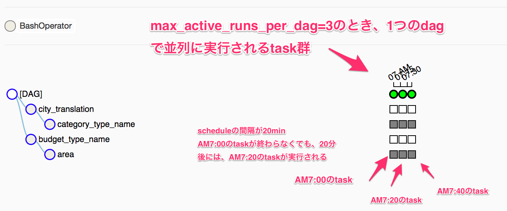
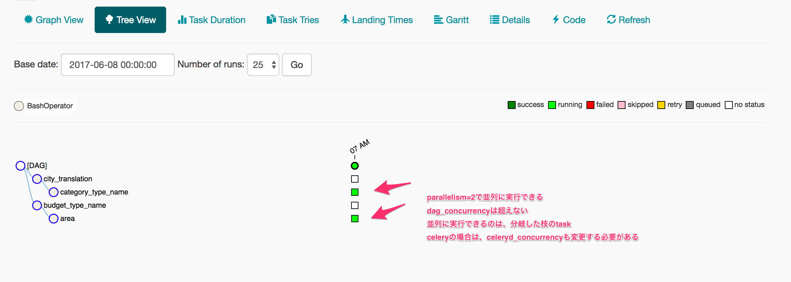
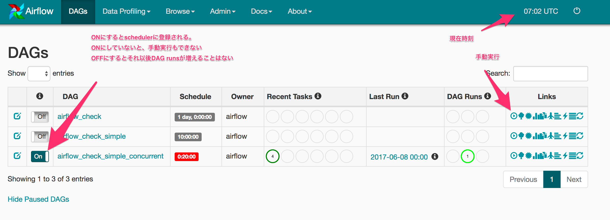
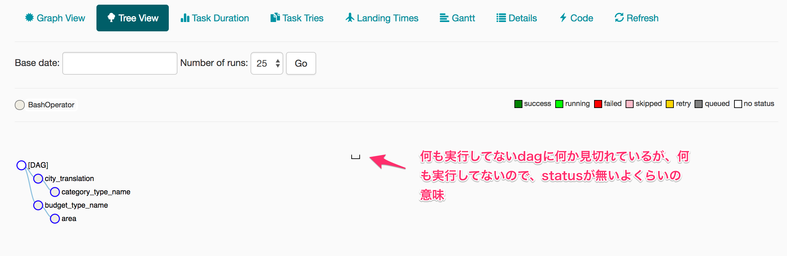

## airflow


## Install
```
pip install airflow
```

以下のコマンドで、初期化とサーバの立ち上げができる。

```
airflow initdb
airflow webserver -p 8080
```

airflowコマンドを一度でも実行すると、defaultだと`~/airflow`に作業用のディレクトリが作られる。

```sh
# airflow needs a home, ~/airflow is the default,
# but you can lay foundation somewhere else if you prefer
export AIRFLOW_HOME=~/airflow
# initialize the database
airflow initdb
# start the web server, default port is 8080
airflow webserver -p 8080
```

DAGを追加するときは、`$AIRFLOW_HOME/dags/`以下にdagsを定義したpythonファイルを配置する。
defuaultで幾つかexampleのdagが追加されているので、動作確認が可能。

defaultのDBはsqliteになっているが、slqiteはtaskのworkerとweb serverからの同時アクセスができずに、動作が不安定になるっぽいので、すぐにMySQLなどに変更した方が良い。
また、MySQLなどに変更すれば、CeleryExecutorを入れてtaskの並列実行と手動実行ができるようになる。
celeryを使う場合は、 手動実行にもschedulerが必要になっているので、schedulerは起動させる。
workerは起動しないと、taskが処理されないので、起動する。

```
airflow worker
airflow scheduler
airflow webserver -p 8080
```

## Configs
`$AIRFLOW_HOME`に、`airflow.cfg`が作られ、 defaultだと`~/airflow`が`$AIRFLOW_HOME`になっている。
設定ファイルは以下のような`ini`形式になっている。

```ini
[core]
sql_alchemy_conn = my_conn_string
```


formatは`$AIRFLOW__{SECTION}__{KEY}`の形式である。
上の例の場合は`$AIRFLOW__CORE__SQL_ALCHEMY_CONN`に値を設定すれば良い。
`SECTION`と`KEY`の間は`_`が2つであることに注意する。

* [An Effective Airflow Setup](http://the-efficient-programmer.com/programming/an-effective-airflow-setup.html)

設定を変更しそうな項目は、以下。

```bash
# ${AIRFLOW_HOME}は適当なpathが定義されているとする
export AIRFLOW__CORE__AIRFLOW_HOME="${AIRFLOW_HOME}"
export AIRFLOW__CORE__DAGS_FOLDER="${AIRFLOW_HOME}/dags"
export AIRFLOW__CORE__BASE_LOG_FOLDER="${AIRFLOW_HOME}/logs"
# Executer
export AIRFLOW__CORE__EXECUTOR="CeleryExecutor"
# defaultのexampleをいれるか
export AIRFLOW__CORE__LOAD_EXAMPLES="False"
# Airflowで使うDB
export AIRFLOW__CORE__SQL_ALCHEMY_CONN="mysql://user_name:password@db_host:db_port/db_name"
export AIRFLOW__CORE__SQL_ALCHEMY_POOL_SIZE=5
# 並列性の設定
export AIRFLOW__CORE__PARALLELISM=2
export AIRFLOW__CORE__DAG_CONCURRENCY=3
export AIRFLOW__CORE__MAX_ACTIVE_RUNS_PER_DAG=1
# ?
export AIRFLOW__CORE__FERNET_KEY="cryptography_not_found_storing_passwords_in_plain_text"
# webserverのBASEのURL
export AIRFLOW__WEBSERVER__BASE_URL="https://0.0.0.0:8080"
# webserverのHostとport
export AIRFLOW__WEBSERVER__WEB_SERVER_HOST="0.0.0.0"
export AIRFLOW__WEBSERVER__WEB_SERVER_PORT=8080
# serverのworker
export AIRFLOW__WEBSERVER__WORKERS=1
# logの場所
export AIRFLOW__WEBSERVER__ACCESS_LOGFILE="/path/to/access_log.log"
export AIRFLOW__WEBSERVER__ERROR_LOGFILE="/path/to/error_log.log"
# webserverにユーザ認証機能をつける場合はTrue, Backendも以下に変更が必用。
export AIRFLOW__WEBSERVER__AUTHENTICATE="True"
export AIRFLOW__WEBSERVER__AUTH_BACKEND="airflow.contrib.auth.backends.password_auth"
# workerの並列性
export AIRFLOW__CELERY__CELERYD_CONCURRENCY=3
# worker用のDB
export AIRFLOW__CELERY__BROKER_URL="sqla+mysql://db_user_name:password@db_host:db_port/db_name"
export AIRFLOW__CELERY__CELERY_RESULT_BACKEND="db+mysql://db_user_name:password@db_host:db_port/db_name"
# celeryのflowerの設定
export AIRFLOW__CELERY__FLOWER_HOST="0.0.0.0"
export AIRFLOW__CELERY__FLOWER_PORT=5555
# schedulerのlogの場所
export AIRFLOW__SCHEDULER__CHILD_PROCESS_LOG_DIRECTORY="${AIRFLOW_HOME}/logs/scheduler"
# schedulerの並列性
export AIRFLOW__SCHEDULER__MAX_THREADS=1
```

### Scaling out with Celery
taskの並列処理にはceleryが必要。
Web UIからTaskの手動実行する場合もCeleryが必要。

* [Configuration — Airflow Documentation](https://pythonhosted.org/airflow/configuration.html)

Installは、

```
pip install apache-airflow[mysql]
pip install apache-airflow[celery]
```

でOK。
使用するDBの設定は`airlfow.cfg`の以下を変更する。
password`;`は含まない方が良い。
Celeryのworkerなどでエラーが出る場合もある。

```ini
sql_alchemy_conn = mysql://[user_name]:[password]@[host]:[port]/[db_name]
broker_url = sqla+mysql://[user_name]:[password]@[host]:[port]/[db_name]
celery_result_backend = db+mysql://[user_name]:[password]@[host]:[port]/[db_name]
```

`pip install airflow[mysql]`で`mysql_config`がない系のエラーがでる場合は、

* mysql-devel
* mysql-community-devel

をいれると解決する場合がある。
また、MySQLは5.6.4以降にする必要がある。
Celeryの依存ライブラリである、kombuはGitHubの最新版をbuildしてinstallする必要がある。
なのでpipでCeleryをいれる場合は、kombuは削除して、入れ直す。


### Concurrency/Parallesm
`airflow.cfg`の設定ファイルについてで、以下は並列にかかわるパラメータ。
airflowの挙動に慣れるまでは、すべて`1`に変更しておいた方が良い。

* parallelism
    * schedulerが並列に実行するpython instanceの数
    * taskの並列実行数
* dag_concurrency
    * dagごとのtask instandeの並列実行数
    * workerが空いていても、この同時実行数を超えない
* max_active_runs_per_dag
    * dagごとのrunsのtaskの最大数
* worker
    * web serverを実行するworkerの数
    * web serverのmulti processの数

celeryを使う場合は

* celeryd_concurrency
    * celeryのworkerの数
    * workerがtaskを実行するので、taskの最大同時実行数

`celeryd_concurrency >= dag_concurrency >= max_active_runs_per_dag`の関係っぽい

max_active_runs_per_dag


parallelism


### Pool
* poolはWeb UIから作成できる。
* `Admin->Pool`から新しくpoolを作る。
* pool名とslot数を決める。
    * pool名はpoolのidになる
    * slot数はpool内のtaskの同時実行数
* poolを作成すると、airflowのpython script内でoperatorを作る際にpool名を指定できる

## Commands/CLI
実行日`execution_date`でdagのtaskを実行

```
airflow run <dag_id> <task_id> <execution_date>
```

DAGの一覧を表示

```
airflow list_dags
```

`<dag>`のtaskの一覧を表示

* `--tree`
    * taskの一覧をtree形式で表示

```
airflow list_tasks <dag> [--tree]
```

実行日`execution_date`でtaskをtest実行する。

```
airflow test <dag_id> <task_id> <execution_date>
```

`start_date`から`end_date`の期間だとして、`dag_id`のdagをスケジュール実行する。
下記の設定では、dagを2回実行する。

* dag
    * start_date: 2016/1/1
    * end_date: 2016/1/2
    * schedule_interval: @daily
* backfill
    * `airflow backfill dag -s 2016/1/1 2016/1/3`
    * start_date: 2016/1/1
    * end_date: 2016/1/3

```
# airflow backfill dag -s 2016/1/1 2016/1/2
airflow backfill <dag_id> -s start_date -e end_date
```

## Configuration

### integration with upstart
* [Configuration — Airflow Documentation](https://airflow.incubator.apache.org/configuration.html#integration-with-upstart)
* [incubator-airflow/scripts/upstart at master · apache/incubator-airflow](https://github.com/apache/incubator-airflow/tree/master/scripts/upstart)

## Security
* [Security — Airflow Documentation](https://airflow.incubator.apache.org/security.html)

### Web Authentification
password 認証をつける方法。
password subpackageをインストールする。

```
pip install airflow[password]
```

`airlfow.cfg`に以下を設定する。

```ini
[webserver]
authenticate = True
auth_backend = airflow.contrib.auth.backends.password_auth
```

defaultでuserは作られていないので、userを以下で追加する。

```python
$ cd ~/airflow
$ python
Python 2.7.9 (default, Feb 10 2015, 03:28:08)
Type "help", "copyright", "credits" or "license" for more information.
>>> import airflow
>>> from airflow import models, settings
>>> from airflow.contrib.auth.backends.password_auth import PasswordUser
>>> user = PasswordUser(models.User())
>>> user.username = 'new_user_name'
>>> user.email = 'new_user_email@example.com'
>>> user.password = 'set_the_password'
>>> session = settings.Session()
>>> session.add(user)
>>> session.commit()
>>> session.close()
>>> exit()
```

### SSL
SSLを設定する場合は、証明書と公開鍵の場所を`airflow.cfg`に記載する。
設定した場合は、URLは`https://`でアクセスする。

```ini
[webserver]
web_server_ssl_cert = <path to cert>
web_server_ssl_key = <path to key>
```

defaultでは、portは変わらないので、SSLのportを変更したい場合は、`airflow.cfg`に以下を変更する。

```ini
[webserver]
web_server_port = 443
base_url = http://<hostname or IP>:443
```

なぜかdaemon化するときは、certfileが必要(1.8.0)。

## Scheduling
DAGごとにcronのようなscheduleを設定できる。
scheduleを設定しない場合は、手動実行のみ可能。
scheduleは`airflow.DAG`クラスを作成時に`schedule_interval`引数で指定する。
3通りの指定が可能

1. cron形式の指定も可能。
    * presetと同じ表現力
2. presetと呼ばれる以下の表現可能
    * `None`
    * `@once`
    * `@hourly`
    * `@daily`
    * `@weekly`
    * `@monthly`
    * `@yearly`
3. datetime.timedelta
    * 一番柔軟に指定できる

例えば1時間ごとに実行の場合は以下のように指定する。

```python
airflow.DAG(schedule_interval="0 * * * *")
airflow.DAG(schedule_interval=@hourly)
```

* [Scheduling & Triggers — Airflow Documentation](https://airflow.incubator.apache.org/scheduler.html)

### Term/Conecepts
用語と概念

* downstream/upstream
    * taskのA, Bがあった場合、AのあとにBが実行されるとき
    * Aがupstream
    * Bがdownstream
* opertor
    * 個々のtaskはscriptの中では`Operator` instanceとして作成する
* task
    * operatorがinstance化されるとtaskと呼ばれる
* task instance
    * 実行中のtask
    * `running`, `failed`, `skipped`, `up for retry`などの状態を持つ
* DAG
    * task(or operator or task instance)の集まりに実行順序関係をつけたもの
* Queue
    * taskをqueueして、実行するにはexecutorをCeleryExecutorに変更する必要がある
    * CeleryExecutorを使うには、airflow用のdbをMySQLなどに変更する必要がある
        * defaultはsqlite
    * queueに入ったtaskは、taskのworkerが引き受ける
    * queueは名前(id)をつける
    * queueはBaseOperatorの引数として、指定できる
    * queueは複数つけることができる
    * default(未指定)のqueueは`airflow.cfg`で指定されている
* Worker
    * taskをqueueに登録して、queue内のtaskを引き受けるのがworker
    * 例えば、sparkで実行するtaskをspark用のqueueにいれて、spark用のworkerのみがそのtaskを引き受けるということもできる
    * web serverのworkerとtaskのworkerそれぞれ存在する
* Service Level Agreement
    * taskが正常終了するまでの期限を記載できる
    * 期限までに終了しなければ、missed SLAとしてlogが記録される
    * 期限はtimedeltaで指定
* Trigger rules
    * すべてのoperatorで指定できる
    * 親のoperatorの終了状態(success, failedなど)をtriggerに、実行制御ができる
* zombie & undead
* policy
    * taskに対して、policyを設定できる
    * 特定の条件を満たすtask (operator)に対する設定を記述できる
    * 例えば、特定のoperatorはあるqueueにいれるなど
* XComs
    * cross communication
    * task間でのmessageや状態のやり取りができる
    * 多分使わない
* hooks
    * 
* Pools
    * 並列実行するtaskをpoolすることができる
    * poolにつまれたtaskを、何個のworkerが処理するかを指定できる
    * Web UIからも設定可能
    * operatorのpool引数で、operatorの所属するpoolを指定する
        * 何も指定しない場合はdefault poolに入る
* schedule_interval
    * 実行間隔
* execution_date
    * taskがschedulingされている日で実行された日とは異なる
    * base_dateが`2017-07-01`でschedule_intervalが`1 day`の場合で、scheduleをONにしたのが`2017-07-05`の場合は、DAGは5回実行される。このときのexecution_dateは
        * `2017-07-01`
        * `2017-07-02`
        * `2017-07-03`
        * `2017-07-04`
        * `2017-07-05`
* running date
    * taskが実行された日
    * 上記の例ではrunning dateは全てのtaskで同じ
* dagのstart_dateとend_date
    * 有効期間と考えて良い
    * この期間
* Dag Runs
    * 指定したexecution dateでdagを実行する
    * start_dateを指定できるが

DAG Runsで実験

* 条件
    * execution_date
        * 2017-07-02
    * start_date
        * 2017-07-02
    * end_date
        * 2017-07-04
* result
    * 2017-07-02がexecution date
    * 1回実行される
* 条件
    * execution_date
        * blank
    * start_date
        * 2017-07-02
    * end_date
        * 2017-07-04
* result
    * createした日時がexecution dateになる
    * start_date, ednd_dateの間であれば1回実行される

## Scheduling spark jobs
* [Scheduling Spark jobs with Airflow – Insight Data](https://blog.insightdatascience.com/scheduling-spark-jobs-with-airflow-4c66f3144660)
* [Automated Model Building with EMR, Spark, and Airflow - Agari](https://www.agari.com/automated-model-building-emr-spark-airflow/)


BashOperatorで`spark-submit`をする

## Tips
よくある落とし穴。
見ておいた方が良い。

* [Common Pitfalls - Airflow - Apache Software Foundation](https://cwiki.apache.org/confluence/display/AIRFLOW/Common+Pitfalls)

### Timezone
Pitfallsにも記載してあるが、UTC前提で開発されている部分があるらしいので、Airflowのarchitecture全体でUTCにしておいた方が、良いらしい。


### TemplateNotFound Error
TemplateNotFoundというエラーがでる場合、bashcommandの引数の最後にスペースがあるか確認する。
Bash scriptを直接呼ぶ場合は、最後にスペースが必要。
そうでない場合は、引数はJinja templateとして扱われるので、`BashOperator`classの引数`template`に空でも値を渡す必要がある。。

* [python - TemplateNotFound error when running simple Airflow BashOperator - Stack Overflow](https://stackoverflow.com/questions/42147514/templatenotfound-error-when-running-simple-airflow-bashoperator)


### Webserver
Gunicornはport 80での起動は推奨されていない。
airflowのwebserverも80での起動はできない場合があるっぽい。
1024より上にするのが良いっぽい。

* [python - Can't run gunicorn on port 80 while deploying django app on AWS EC2 - Stack Overflow](https://stackoverflow.com/questions/32298481/cant-run-gunicorn-on-port-80-while-deploying-django-app-on-aws-ec2)


### Error with --debug
debugで立ち上げるとエラーになる。

```
airflow webserver --debug
```

とすると、エラーがでる。
2017/5/2にmasterで修正済みらしい。

* [AIRFLOW-1165 airflow webservice crashes on ubuntu16 - python3 - ASF JIRA](https://issues.apache.org/jira/browse/AIRFLOW-1165)

### Delete DAG
DAGを削除するには以下のテーブルからレコードを削除する必要がある。

```sql
DELETE FROM xcom WHERE dag_id='';
DELETE FROM task_instance WHERE dag_id='';
DELETE FROM sla_miss WHERE dag_id='';
DELETE FROM log WHERE dag_id='';
DELETE FROM job WHERE dag_id='';
DELETE FROM dag_run WHERE dag_id='';
DELETE FROM dag WHERE dag_id='';
```

DELETE FROM xcom WHERE dag_id='ETL_TEST';
DELETE FROM task_instance WHERE dag_id='ETL_TEST';
DELETE FROM sla_miss WHERE dag_id='ETL_TEST';
DELETE FROM log WHERE dag_id='ETL_TEST';
DELETE FROM job WHERE dag_id='ETL_TEST';
DELETE FROM dag_run WHERE dag_id='ETL_TEST';
DELETE FROM dag WHERE dag_id='ETL_TEST';


もしくは、`$AIRFLOW_HOME/dags`から該当のscriptを削除して、`airflow resetdb`でDBをresetする。

### Delete Default DAG
`airflow initdb`するとdbにexampleのDAGが登録される。
exampleのDAGが不要な場合は、`airflow.cfg`で`load_examples = False`を指定する。


* [Airflow: how to delete a DAG? - Stack Overflow](https://stackoverflow.com/questions/40651783/airflow-how-to-delete-a-dag)

### Warning: ExtDeprecatonWarning
Warningがでる。
対処は調べてない。

```
..flask/exthook.py:71: ExtDeprecationWarning: Importing flask.ext.cache is deprecated, use flask_cache instead.
  .format(x=modname), ExtDeprecationWarning
```

### Restart scheduler/worker/webserver
prcessをkillして再起動する。

```
cat $AIRFLOW_HOME/airflow-webserver.pid | xargs kill -9 && rm $AIRFLOW_HOME/airflow-webserver.pid
cat $AIRFLOW_HOME/airflow-scheduler.pid | xargs kill -9 && rm $AIRFLOW_HOME/airflow-scheduler.pid
cat $AIRFLOW_HOME/airflow-worker.pid | xargs kill -9 && rm $AIRFLOW_HOME/airflow-worker.pid
```

再起動は起動時と同じコマンドを使う必要がある。

### log rotation
log rotate機能は現在ないっぽい。

### DAGの追加
* 要確認
    * DAGを追加する場合は、`airflow resetdb`した方が良い。
    * dag pathにDAG用のpython fileをおいた時点で、schedular以外では使えるようになる。
    * schedularに載せるためには、`airflow resetdb`が必要。

### Executors
* [API Reference — Airflow Documentation](https://airflow.incubator.apache.org/code.html?highlight=localexecutor#executors)

* SequentialExecutor
    * sqlite可能
    * 1つのtaskのみが動く
    * debug用
* LocalExecutor
    * localでmulti taskが動く
    * sqlite不可
    * subprocessで動く
* CeleryExecutor
* MesosExecutor

### Error ALTER TABLE dag MODIFY last_scheduler_run DATETIME(6) NULL
resetdbなどで以下のエラーがでる場合がある。

```
sqlalchemy.exc.ProgrammingError: (_mysql_exceptions.ProgrammingError) (1064, "You have an error in your SQL syntax; check the manual that corresponds to your MySQL server version for the right syntax to use near '(6) NULL' at line 1") [SQL: u'ALTER TABLE dag MODIFY last_scheduler_run DATETIME(6) NULL']
```

mili secondが必要なので、 MySQLのversionを5.6.4にあげる必要がある。

* [AIRFLOW-748 Cannot upgradedb from airflow 1.7.0 to 1.8.0a4 - ASF JIRA](https://issues.apache.org/jira/browse/AIRFLOW-748)

### Error. No such transport: sqla
`airflow.cfg`にCeleryのbrokerのURLに`sqla+mysql`と書いていると起こる。
Celeryの依存パッケージである `kombu`の問題らしい。
最新の`kombu`では解決しているので、updateする。

* [AIRFLOW-797 CLONE - No such transport: sqla when using CeleryExecutor - ASF JIRA](https://issues.apache.org/jira/browse/AIRFLOW-797)

### Log page is not found in task instances page
Web UIのTask InstanceページのTaskのLogのURIがNot Foundになる。
`airflow.cfg`のweb serverのURLをserverのURLに変更する。

### DAG scriptの更新
dagを定義したスクリプトの変更は、web serverやDBの更新なしで反映される。

### Delay a start time of task
dailyのscheduleは基本的に、各日付の`00:00:00`に開始される。
開始時刻をずらしたい場合は、最も上流のtaskとして`TimeSensor`か`TimeDeltaSensor`をいれる。
`TimeSensor`は、指定した時間になるまで待つ、`TimeDeltaSensor`は指定時間待つだけのoperatorである。
UCTでやっている場合に、日本時間AM00:00まで待つには、`TimeSensor`は15時まで、`TimeDeltaSensor`は15時間待てば良い。
ただ、15時間待っている間、DAGはRunning状態であるから、 実際にtaskが開始された時刻を通知すると便利である。
その場合は通知用の関数`notify_to_start_dag`を作成して、operatorの`on_success_callable`に渡す。

```python
import airflow.operators.sensors as sensors
sensors.TimeSensor(
    task_id="time_sensor"
    target_time=datetime.time(hour=0, minute=0, second=0)
    dag=dag,
    on_success_callback=notify_to_start_dag)
sensors.TimeDeltaSensor(
    task_id="time_delta_sensor"
    delta=datetime.timedelta(hours=0, minutes=0, seconds=0),
    dag=dag,
    on_success_callback=notify_to_start_dag)
```

`TimeSensor`の15時というのは、taskが始まってから最初に訪れるUTC時間の15時までという意味になる。
つまり、taskの開始時に15時を過ぎていたら、次の日の15時まで待つ。
また、TimeSensorやTimeDeltaSensorで待っている間は、workerが消費され続ける。

* [airflow.operators.sensors — Airflow Documentation](https://airflow.incubator.apache.org/_modules/airflow/operators/sensors.html)

### re run failed dags
* [python - How to restart a failed task on Airflow - Stack Overflow](https://stackoverflow.com/questions/43270820/how-to-restart-a-failed-task-on-airflow)

taskがfailした場合は、failしたtaskをWebUIでClearすれば、failしたtaskから再実行される。
failしたtaskに依存しているdownstream taskの状態(upstream  failed)も合わせてclearされる。

### Ad hoc query
Web UIでAdhoc queryをAirflowのserverに対して実行できる。
接続の設定が必要。
`Admin->Connections`から`mysql_default`をEditで接続に必要な情報を入力する。

* Host
* Login
    * login user
* Password
* port
* Schema
    * DB name

`mysql default`でなくても新しく作成しても良い。
passwordなどはdefaultでは、plain textでDBに保存されるので、必要であれば、pythonの`cryptography`をinstallしておく。

* [FAQ — Airflow Documentation](https://airflow.incubator.apache.org/faq.html#why-are-connection-passwords-still-not-encrypted-in-the-metadata-db-after-i-installed-airflow-crypto)

```
pip install apache-airflow[crypto]
```

でできる。

## API Reference

### operators
BaseOperatorで定義されている共通の引数

* start_date
    * 最初のexecution_dateになる
    * dailyのtaskの開始は`00:00:00`
    * houlyのtaskの開始は`00:00`
    * 開始をずらしたい場合は、TimeDeltaSensor, TimeSensor
* depends_on_past
    * trueにすると、上流のtaskのsucceedをまつ
* wait_for_downstream
* pool
    * 使用するpool名を記載
    * Noneの場合は、defaultのpoolに入る
* sla
    * taskの期待する実行時間をtimedeltaで指定
    * 1時間で終わってほしいときは、1hourで指定
    * 実行時間の上限、これを超えるとSLA missというlogが出力
* trigger_rule
    * 依存しているtaskのstateに応じて実行を制御する
    * ` all_success | all_failed | all_done | one_success | one_failed | dummy`
    * defaultはall_success
    * all_sccess: 依存しているtaskが全てsuccess
    * all_faild: 依存しているtaskが全てfailed
    * one_success: 依存しているtaskが全1つでも成功
    * one_failed: 依存しているtaskが全1つでもfailed

### Macros
bashOperatorのcommandの中で`{{ ds }}` とした場合は、`{{ somechar }}`で囲まれた中身が評価された結果で実行される。
Macroとして利用できるものとして以下がある。
基本的にはoperatorは、execution dateを受け取ってその日付に対する処理をするようにした方が良い。
failした場合の再実行の際には、日付を気にする必要がなくなる。

* `{{ ds }}`
    * `YYYY-MM-DD`形式のexecution date
* `{{ ds_nodash }}`
* `{{ yesterday_ds }}`
    * `YYYY-MM-DD`形式のexecution date - 1
* `{{ tomorrow_ds }}`
    * `YYYY-MM-DD`形式のexecution date + 1

任意形式の日付が欲しい場合は `macros.ds_format`を使う。

* `yesterday = '{{ macros.ds_format(yesterday_ds, "%Y-%m-%d", "%Y/%m/%d") }}'`
* `today = '{{ macros.ds_format(ds, "%Y-%m-%d", "%Y/%m/%d") }}'`


## Web UI





## docker
* [puckel/docker-airflow: Docker Apache Airflow](https://github.com/puckel/docker-airflow)

officialではないが、docker imageが提供されている。

```
docker pull puckel/docker-airflow
```

`CeleryExecutor`で実行したい場合は、以下を実行する。

```
docker-compose -f docker-compose-CeleryExecutor.yml up -d
```

自分のdagを登録したい場合は、docker-compose fileを編集する。
また、defaultのexampleが不要の場合は、yaml内のwebserverのevironemtにある`LOAD_EX=n`とする。

```yaml
- volume:
  - /path/to/local/dags:/usr/local/airflow/airflow/dags
```

必要なpython packageがある場合は、`requirements.txt`に必要なpackageを記載して、docker内の`/requirements.txt`にmountすれば良い。
docker-composeの`volumes`ではなぜかファイルがディレクトリとしてマウントされてしまう場合がある。
その場合は、`Dockerfile`を直接編集して、`COPY requirements.txt /requirements.txt`をつけてbuildする。

## Reference
* [Apache Airflow (incubating) Documentation — Airflow Documentation](https://airflow.incubator.apache.org/)
* [Airflowによるデータパイプラインのスケジュールとモニタリング - Speee DEVELOPER BLOG](http://tech.speee.jp/entry/2016/07/07/050000)
* [Airflow: a workflow management platform – Airbnb Engineering & Data Science – Medium](https://medium.com/airbnb-engineering/airflow-a-workflow-management-platform-46318b977fd8)
* [Airflow - データパイプラインのスケジュールと監視をプログラムしてみた - Qiita](http://qiita.com/haminiku/items/b431e9cd1cf4e300f8f0)
* [Airflow: When Your DAG is Far Behind The Schedule](http://hafizbadrie.com/airflow/2016/12/12/airflow-when-your-dag-is-far-behind-the-schedule.html)
* [ETL example — ETL Best Practices with Airflow v1.8](https://gtoonstra.github.io/etl-with-airflow/etlexample.html)
