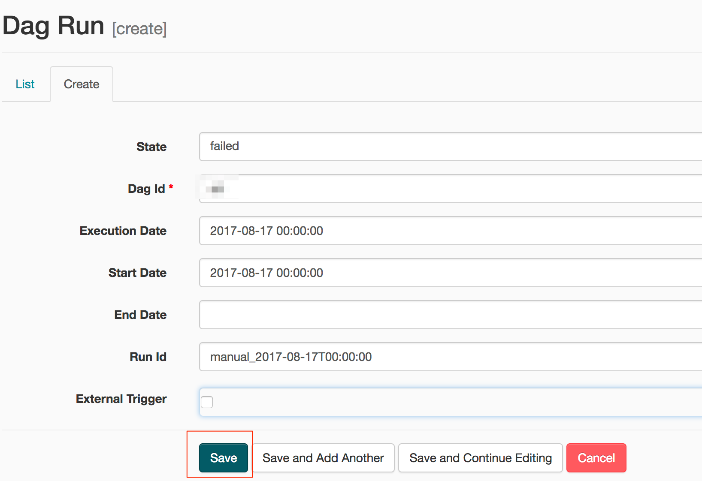
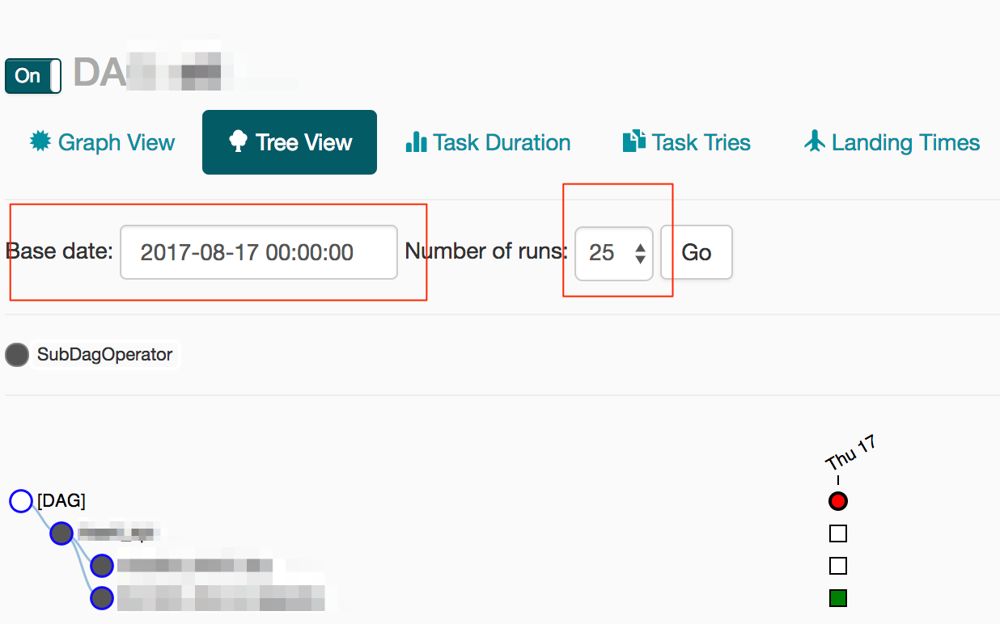
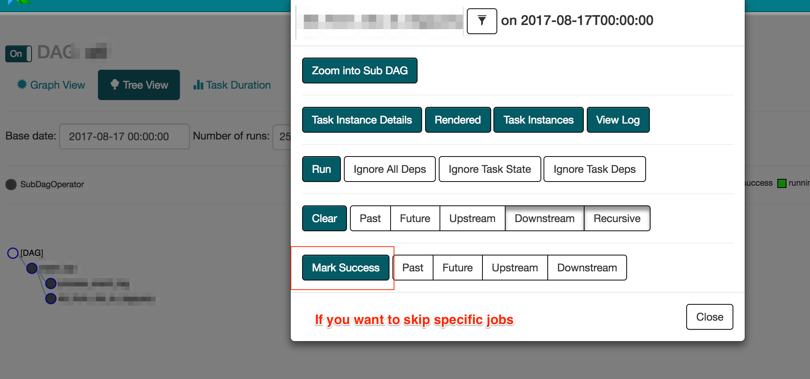

## Airflow Web UI

### (1) Run a job which hasn't scheduled yet

    

    

    

### (2) Run a specfic TaskInstace in a job which hasn't scheduled yet
Almost same as (1). A key point is that you first mark all TaskInstances with success.
Then you clear TaskInstances which you want to run.

    

    

    

## Reference
