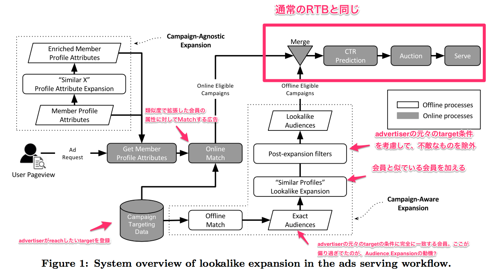
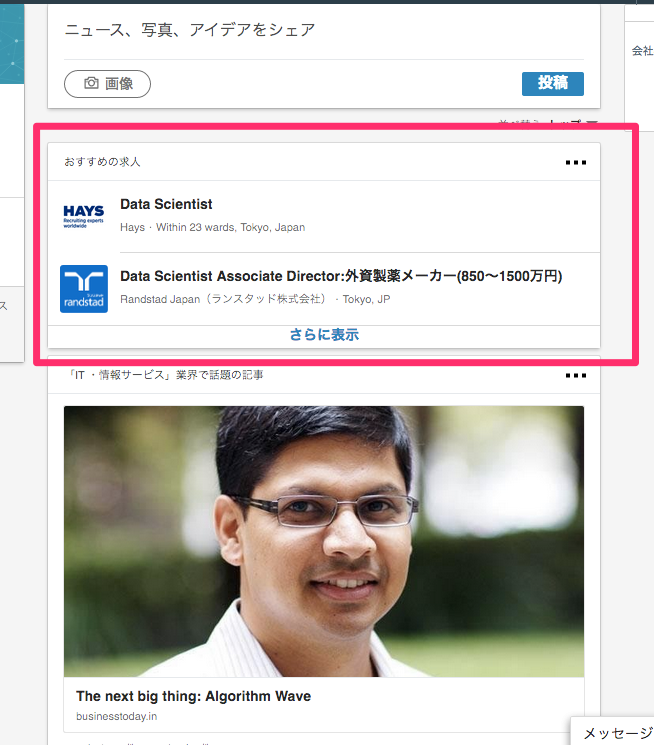
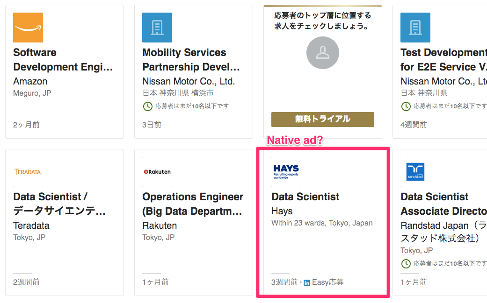
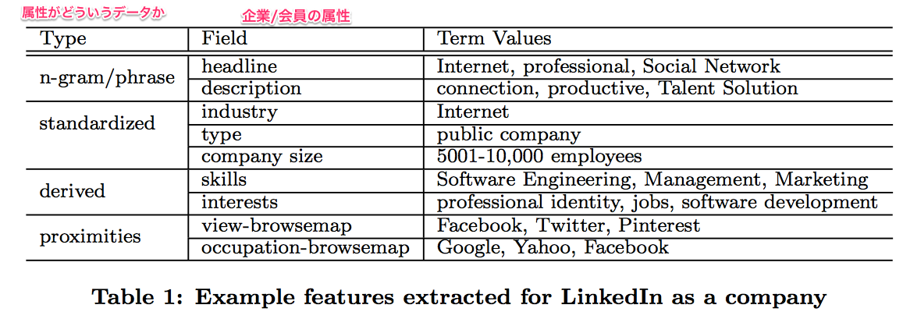
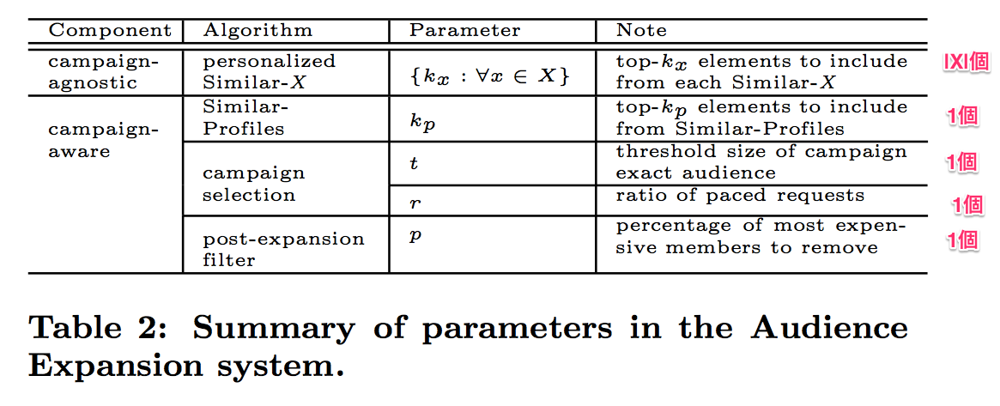
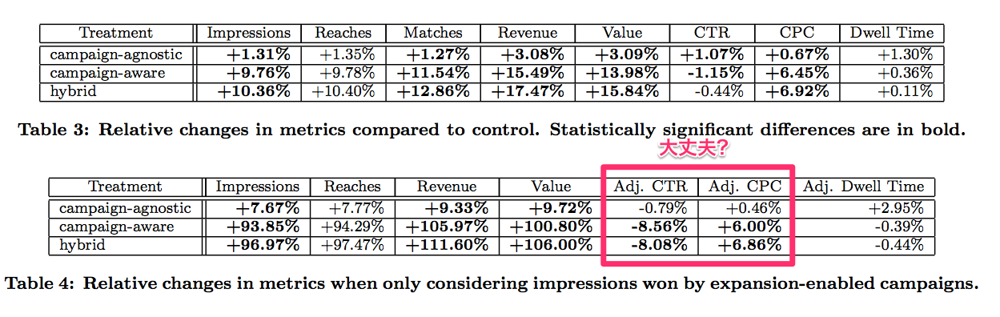

## Audience Expansion for Online Social Network Advertising
LinkedInのAudience Expansionについて。 
campaignは、advertiserの広告のことである。

LikedInでは、advertiserがreachしたい属性(location, age, skill, etc)を指定して、広告を出すことができる。
例えば、userのskillにData Miningを持つuserと指定した時には、Big DataやData Analysisなどを持つuserを対象にできると良い。
こういったkeywordや関連属性を全て網羅して指定することは、多くのadvertiserにとっては難しい。
LinkedInでは、Audience Expansionと呼ぶ手法を開発し、advertiserが指定した属性を自動的に拡張する方法を開発した。
Audience Expansionは以下の2つの要素からなる。

* campaign-agnostic expansion
    * campaignの情報を使わない
    * campaign-independent
    * Similar-Xと呼ばれる手法を使い、会員の属性に似ている属性を加える
        * Xはentityの集まりで、 entityとはユーザの属性(skill, title, description, 働いている会社、所属しているLinkedIn groupなど)である
        * 会社Aと会社Bが似ていれば、会社Aで働く人の属性に会社Bの属性も足す
        * 類似度計算はcosine類似度
    * 会員の属性の拡張
* campaign-aware expansion
    * campaignの情報を使う
    * campaign-dependent
    * advertiserが指定したtarget属性に似ている属性を計算し、似ている属性を持つ会員もtargetに含める
    * advertiserが指定したtargetの拡張

記載はないが、元々advertiserの指定した属性だけで会員に広告を出していたが、それだとメジャーなワードに一致する一部の会員が、広告の割当ができてなかったのかもしれない。
例えば、"Data Mining"とskillにある人に集中し、"Big Data Analysis"とskillに記載している人には広告の割当ができてなかった。
4億人の会員のimpressionの在庫を捌くことが主な目的でCTRとかは特に気にしてなさそう。

## Introduction
Internet Adの3要素は以下のように関係している。

* Users 
    * websiteの閲覧を通して自身の興味と関心を表現
* Advertisers
    * marketingとして価値あるuserを模索
* Social network
    * 実際の広告枠を提供

LinkedInでは以下の2種類の広告がある

* sponsored content
    * userのnewsfeedに表示される
    * infeed広告
* text or display ads
    * pageの上部、右側に表示される

userの属性(title, skill、働いている企業、LinkedIn group, etc）が多すぎてadvertiserが適切にtargetingできていないので、Audience Expansionを作った。
例えば、skillに`Online Advertising`をもつuserにtargetingした場合、自動でskillに`Interactive Marketing`と記載のあるuserにもreachできるようになる。

他のadvertising platformも同様の機能をもっているが、この手法は、conversion orientedである。
つまり、Advertiserが事前に指定したreachしたいuserを下に、そのuserのlistを拡張することができる。
Advertiserの中には、自身のmarketing部門に基いて、targetingを行いたい場合もあるため、この機能は基本的には無効であり、userは明示的にこの機能をONにすることで利用可能になる。

* Avertiserのメリット
    * 限られた労力で、advertiserのcampaignにあったsegmentを見つけることができる
* LinkedIn
    * 今までtargetingされていなかったuserに適切なadsを提供できる

論文の成果は以下。

* campaign-agnostic
    * LinkdeInでは、Similar-X recommender system という名称のシステム
    * userのoriginalのprofileを補間する
    * campaignとは無関係なので、静的、offline、事前にできる
    * campaign-indepentの方が意味として近い
* campaign-aware
    * campaingのtarget audienceを拡張する
    * Nearest Neighborでやっている
        * 距離はSmilar-ProfilesというSimilar-Xの類似手法
* 両方の強みをいかしたsystemを作った

実際のproductionとして使っており、かなり(impressionは)良くなったらしい。

## 3.System
LinkedInのAudience Exapansion systemの概観。

<div style="text-align: center">
    
</div>

### 3.1 Overview
LinkedInの広告の形態。
1ページに複数の広告枠がある。

* Text Ads,
    * ページの上部と横に表示される
    * 論文当時と今で変更があるかも

<div style="text-align: center">
    
</div>

* Sponsored Updates
    * native contentとしてuserのfeedに表示される
    * 論文当時と今で変更があるかも

<div style="text-align: center">
    
</div>

advertiserはがcampaignを作る時、広告のformatを指定する。
また、予算を指定し、targetingを行う。
bidは、CPMかCPCで行う。
targetingは、以下が指定可能。
また各項目は、否定も設定可能。

* location
* age
* company name
* skills
* seniority
* など

例えば、locationがUSAかCanadaでCaliforniaでなく、ageは18-24か25-34で、seniorityがunpaid、trainingでないといった指定が可能。

```
(location == "USA" OR location == "Canada")
AND
(location != "California")
AND
(age == "18-24" OR age == "25-34")
AND
(seniority != "unpaid")
AND
(seniority != "training")
```

targetを決めるとbidの概算がadveritiserに表示されるとともに、Audience Expansionを使うどうかのオプションが表示される。

広告の掲載は、LinkdedInの会員がサイトに訪問した時に、空いている広告枠があれば開始される。
処理の大まかな流れは以下

* 会員のPVとともに、backendにad requestがいく
* 会員のprofile情報が取得され、広告のtargeting条件に一致している広告が表示される
* 該当の広告が複数ある場合は、second-price auctionによって表示する広告が蹴っていされる。
* auctionで買った広告が、frontendに送られ、広告が表示される。

Audience Expansionは2段階ある。

1. 会員のprofileを取得する時に、会員情報を拡張
    * camplaign-agnostic
    * offlineのbatch処理
2. 直接targetに指定されなかった会員に対して、targetに似ている会員も広告のtargetに含める
    * campaign-aware
    * offlineのbatch処理

### 3.2 Campaign-Agnositc Expansion
campaign-agnosticは Smilar-X algorithmに基づく。
Xは、profileの属性(company, LinkedIn Gropu, skill, job title, etc)が入る。
例えば、similar-Skillsの場合、`Data Mining`と指定したら、`Big Data`, `Machine Learning`といったものも会員の属性として加える。
Similar-X algorithmは後で解説するように、similarityをlogistic regreesionでscoreとして出力するmodelである。
この手法は、精度は悪いが、会員の情報のみからできるという点で、優れている。

### 3.3 Campaign-Aware Expansion
targetで指定された属性を会員へのlabelとみなす。
labelとみなすことで、labelに近いもの探す分類問題として考えることができる。

1. offline match
    * targetで指定された会員をHadoop jobで列挙する
2. Filter campaign
    * 似ている会員にtargetを拡張しても、有用でない広告をのぞく
    * 例えば、targetがそもそも広すぎるもの、targetを拡張せずとも指定予算をすぐに使い切ってしまうものなど
3. expand audiences to similar profile
    * similar-profiles algorithmによって似ている会員に拡張する
4. filter expansion
    * 得られた似ている会員から、もともとのtargetの否定条件を満たすもの、性別やlocationの条件に一致しないものを除く

最終的な出力は、campaign idとaudience idを紐付けてkey-value storeに保存される。

### 3.4 Hybrid Expansion
campaign-agnosticとcampaign-awareは補完的なので、組わせて使う。

## 4. Modeling

### 4.1 Feature Exgraction

* multi-fielded documentとして扱う
    * n-gram/phrase
        * 企業のheadlineやdescriptionのn-gramやphrase
        * stemmingと簡単なstop wordの削除をする
        * phraseは辞書で対応する
    * standardized named data type
        * industryのtypeや会社の大きさで分類されたデータ
    * derived data types
        * 従業員や会社のfollower(linkedInは会社をfollowできる）に共通する能力か類推されるデータ
        * Internet companyはNetwork DevelopmentやSoftware Engineeringなどである
    * network proximities
        * userとcompanyの関係から類推される能力
        * 会社を閲覧した、働いた人、他の会社から閲覧されたかどうか

Table1がLinkedInから抽出された特徴。

<div style="text-align: center">
    
</div>

### 4.1.2 The Model
各、会社や会員をentityとして扱い、entityをmulti-fielded documentとみなして、field間の類似度をVector Space Modelで計算する。
類似度の計算はcosain類似度とする。

* $$f_{i, s}$$,
    * entity $i$のfiled $s$
* $$f_{j, t}$$,
    * entity $j$のfiled $t$

$$
    s(f_{i, s}, f_{j, t})
    :=
    \frac{
        \langle V(f_{i, s}), V(f_{j, t}) \rangle
    }{
        \|V(f_{i, s})\|
        \|V(f_{j, t})\|
    }
$$

ここで、$$V(f_{i, s})$$はfiledのvector表現である。
これを用いて2つのentity間の類似度を次のように測る。

* $\mathcal{T}$
    * entityのfiledの中で、textによるもの
    * 基本的にn-gram/phraseのfield
* $\mathcal{I}$
    * entityのfiledの中で、IDによるもの
    * 基本的にstandardized, derived, proximityのfiled
* $\mathcal{F}$
    * $\mathcal{F} = \mathcal{T} \subset \mathcal{I}$
    * $\mathcal{T} \cap \mathcal{I} = \emptyset$
    * entityのfiledの種類
* $V_{i,j} := \mathcal{F} \times \mathcal{F}$
    * entity $i$とentity$j$の間のfiledの関係を表す頂点

$$
    \mathcal{E}_{i, j}
    :=
    \{
        (f_{s}, f_{t})
        \in
        V_{i, j}
        \mid
        (f_{s}, f_{t})
        \in
        \mathcal{T} \times \mathcal{T}
        \vee
        (f_{s}, f_{t})
        \in
        \mathcal{I} \times \mathcal{I}
    \}
$$

このEdge $$\mathcal{E}_{i,j}$$を順序付けたものを$$E_{i,j} = ((f_{s}^{1}, f_{t}^{1}), \ldots, (f_{s}^{N}, f_{t}^{N}))$$とする。
Edgeから定まる類似度ベクトルを以下で定義する。

$$
    \mathbf{s}_{i, j}
    :=
    (
        s(f_{s}^{1}, f_{t}^{1}),
        \ldots,
        s(f_{s}^{N}, f_{t}^{N})
    )
$$

更に、各filedに重み$\mathbf{w}$を加えたものを最終的なentity $i$とentity$j$の類似度ベクトルとして定義する。

$$
    S(i, j)
    :=
    \langle
        \mathbf{w},
        \mathbf{s}_{i, j}
    \rangle
$$

主に$\mathbf{w}$は、userのentityへの過去の行動ログから学習する。
例えば、2つの会社(entity $i$とentity $j$)が過去に同じように広告のtargetにされていれば重みを増やし、逆にtargetから外されていれば、重みを減らす。
このmodelに対して、elastic net regularizationによるlogsitc regressionで学習する。

### 4.1.3 Perosnolization
単純なSimilar-Xは、personalizationに弱い。
Company AとCompany Bがあったとする。
AとBはSimilar-Comaniesで似ているとする。
Bで働く会員の属性に、Aも加えられる。
つまり、Bで働く人は、Aをtargetとしてる広告のtargetにもなる。

これは、advertiserにとってもA, Bで働く人にとってもpersonalizeされていない。
personalizeするために、各userについてuserの好むentityと好まないentityの2値を学習する方法をとっている。
会員が好むentityの中で、上位$k_{x}$個($x$は各属性)取得する？
ちょっと詳細が読み取れない。

companyを例にすると、userとcompanyの特徴量を4.1.1.と同様に取得し、例えば、userがcompanyをfollowしていれば好む、unfollowしていれば好まないにする。
これをtraning dataとして、logistic regressionで学習する。

### 4.1.4 Similar-Profiles
Similar-Profilesは、会員のprofileに対するSimilar-X algorithとも言える。
LinkedInでは4億以上の会員に対してこれを行っている。
問題としては、この組み合わせだから4億の2乗である。

この大きなデータの中で、高いcosine類似度をもつ組を見つけるために、、Locality Sensitve Hashing (LSH) techniqueを使っている。
全ての会員は、$n$個のclusterにmapされ、そのclusterの中でのNearest Neighbor searchを行っている。

### 4.2 A Note on Implementation


* 以下はHadoopで実装している
    * feature extraction
    * indexing
        * Luceneを改良して行っている
        * real time indexing
        * faceting 
    * search process

campaign-awareでは、まずSimilar-Profilesに基づいて、もともとの広告のtargetを満たす会員を見つける。
この会員の上位層が、audience expansionの候補となる。
一人の会員にたくさんの広告が対象となることを防ぐために、全てのcampaignを拡張せずに、ある閾値以下のcampaingだけを拡張する。
これを達成するために、heuristicにmember-campaign fitness $F$という値を計算している。

* $m$
    * 会員
* $c$
    * campaign, 広告
* $T(c)$
    * campaign $c$のもともとのtargetの会員の集合

$$
\begin{equation}
    F(m, c)
    :=
    \frac{
        \sum_{m^{\prime} \in T(c)}
            S(m, m^{\prime})
    }{
        \sqrt{| T(c) |}
    }
\end{equation}
$$

$F(m, c)$がある値以下のものだけが、Audience Expansionの対称となる。
この閾値の直感的意味は、すでに元々のtargetに似ている会員については拡張をしないということである。
割ってnormalizeしているのは、campaign間でこの値を比較するためで、 分母でrootをとっているのは、best practiceである。

### 4.3 Other Considerations

### 4.3.1 Campaign Selection
全てのcampignでAudience Exapamnsionはしない.

* advertiserの予算が少なすぎる場合
* 元々のtargetが広すぎる(USA 全員)場合

このcampaignの選定はheuristicなruleに基いて行っている。
offlineのworkflow時に、この判断を行い、不要と判断した場合は、Audience Expansionは行わない。
このruleは以下の直感的な要請を満たすようにしている。

* より精緻な属性で会員を特定できるような、拡張が可能
    * 単純に、同じ性別や同じ地理に住むなどではなく
* 対象となる会員が多すぎないこと
* 拡張した際に発生するimpressionに対する十分な予算があること

予算の推定は以下のように行っている。
campaignは、dailyの予算をオプションで指定でき、全体の予算を超えると、その後のauctionには参加できない。
そのため、予算を超えそうなことが予測された場合は、ad serverで pacing algorithmによって、randomにauctionからcampaignを除外するということを行う。
期間の中で、$M$回のauctionがあっても、参加可能なauctionが$N$回であれば、$N$回になるように、参加を制限する。

また、逆にAudience ExpansionをONにしていないcampaignであっても、期間の終わりごろに$r:= N/M$が1より少ないときは、Audience Expansionによっって、targetを増やす。

### 4.3.2 Post-Expansion Filters
Audience Expansionで対象となった会員に対して、元々のtarget条件に基いてfilterをかける。
特に、性別やlocationが指定してあった場合は、それらはskillなどより、強い条件とみなしてこの条件を満たさないものを除く。

拡張した会員の中で、costの高い会員は除く処理も行っている。
ここで、costの高い会員とは、会員の属性が他の会員より明らかになっている会員で、属性に関する情報の少ない会員より、より高いbidをつけられると予想できる。
これを、簡単な回帰モデルで以下のように予測している。

$$
    Y
    :=
    \log \mathrm{Bid}
    =
    X\beta _ \epsilon,
    \quad
    \epsilon
    \sim
    \mathrm{N}(0, \sigma^{2})
$$

である。
ここで、$X$は会員の属性である。
このモデルで拡張した会員のcostを算出し、上位$p$ %は対象から覗いている。

### 4.3.3 Online/Offline Sync
campaign-awareはofflineで行われる。
そのため、advertiserがcampaignのtargetをonlineで変更した場合に、以前のtargetに基づくAudience Expansionではadvertiserのtargetと齟齬が生じる。
齟齬がおきないように、advertiserのcampaignの設定とAudience Expansionのoffline処理にそれぞれtimestampをつけ、campaignのtimestampの方が古いかどうかを確認している。

## 5 Experiments

### 5.1 Paarameter Setting
Tabl2にあるように、Hyper parameterが多い。
hyper parameterの決定A/B testで決めている。

<div style="text-align: center">
    
</div>


### 5.2 Similar-Profiles in Campaign-Aware Expansion

### 5.3 Online A/B Test
user idに基いて、実験対象を以下のようにわける。 

* no expantion: 5%
* campaign-agnosticのみ: 5%
* campaign-awareのみ: 10%
* hybrid: 70%
* other: 10%
    * 他の方法
    * 論文では記載なし
    * 成果がなかったからかかなかった？
    * business的な理由で対象にできなかった？

以下を比較

* Impressions
    * userのpage requestごとのimpression
* Reaches
    * ある日にadvertiser からの広告をuserが見たら1
    * 同じ日に同じadvertiserからの広告を複数回見ても1
* Matches
    * 各userのpage requestに対して、掲載対象となるadvertiserの数
* Revenue
    * 3つの要因がある
    * impressionが増えたことによるもの
    * Audience expansionの拡張で、競合があまりいなかったimpressionに対して、拡張されたものが高いbidを出していた
    * Audience Expansionで、競合が増えてことによって、advertiserが高いbidをだしたことによるもの
        * second price auctionだが競合の数が増えて、全体のbidがあがるらしい
* Value
    * LinkedInではrevenueより大事
    * social welfare, total valueともいう
    * valueは、bidのこと
    * 各impressionに対するbidの和がtotal value
    * advertiserのvalueを増やすのが、Audience Expansionの最終的な目的
* CTR
    * impressionに対するclick
    * CTRを増やすことが目的ではないが、減りすぎないよう見ている
* CPC
    * advertiserにとっては低い方が良い
* Dwell Time
    * 広告からLanding Pageに移動した際の、LPの滞留時間
    * 5分を上限として、図っている
    * Audience Expansionした対象も下のtargetと同じ滞留時間であって欲しいので、この時間が減らないか見ている

Audience Expansionで、impressionが増えるのは当たり前なので、Dwell TImeやCPC, CTRが変わらずにどれだけimpressionを増やせるかが大事。

<div style="text-align: center">
    
</div>


## Reference
* Liu, H., Pardoe, D., Liu, K., Thakur, M., Cao, F., & Li, C. (2016). Audience Expansion for Online Social Network Advertising. Proceedings of the 22nd ACM SIGKDD International Conference on Knowledge Discovery and Data Mining - KDD ’16, 165–174. https://doi.org/10.1145/2939672.2939680
* [ファセットナビゲーション とは 意味/解説/説明 （ファセットナビゲーション） 【Faceted Navigation】 Web担当者Forum](http://web-tan.forum.impressrd.jp/g/%E3%83%95%E3%82%A1%E3%82%BB%E3%83%83%E3%83%88%E3%83%8A%E3%83%93%E3%82%B2%E3%83%BC%E3%82%B7%E3%83%A7%E3%83%B3)
