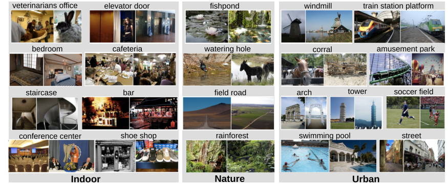
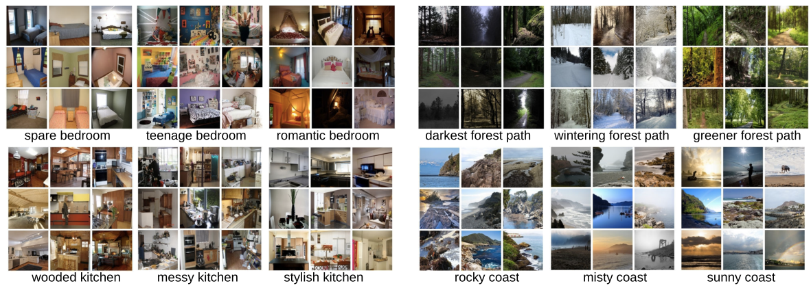
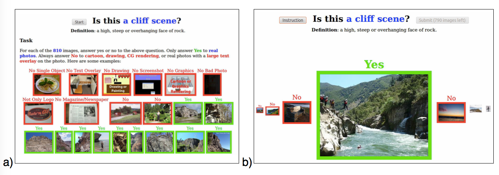
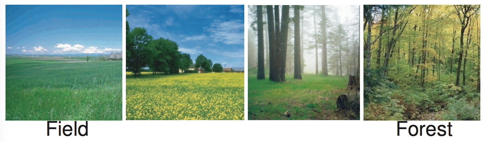
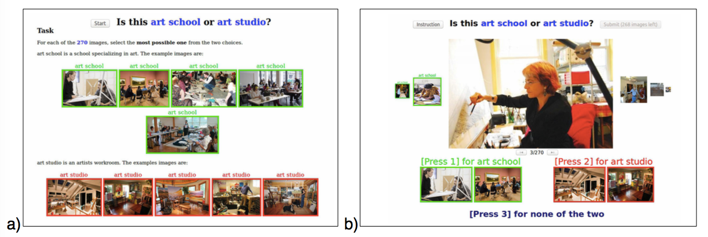
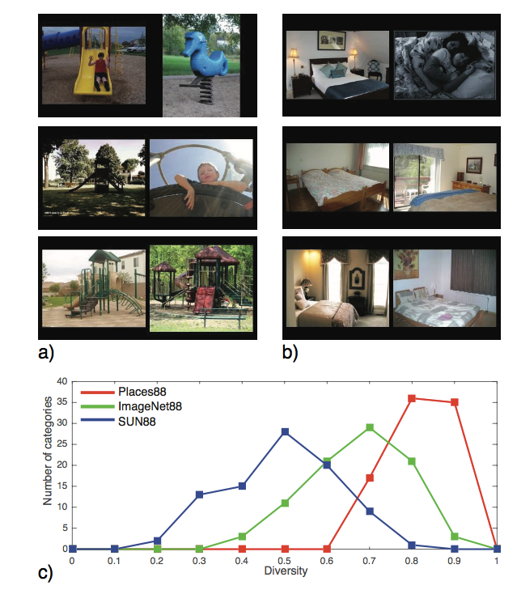
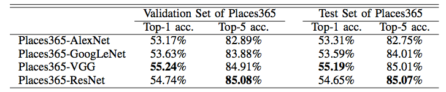
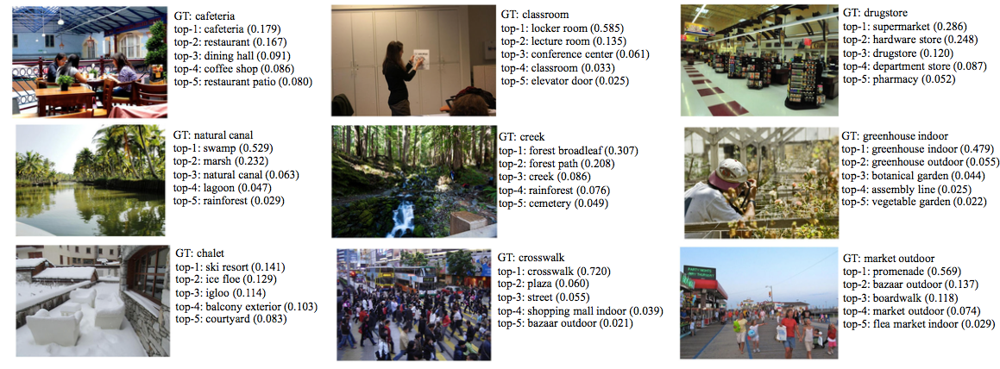

## Places A 10 million Image Database for Scene Recognition

* 2012年のPlaces dataseの改良版
* Scene recognitionに対する10 millionのdatasetを作成した
* object detectionで使われているgooglenet, VGG16, alexnetなどの手法を今回のdatasetで学習させて、testを行った

## 1. Introduction

## 1.1 The rise of multi-million datasets
Supervised learningで重要なこと

* algorithmが問題に適していること
* training dataが問題の答えを適当に網羅しており、十分なdata量があること
    * class分類の場合は

## 1.2 Scene-centric Datasets
既存のscene recognitionのdatasetsたち。
Deep learningによるobject detectionで使われるImageNetのような大規模datasetと呼ばれるものはない。

* Scene15 database
    * 15 scene categories
    * 1 scene あたり数百枚
* MIT indoor67 database
    * 67 indoor categories
* SUN (Scene UNderstanding) database
    * 397 categoreis
    * 130, 519 images

scene recognitionに限らないdataset

* Pascal VOC dataset
    * segmentationとobject detection用の情報が付与されたdataset
* COCO dataset
    * object instance
    * 写真中のobjectにbounding boxや多面体による座標情報が付与されている
* Visual Genome dataset
    * objectとその属性とobjectの間の関係などの情報が付与されている
* ADE20K
    * scene, object, objectの部分などに対する情報が付与されている

## 2 Places Database

## 2.1 Coverage of the categorical space
Places datasetでは人間が訪れることができる場所に限り、categoryを作成している。
SUN datasetは最初にscene categoryを表現するwordについてまとめたdatasetである。
SUN datasetでは以下のようにしてcategoryを作成した

* WordNetを利用してSUN database teamは70,000 workdsとscene, 場所, 環境を表現するwordを選んだ
    * 具体的には`I am in a 'place'`, `let's go to the/a 'place'`などのphraseに利用できる単語を選んでいる
* synonymで表現されているclassをまとめ同じ語で表現されているclassを分け(churchesをinside churchesとoutside churchesに分けるなど)、900 の異なるschene categoryを作成した

Places datasetではSUN datasetのscene categoryを踏襲し、幾つかの変更を加えて利用している
変更については、2.2.4で述べる。

## 2.2. Construction of the database
Places databsaeは4つのstepを通して、作成された。

* Step1. scene categoryのimageをinternetからDLする
* Step2. DLしたimageをscene categoryごとにlabel付けを行う

ImageNetやCOCO datasetも似たような方法で作成されている。
ImageNetについては

* ImageNetやCOCO datasetなどと同じ方法で収集
* ImageNetのcategoryは、Wordnetにもとづいている
* WordNetのsynonimを利用していくつかのsearch engineで候補の画像を取得
* AMTでcategoryに属すか属さないかの分類を行う
* Quality controlのために、複数のuserに同じ画像をlabel付させる
* 500-1200 のgrouop-truth imageがsynonymごとに得られる

COCO datasetについては

* 画像内のobject instanceに焦点をあててannotationを行っている
* iconっぽい画像を減らすために、画像の候補はFlickrから取得してる
* COCOのannotationのprocessは以下に分けてAMTで行われた
    * objectにcategory lableをづける
    * object instanceの場所の指定
    * instanceのsegmentaiton
* COCOでは80 objectのcategoryと 2 million のobject instanceのdataがある

Placesでのdatasetの作成について述べる。

### 2.2.1 Step1: Downloading images using scene category and attributes
* google images, bing images, flickrを利用して、画像を集める
    * query wordはSUN datasetのscene classを利用する
    * 見た目のdiversityのために、それぞれのsceneで696のcommon English adjective(messy, spaare, sunny, desolateなど)を使って検索した画像を利用する
* 少なくとも200x200のsizeのcolor画像を60 million収集し、URLでidをつける
* SUN datasetと異なるように、PCAで画像の類似度を調べ、SUN datasetと同じものを取り除いている

    
     
    Figure1

### 2.2.2 Step2: Labeling images with ground truth category
step1で収集した画像をAmazon Mechanical Truc(AMT)にcloud sourcingする。
このstepでAMTのworkerによって、分類が明らかにできる画像のlabelづけを行う。

* category (e.g. cliff)に属するimageであれば、YES、属さなければNOをつけてもらう

画像の例

    
     
    Figure3

AMTの画面の例

    
     
    Figure4

* 1回目のAMT
    * SUN datasetの収集時の知見から、onlineで集めた画像の50%はcategoryに適した画像ではないため、AMTの画面はdefaultでNOにする
    * AMTのworkerは、画像がcategoryに属さなければspace keyで次の画像のcheckに進む
        * 赤の囲み線
    * 画像がcategoryに属せば、特定のkeyをおしてYESをsetして次の画像のcheckに進む
        * 緑の囲み線
    * AMTの各workerはこれを750 imagesに対して行う
    * quality controlの指標として、各workerのtaskの画像の中に、SUN datasetからYESの画像とNOの画像を30枚ずつ加えておく
        * workerのtaskはこのquality controlの画像が90%の精度で分類できている場合のみ利用する
* 2回目のAMT
    * 1度目でYESと回答された画像のみ集め、もう一度同様にAMTのworkerにtaskとして依頼する
    * このとき、defaultの回答はYESにする
    * このtaskで25.4%の画像がNOと回答された

3度目のAMTではNOと回答されるimageの数が有意な数に満たなかったので、考慮していない

上記の2度のclearningで、7,076,580 の画像と476 scene categoryが得られた。
その中で、413 scene categoryは、少なくとも1,000あり、98 sceneについては20,000以上ある。

### 2.2.3 Step3: scaling up the dataset using a classifier
Spte2では、人手で明らかにcategoryに属するものを判別した。
ここでは、 classifierによって、 476 scene categoryに分類されなかった53 millionの画像を再度label付することを行う。
例えば、living-roomのqueryでbedroomの画像がDLされた場合は、living-roomとしてNOという回答がworkerによってされている場合がある。
Step3では、画像にcategoryをつけなおし、再度annotationを行う。

ここでは、AlexNetを使って53 millionの画像を再度分類を行う。

* それぞれのscene categoryから1000の画像をrandomに選び、traning setとする
* 同様にscene categoryから50の画像をrandomに選び、validation setとする
* AlexNetでは32%の精度でvalidation setの分類ができた
* この学習済みのAlexNetで、53 millionの画像について、各classに属するか否かを判定する[0, 1]のscoreを出力する
* Step2で画像が少なかった各categoryで、scoreが0.8以上の画像についてFiguire 4よ同様の手順でAMTでの分類を行う

最終的に、401のcategoryが5,000 imagesをもち、240 scene categoryが20,000以上の画像をもった。
このstepで3 millionの画像が新たに追加された。

### 2.2.4 Step 4: Improving the separation of similar classes
SUN datasetはWordNetを用いてsynonymをまとめていたが、依然として幾つかの似たようなcategory名が存在した。
例えば、ski lodgeとski resortやgarbage dumpとlandfillなどである。
これらを手で、46のsynonymのpairにまとめて、1つのcategoryに統合した。

更に、いくつかのscene categoryは協会が曖昧なものがあることを発見した。

    
     
    Figure5

これらのcategoryでは、`Does image belongs to A?`などの一方に属する設問には回答しづらく、 `Does image I belongs to class A or B?`のような設問であれば回答しやすくなる。
Step3までのannotationの結果をみて、幾つかのscene categoryのpairでworkerが回答を混乱していることが判明した。
例えば、canyonとmountain, butteとmountainなどである。
また、`jacuzzi`と`swimming pool indoor`, `pond`と`lake`, `volcano`と`mountain`, `runway`と`highway`と`road`, `operating room`と`hospital room`などである。
53の曖昧なcategoryを区別し、新しいAMTのinterfaceで再度workerに分類を依頼した。

    
     
    Figure6

最終的に、10,624,928 imagesと434のplaces categoryを得た。

## 3. Places Benchmarks
Places datasetを利用したbenchmarkについて述べる。
algorithmの検証用にPlaces datasetのsubsetとして幾つかのdatasetが提供されている。

* Places365-Standard
    * 365 category
    * 各category 3068から5000までの画像
    * 1,803,460 training set
    * validation setは各class 50 images
    * test setは各class 900 image
    * この論文の実験は全てこのdatasetで行われている
* Places365-Challenge
    * 365 categoryでPlaces365-Standardと同じcategory
    * 8 million training set
    * validation setは各class 50 images
    * test setは各class 900 image
    * この論文の実験は全てこのdatasetで行われている
* Places205
    * Places 1 datasetのsubset
    * 205 scene category
    * 2.5 million
    * 各categoryについて、5,000から15000
    * 2,448,873のtraning set
    * validation setは各category 100 images
    * test setは各category 200 image
* Places88
    * 88 common scene category
        * ImageNet, SUN, Places 205で共通
    * Places 1のround 2までの画像で構成されている
    * このdatasetは異なるdataset間でのperformanceの計測に使われる
    * categoryは共通だが、dataset間で同じ画像は含んでいない
* ImageNet88
    * 88 common scene category
        * ImageNet, SUN, Places 205で共通
    * このdatasetは異なるdataset間でのperformanceの計測に使われる
* SUN88
    * 88 common scene category
        * ImageNet, SUN, Places 205で共通
    * このdatasetは異なるdataset間でのperformanceの計測に使われる

## 4 Comparing Scene-Cenetric Datasets
Places88/ImageNet88/SUN88 benchmarkを用いてdataset間の比較を行う。
Places88が最も多くのdataをもつdatasetである。
次節でdatasetのdiversityについての比較を行う。

## 4.1 Dataset Diversity
image dataset間の比較はopen problemである。
image dataset間の比較において重要なのは、以下の2つである。

* dataのdense
    * dataの集中度
* dataのdiversity
    * dataが見た目と視点の多様性

diversityを測るために、biologyでecosystem間の比較に利用されるSimpson index for diversityを応用する。
simpson index for diversityは、ecosystem間で異なる種がどの程度分布しているかを調べる指標として利用される手法である。

次のideaに基いて、simpson index for diversityを拡張する。
画像の集合$A$が集合$B$よりdiverseであるとは、$B$からrandomに選んだ2つの画像の類似度より、$A$からrandomに選んだ２つの画像の類似度の方が小さい。
$B$に対する$A$の類似度は

$$
\begin{equation}
    \mathrm{Div}_{B}(A)
    :=
    1
    -
    P(d(A_{1}, A_{2}) < d(B_{1}, B_{2}))
\end{equation}
$$

ここで、$$A_{1}, A_{2}$$は$A$からrandomに選んだ画像で、$$B_{1}, B_{2}$$は$B$からrandomに彫らんだ画像である。
式は、$d$は画像間の非類似度を与え、$$d(A_{1}, A_{2})$$は$$A_{1}, A_{2}$$の非類似度である。

$$
    \mathrm{Div}_{A_{2}, \ldots, A_{N}}(A_{1})
    :=
    1
    -
    P(d(A_{1, 1}, A_{1, 2}) < \min_{i=1, \ldots, N}d(A_{i, 1}, A_{i,2}))
$$

$$A_{i,1}, A_{i, 2}$$は$$A_{i}$$からrandomに取得した画像。

この指標を用いて、SUN88, ImageNet88, Places88のdiversityをAMTを用いて行う。
ここで、AMTのworkerは式中のdiversityを測る$d$の役割を担う。

* 各datasetの各categoryから画像のpairを2つrandomに選ぶ
    * 一様分布
* 各datasetから4 pairを選ぶ

playgournd, veranda, waiting roomの3つのcategoryで比較した結果がFigure 8となる。

    
     
    Figure8.

## 5 Convolutional Neural Networks For Scene Classification
* 手法
    * CNN
    * AlexNet
    * GoogLeNet
    * VGG16
    * ResNet
* dataset
    * Places205
    * Places365-Standard

で比較した結果を示す。
計算環境は

* framework
    * Caffe
* Nvidia GPUs Tesla K40
* Nvidia GPUs Titan X

精度は1つだけ予測した場合と上位5つを予測結果とした場合の精度を示している。

    Table 2
     
    

    
     
    Figure 10.

## 5.2 Web-demo for Scene Recognition
Places-CNNのWeb demoが公開されている。
demo中のheatmapはCAM techniqueで生成している。

* http://places.csail.mit.edu/demo.html
    * Places205-AlexNet
* http://places2.csail.mit.edu/demo.html

## Reference
* Zhou, B., Lapedriza, A., Khosla, A., Oliva, A., & Torralba, A. (2017). Places: A 10 million Image Database for Scene Recognition. IEEE Transactions on Pattern Analysis and Machine Intelligence, 8828(c), 1–14. https://doi.org/10.1109/TPAMI.2017.2723009
